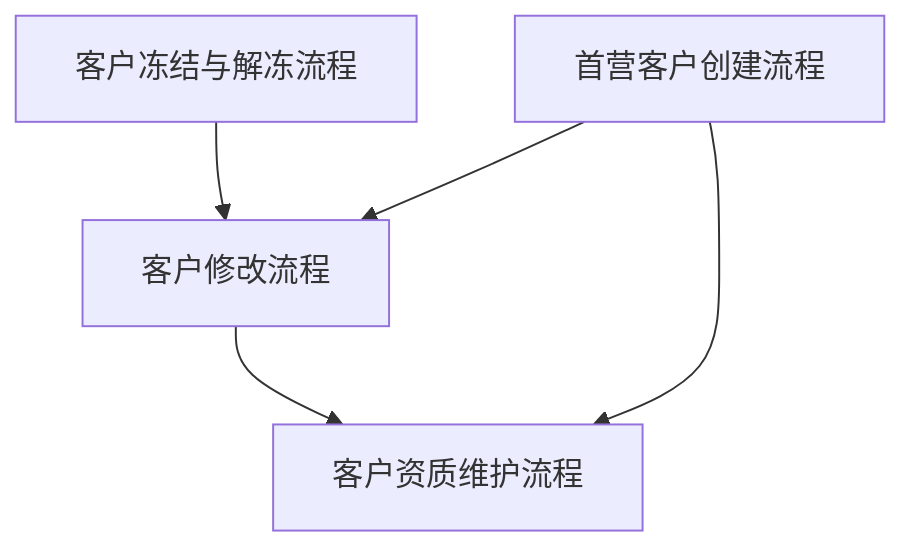
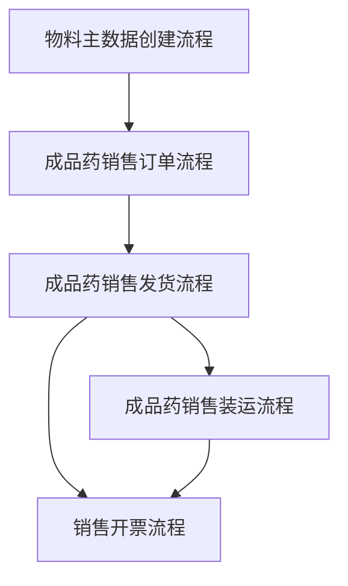
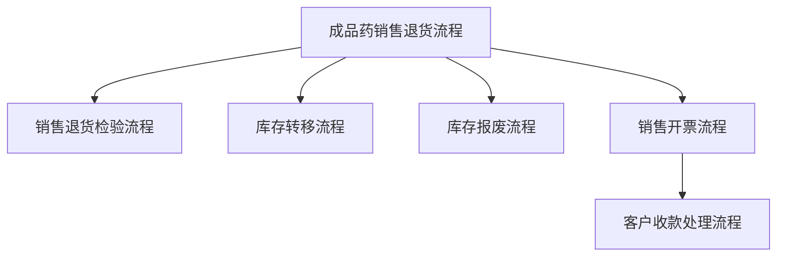

# 1.知识碎片

> zmmu010 扩展公司代码 扩展销售组织（MDM推送过来的客户）
>
> ZMMU011：扩充物料信息旧，之前上线的公司用
>
> ZSDU005：可扩展非MDM推送过来的客户公司代码视图
>
> ZMMU019：扩充物料视图新上线的公司用（销售视图配置表 ZMMT015，配置好数据后，在前台界面查询物料若没有可取消勾选是否新建，然后提交审批，审批通过后则会自动根据配置表数据进行扩充）
>
> FB03 查看凭证列表
>
> VLPOD：客户收获凭证
>
> ZFIU041：批量 pod
>
> VLPODL：自动pod
>
> Zfir020：进销存报表也可以查看物料库存
>
> MMBE：查看物料库存数量
>
> MB51：查看物料凭证，可以看到物料的移动情况，也可以查看物料库存
>
> MM03：会计视图 1 也可以查看物料库存信息
>
> MM60：查看物料清单
>
> ZMMR002：库存查询报表
>
> ZMMR003：批次属性查看
>
> MB53：查看工厂库存可用性
>
> MB52：查看物料库存
>
> MB5B：查看过账日期库存
>
> MB5T：查看在途库存
>
> MSAA：批量修改订单信息
>
> MSC3N：查看物料批次信息
>
> MD04：输入对应物料号以及工厂查看物料库存（==可查看物料去向定位到订单号==，必要时可通过批次进行查询）
>
> CO09：查看销售库存是否能确定到数量
>
> MIGO + 561：可以将物料的库存初始化，需要配置物料相应视图的信息
>
> MM50 ： 扩充物料视图信息
>
> ZSDR002：销售订单跟踪表
>
> ZSDSO001：销售订单查询报表
>
> ZSDC001：自销交货单发货信息是否传值销管平台公司代码配置表
>
> ZSDR003：销售发货明细表
>
> ZSDF001：打印成品药随货通行单（SMARTFORMS：恒生-ZSDF001，金远-ZSD_RSD000（标准），浙江康莱特-ZSD_RSD003，杭煜医药-ZSD_RSD004_5011）
>
> ZSDF002：打印非成品药/退货交货单
>
> zsdr005：销售折扣渠道平台调用 SAP 信息（处方药销管）
>
> ZSDR009：自销订单折扣信息传至销管平台
>
> Zsdr006：回款单渠道平台调用 SAP 信息（处方药销管）销管单据日期取 h_bldat  收款日期取 h_buda （ZSDT002 记录日志表，记录成功则，下次不推送，可使用这种方式来排除无需推送仍在推送清单中的凭证数据，回写日期为空即可）
>
> ZSDR008：自销的回款单渠道平台调用
>
> ZSDR009：自销订单折扣信息传至销管平台
>
> ZSDU001：运输单批导
>
> ZSDU003：交货单客户签收维护
>
> ZSDU004：销售订单批导
>ZSDU005：客商扩展公司代码视图
> 
> ZSDU006：依据交货单创建退货销售订单创建
>MB21：创建预留（若创建预留时，可用库存不够，则会把所有可用库存都占用，创建预留时需要把库存地点填写上，MMBE 中预留这一列才会显示出数量）
> 
> MB23：查看物料的库存预留
>
> MB22：修改物料的库存预留（物料的可用性检查会包含已下单还未发货的物料，也会包含预留的这部分物料）
>
> MB24：查看预留清单
>
> ME1p：查看物料的单价（mm03，查看物料会计视图下的价格）
>
> FBL5N：查看客户的未清项明细
>
> VL06O：可以查看交货单清单（查看未交货的交货订单,批量交货过账）
>
> VL10A：查看可交货单的销售订单列表
>
> VL10C：批量创建交货单
>
> VL06F：批量查看所有的外向交货单
>
> VL06G：待发货的交货单清单
>
> VFX3：批量批准至会计
>
> ZFIU010：回款认领平台
>
> ZFIU027:清账
>
> zfir043：金税发票清单维护
>
> zfiu045：资金对账
>
> VL06F：通用交货清单
>
> VL06：交货监控器
>
> VL06I： 入库交货监控器
>
> VLPODA：显示外向交货
>
> ZSDR003:销售发货明细表
>
> ZSDR004:产品销售情况报表
>
> ZSDU003:交货单客户签收维护
>
> BP：查看客户
>
> XD99：批量维护客户
>
> ==VCUST==：查看客户清单（按销售组织）
>
> ==MKVZ==：查看供应商清单（根据采购组织筛选）
>
> S_ALR_87012087： 查看供应商清单（可使用“搜索帮助标识”字段根据公司代码等信息进行筛选）
>
> ZFLOW：前置单据流转中心
>
> VCH1/VCH2：配置批次拆分策略
>
> VF04：查看未开票的交货单情况（不能点击保存，点击保存则全部开票）
>
> ZSDU003：交货单客户签收维护（客户收到货后，进入该报表维护签收时间，点击保存即可）
>
> va01：创建销售订单（OR，==RE-退货可参考正向订单创建==）
>
> va05：销售订单清单
>
> va11：创建询价单
>
> va21：创建报价单（QT）
>
> va25n：查询报价清单
>
> va31：创建计划协议（LP，有计划行用于规划各时间段分别交付多少数量，==可作为参考生成交货单==）
>
> Va35n：查看计划协议报表
>
> va41：创建合同（CQ，无计划行，==可作为参考生成订单==）
>
> va45n：合同清单
>
> CNS0：项目发货
>
> ZSDR007：销售发货明细报表
>
> ZSDF002：销售交货单打印
>
> ZSDR003：销售发货明细表
>
> ZSDR004：产品销售情况报表
>
> ZSDSO001：销售订单查询
>
> ZSDU003：交货单客户签收维护
>
> ZSDU004：销售订单批导入
>
> ZSDU005：客户扩充公司代码视图
>
> ZBPMR001：查看 BPM 流程数据（流程节点不经过某用户，则 ZBPM 事物码中无法查询到流程审批数据）
>
> ZSDB001：运单号电商平台接口推送 EC（SI_SEND_LOGISTICS_OUT）
>
> VL10A：查看未交货的销售订单（批量交货）
>
> ZJM_SD001：SAP推送销售发货单至WMS
>
> ZJM_QM004：WMS推送销售出库质量复核单至SAP
>
> ZJM_SD002：SAP推送销售退货申请单至WMS
>
> ZJM_QM002：WMS推送销售退货入库验收质量复核单至SAP
>
> FD01：创建客户（BP）
>
> VL_COMPLETE：手动完成未清交货
>
> BUPA_PRE_DA： 当客户主数据无法编辑时，通过该事务码将客户重设标记，设置为可编辑状态
>
> BUPA_PRE_DA：将客户/供应商删除标记取消
>
> BUS2：修改业务伙伴角色字段组
>
> BUS3：修改业务伙伴角色视图
>
> BUS4：修改业务伙伴角色视图部分
>
> OVLP：查看交货项目类别是否勾选拣配功能
>
> VK11：维护销售价格
>
> VKM3：批准已超信贷额度的销售订单
>
> VKM4：放行信贷额度的订单
>
> VD51：客户物料信息记录---配置客户专属物料主数据（物料描述等信息）
>
> VL01NO：无订单创建交货单
>
> VL10C：未交货清单
>
> VL10 ： 合并订单交货
>
> VL06O：外向交货监控（用于发货可以批量过账）
>
> LS24：查看物料仓位信息，库存信息

> ### 金远配置表
> 
> - [x] ZBPM001，流程节点配置（SD01，SD04，SD05，0051--审批到熊总）
> 
> - [x] ZMMT021，客户扩充公司代码、销售视图默认信息配置表
>   
>   - [x] 签名、logo 的上传
> 
> - [x] ZBPM000，配置对应的流程类型，才会推送钉钉待办（SD04，SD05）
> 
> - [x] 配置 VCH2 自动批次确认
> 
> - [x] 配置交货单打印配置表ZSDT008
> 
> - [x] 配置成品料的 eas 编码，换算单位和件数单位
> 
> - [x] 扩充客户主数据到 3310 （ZSDU005）
> 
> - [x] 账号角色配置
> 
> - [x] 上线后台 JOB
> 
> - [x] 上线前发通知，12月1号上线，EC 下单
> 
> - [x] 给方总角色添加权限对象ZSDDN001，用于交货单审批状态修改

> ### 销售订单增强相关代码所在位置
> 
> 1. MV45AFZZ：ENHANCEMENT 2  ZSDE005（1123行）
> 2. MV45AFZZ：226 行 （退货订订单退货到冻结）
> 
> ### 交货单增强相关代码所在位置
> 
> 1. MV50AF0F_FCODE_BEARBEITEN 中 201 行（自动 POD）
> 2. MV50AFZ1（交货证明增强）
> 
> ### 销售开票增强
> 
> 1. RV61AFZB （170行）
>    - 若交货单开票对应的开票类型是 ZF2、ZF3、ZIV2 时，并且该交货单与拣配有关，但未拣配完成，则不允许开票
>    - 若交货单拣配完成，但未做 POD 没做交货确认，则不允许发票过账
> 
> ### 客户维护
> 
> 集团外的统销客户的选择规则都维护统销，其他维护自销
> 
> ### 凭证流
> 
> ![[raw/assets/SD-01.png]]
> 
> 未清算：表示未客户清账
> 
> 已冻结：表示系统形式发票未发布到会计核算
> 
> #### 刷新底表程序
> 
> SE38运行程序可SDVBUK00 可检查修正订单状态是否已完成
> 
> SE38运行一下程序ATP_VBBE_CONSISTENCY 刷新交货单库存，MD04 数量
> 
> SE38 执行程序RM06C020 ，刷新异常预留，采购申请等数据。
> 
> SE38,运行程序RVV05IVB，重建 SD 单据索引（若有异常，先修改交货单的开票状态为C，然后再使用该程序进行刷新）
> 
> > ==VKDFS== 是存放销售订单、交货单开票索引的表，在创建订单、交货单后，系统会自动在 VKDFS 中创建开票索引，随后在 VF04 未开票清单中显示该数据
> > 
> > VEPVG  Delivery Due Index        Delivery Due List (VL04)
> > VKDFS  Billing Initiator          Billing Due List (VF04, VF24)
> > VTRDI  Shipment Planning Index     Shipment processing (VT01/VT04)
> > VRSLI Receipt of Material from Deliveries SC Stock Monitoring (ME2O)
> > VAKGU  Sales Index: Quotation Validity List of Quotations (VA25)
> > VAKPA  Orders by Partner Function   List of Sales Orders (VA05)
> > VAPMA  Order Items by Material      List of Sales Orders (VA05)
> > VLPKM   Sched. Agrmnts by Cust Mat. List of Scheduling Agreements (VA25)
> > VLKPA  Delivery by Partner Function   List of Deliveries (VL05/VL06)
> > VLPMA  Delivery Items by Material    List of Deliveries (VL05/VL06)
> > VRKPA  Bills by Partner Functions    List of Billing Docs (VF05)
> > VRPMA  Billing Items per Material      List of Billing Docs (VF05)
> 
> VBBE 查看销售需求记录表
> 
> ==交货单批次拆分时批次可用数量取值逻辑：==最后一个批次可用数量的逻辑，还是按照这个物料在3141工厂下的总可用量-交货所属订单的占用数量（不分批次，因为订单占用没有指定批次）
> 
> ==金远交货单审批==是用来把控是否能打印随货同行单
> 
> > ==物料扩充销售组织视图：==
> > 使用 MM01 进行扩充，输入物料号后，按回车，选中销售组织视图，填写好对应的信息即可
> 
> > ### 新增销售物料注意事项
> > 
> > 1. ZMMU019 扩充物料销售视图（需提前配置 ZMMT015 ）
> > 2. 维护物料计量单位和件数换算单位（物料“工厂/数据1" 视图维护，在附加数据中维护换算单位）
> > 3. 在物料基本数据2中维护 EAS 编码（需要营销中心账套高俊霞在 EAS 里手工添加物料，产生物料编码并同步到销管）
> > 4. SAP 中物料基本数据2视图维护的EAS 编码是用于，EC 下单推送到SAP 里来的判断依据，EC 系统里会维护 SAP 物料编码和 EAS 物料编码的对应关系，在EC 推送订单到SAP 里来时，通过该对应关系进行判断， SAP 推送交货单到 EC ，EC 通过对应关系 和 SAP 物料编码得到 EAS 编码推送到 销管系统里，销管系统里根据 EAS 编码去核对交货单。
> 
> > ### SAP 通用分销渠道
> > 
> > 背景：如果设定销售组织的数量为X，分销渠道为Y，产品组为Z，则完整地维护一个客户主数据则需要维护X*Y*Z条数据，而物料主数据需要X*Y条。
> > 
> > 作用：可以让不同的分销渠道、产品组共享一个通用条目，从而达到简化主数据数维护量的目的
> > 
> > ![[raw/assets/SD-02.png]]
> > 
> > ![[raw/assets/SD-03.png]]
> > 
> > ![[raw/assets/SD-04.png]]
> 
> > ### SAP 退货业务
> > 
> > 1、江西康莱特,江西山禾通过济鑫发货：
> > EC下单系统单据退货地址：瑶湖济鑫（==EC维护==）由EC默认带出
> > a.当货物需要重包装时：实际物流退货到浙江康莱特，进行重包装处理，然后再销售
> > b. 当货物破损时：实际物流退货到济鑫，在济鑫进行报废处理
> > 
> > 2、浙江康莱特、恒生本药厂发货：
> > EC下单系统单据退货地址：药厂库房地址（==EC维护==）由EC默认带出。
> > 实际物流地址退货：药厂库房地址
> > SAP下单系统单据退货地址：客户地址
> > 实际物流地址退货：药厂库房地址
> > 
> > 3、宜春有自己仓库、也委托济鑫：
> > 在 EC 退货时则需要商务进行选择需要退回到哪个库房地址。
> > 
> > 4、若有一个药厂多个退货收货地址时，不同退货仓库管理不同品种
> > 
> > 收货地址在 EC 不可以进行修改，只能通过下拉框选择，下拉框的值是从 sap 调用接口获取到的 ZQDPTFU003 。
> > 
> > 收货人、联系电话也是同时获取到的，可以进行修改。EC 是可以保存订单草稿的，保存草稿时和订单审批通过推送到 sap 时，中间可能会出现资质过期的情况，在 ZQDPTFU004 接口中已添加收货地址校验，校验创建销售订单时地址是否有效，后续在交货单过账时也进行校验，校验收货地址是否有效

# 2.流程



> 



> 



# 3.疑问

> 1. 客户修改流程中的 GSP 是指什么？
> 
> 是一种医药行业的规范
> 
> 2. 客户修改流程中：为什么不是 GSP ，修改后还需要重新校验是否是 GSP
> 
> <div align="center">    
>     ![[raw/assets/SD-42.png]]
> </div>
> 
> 3. 为什么非成品药客户创建、修改、冻结与解冻流程节点，且操作人相应的部门都不一样？
> 
> 业务不同
> 
> 4. 成品药销售订单流程
> 
> 5. 从电子商务平台走完销售订单流程后，就会在 sap 中自动创建销售订单 是怎么一回事
>    
>    - 会自动调接口创建
> 
> 6. 需要人工通过 VA01 / VA02 去创建销售凭证是需要订单号，这个订单号怎么获取自动创建的订单号？
> 
> 7. 客户资质检查是否通过，已经创建好了销售订单，此时需要核对的客户资质信息是哪些信息，客户创建流程中不是已经核对过了吗？
>    
>    - 核对客户资质是否过期等信息
> 
> 8. 成品药销售发货流程中
>    
>    - 创建交货单 VL01N，为什么有参考订单和无订单参考之分。
>      
>              会有没有订单但是需要交货的场景，金远药业没有。
>    
>    - 创建好的随货同行单怎么打印，这几种打印都有什么区别
>      
>              格式不同
>    
>    - <div align="center" width="1000" >    
>                  ![[raw/assets/SD-43.png]]
>                    </div>
>    
>    - 交货单复核怎么复核，是客户来复核吗，质检报告单呢，是谁来盖章来质检呢
>      
>              - 领导确认复核
>    
>    - 物流面单是不是指的快递单，快递单号等信息不用在系统里同步维护吗
> 
> 9. 成品药销售装运流程
>    
>    - VT01N：装运为啥没有跟销售订单或者是交货单关联起来
>    
>    - ZVL02N：8000007721 这个单号，为啥过账发货是灰色的点不了。
>    
>    - VLPOD：交货期望的证明填写入口在哪

# 4.业务

## 4.1 客户维护

> #### （1）相关事务代码
> 
> | 事务代码     | 菜单路径         |
> |:--------:|:------------:|
> | BP       | 维护商业伙伴       |
> | ZQMU002  | GSP 资质信息管理   |
> | ZQMU009  | 业务合作伙伴必须资质   |
> | ZQMU011  | 供应商&客户经营范围   |
> | ZGSPU002 | GSP 客户业务员资质表 |
> | ZGSPU003 | GSP 库房地址     |
> | ZGSP004  | GSP 客户附加字段   |
> 
> #### （2）维护客户基础信息---BP
> 
> 1. 在输入框输入 BP
> 
> 2. 点击 “组织” 按钮，新建一个组织。
> 
> 3. 选择对应的业务伙伴角色：客商-集团外
> 
> 4. 选择对应的分组：客商-集团外
> 
> 5. 点击创建，出现以下界面
> 
> ![[raw/assets/SD-05.png]]
> 
> 6. 点击 “标识” 页签进入页面
> 
> ![[raw/assets/SD-06.png]]
> 
> 7. 切换到控制页签，填写对应的业务伙伴类型
> 
> ![[raw/assets/SD-07.png]]
> 
> ### （3）扩充客户公司代码视图
> 
> 1. 切换到公司代码视图下的 客户：科目管理 页签（排序码也需要维护：000）
> 
> ![[raw/assets/SD-08.png]]
> 
> 2. 在公司代码视图下，切换到客户：支付交易页签，填写付款通知书字段对应的规则（统销还是自销）还有原因代码转换字段。
> 
> ![[raw/assets/SD-09.png]]
> 
> #### （4）扩充客户销售与分销视图
> 
> 1. 点击销售与分销视图，填写销售范围相关信息，填写订单页签下的销售部门
> 
> ![[raw/assets/SD-10.png]]
> 
> 2. 切换到装运页签，填写交货工厂、装运条件、POD-相关的等字段信息
> 
> ![[raw/assets/SD-11.png]]
> 
> 3. 切换到开票页签，填写对应的付款条件，客户科目分配组（==之后该客户开票就是通过该科目来开票的==），销项税等信息。
>    
>    通过事务码 VKOA （客户组/物料组/存取关键字）进行配置，将此处配置好的客户科目分配组，与相应的会计科目进行挂钩，后续开票时关联生成科目（具体参数逻辑见目录中---VKOA 分配总账科目）
> 
> ![[raw/assets/SD-12.png]]
> 
> 4. 若该客户在多个销售范围下进行销售，可以在销售与分销视图下进行扩充销售范围
>    
>    ==注意：同时维护多个销售范围时，需要把每个销售范围对应的必填信息都填上==
> 
> ![[raw/assets/SD-13.png]]
> 
> 5. 最后点击上方的保存按钮
> 
> ![[raw/assets/SD-14.png]]
> 
> ### （5）客户 GSP 信息维护
> 
> #### GSP 证件维护
> 
> | 事务代码    | 菜单路径       |
> |:-------:|:----------:|
> | ZQMU011 | 供应商&客户经营范围 |
> | ZQMU009 | 业务合作伙伴必须资质 |
> | ZQMU002 | GSP 资质信息管理 |
> 
> 1. 供应商&客户维护
>    
>    - 输入 ZQMU011
>    
>    - 进入界面，点击按钮 新条目，填写对应的供应商&客户信息
>      
>      <div align="center" width="1000" >    
>             ![[raw/assets/SD-44.png]]
>         </div>
>    
>    - 点击保存，返回上一界面
>    
>    - 点击提交审批
> 
> 2. 业务合作伙伴必须资质维护
>    
>    - 输入 ZQMU009
>    - 进入界面，点击按钮 新条目，根据需求填写相应的资质信息
> 
> 3. 维护 ZQMU009 中维护的业务合作伙伴资质
>    
>    - 输入 ZQMU002
>    - 进入界面，输入维护的公司代码，并选择客户维护
> 
> #### GSP 客户业务员资质维护
> 
> 1. 输入事务码：ZGSPU002
> 2. 进入界面，点击按钮新条目或者选中某条记录点击复制为
> 3. ![[raw/assets/SD-15.png]]
> 4. 输入相应的信息，输入完成后，点击保存。
> 
> #### 库房地址维护
> 
> 1. 输入事务码：ZGSPU003
> 2. 进入界面，点击按钮新条目或者选中某条记录点击复制为
> 3. ![[raw/assets/SD-16.png]]
> 4. 输入完信息后，点击保存即可。**注：**地址行号是带出来的，有就有没有就没有。

## 4.2 标准订单触发审批逻辑

> 创建销售订单，选择物料后，带出来的金额，在 VK12 中根据物料行项目中的类型，可以来定义。
>
> ZOR2 销售订单已审批后，修改对应信息系统对审批流的处理情况（ va02 修改订单）
>
> 1. 修改==价格==（可以修改，重新提交审批），冲销发票后才允许修改
> 2. 修改售达方（不可修改，已审批无法修改）
> 3. 修改订单抬头信息“附加数据标签B” 中的备注信息（不可修改，已审批无法修改）
> 4. 修改物料（不可修改，已审批无法修改）
> 5. 修改数量（不可修改，已审批无法修改）
> 6. 修改==客户参考==（可以修改，不会触发审批流提交）
> 7. 修改==订单地址==（可以修改，不会触发审批流提交）
>
> 订单审批后，无法取消审批。
> 若需要重新提交审批，则按上述规则进行重新提交审批。
> 若需要废弃该订单，则修改订单，点击拒绝即可。
>
> ZSDR002 报表中的 前凭证类型字段含义：VBRK-VGTYP （VBRK 是形式发票数据库表）
>
> 1. 前凭证类型：K，则该发票的前置单据是 ZCR1 类型的贷项销售订单
> 2. 前凭证类型：J，则该发票中的前置单据是 ZOR1 / ZOR2 类型的销售订单交货单（正向的发货）
> 3. 前凭证类型：H，则该发票的前置单据是 ZRE1 类型的退货订单（反向的退货）
> 4. 
>
> 客户资质会先从 ZQMT004 中获取需要校验的资质类型，再从 ZQMU002 中根据对应的资质类型去找资质是否有效
>
> ==销售订单审批流程类型：==
>
> 1. SD01：ZOR1/2 类型销售订单审批流程
> 2. SD02：ZOR3 恒生食品销售业务
> 3. SD03：ZOR2 恒生国际业务外销审批流程
> 4. SD04：ZRE1 销售退货审批流程
> 5. SD05：销售发货审批流程
>
> 销售订单状态审批权限对象控制：B_USERSTAT
>
> 交货单过账权限对象：M_MSEG_WWA

> 销售订单抬头信息，附加信息B中的客户地址相关信息增强 MV45AFZZ（125行）

## 4.3 销售发货

> #### 交货单发货过账自动 POD 逻辑
> 
> 1. 若用户在 Vl02N 交货单号界面点击发货过账则不会自动 POD， 需要点击回车，进入交货单编辑界面，点击发货过账才会自动 POD
> 2. 若销售订单类型是 ZOR2， 售达方编码不是 4位数 则不会自动 POD（如果订单类型为ZOR2，且（订单售达方去除前导0之后不为4位编码，或者售达方 = 3220）  ，则取消自动POD）
> 
> #### 交货单已审批后，修改对应信息审批流处理逻辑
> 
> 1. 修改拣配数量（不可修改，已审批无法修改）
> 2. 收货地址（不可修改，已审批无法修改）
> 3. 批次信息（不可修改，已审批无法修改）
> 4. 发货日期（不可修改，已审批无法修改）
> 
> #### 设置拣配自动批次确认
> 
> 1. 通过事物码：vch1
> 
> 2. 配置如下图
>    
>    <div align="center" width="1000" >    
>         ![[raw/assets/SD-45.png]]
>     </div>
> 
> 3. 其中“定义的选择字段” 需要双击行项目，进入界面后，点击选择标准按钮
>    
>    - 如图：
>      
>      <div align="center" width="1000" >    
>            ![[raw/assets/SD-46.png]]
>        </div>
>    
>    - 然后返回再点击保存即可
> 
> #### 交货单批次拆分物料行项目类别配置
> 
> 1. 物料开启批次拆分后，拆分后的批次子行物料行项目会按配置的参数进行自动分配
> 
> 2. 如下菜单路径进行分配
>    
>    <div align="center" width="1000" >    
>         ![[raw/assets/SD-47.png]]
>     </div>
> 
> 3. 配置信息如下：
>    
>    <div align="center" width="1000" >    
>         ![[raw/assets/SD-48.png]]
>     </div>
>    
>    - CHSP表示批次行设置
>    
>    - 交货类型为ZLF2
>    
>    - 物料项目类别为NORM
>    
>    - ==截图框设置的意思是，CHSP表示批次行设置，交货类型为ZLF2，物料项目类别为NORM时，不管主行项目类别是什么，批次子行类别都是ZTA2==
>    
>    - 项目类别信息如下：
>      
>      <div align="center" width="1000" >    
>            ![[raw/assets/SD-49.png]]
>        </div>

## 4.4 销售开票和冲销

## 4.5 销售退货

>   1.   销售退货部分开票，折扣无法推送销管
>   2.   销售退货部分开票，ec 获取开票数量是否可以获取正确
>   3.   收入成本不匹配自动记账已经 zsdr007 未开票数量取值

## 4.6 与外部系统对接

4.6.0 接口列表

> | 接口信息                                                        | 函数名/事物码    | 通信信道名称                                                          |
> | ----------------------------------------------------------- | ---------- | --------------------------------------------------------------- |
> | MDM推送客户信息到 SAP（自销、统销客户）                                     | ZMDMFU002  |                                                                 |
> | EC推送销售订单到 SAP（销售、退货订单以及订单拒绝）                                | ZQDPTFU004 | ZQDPTFU004                                                      |
> | SAP 推送交货单到 EC                                               | ZQDPTFU005 | SI_CreateDelivery_DS_Out                                        |
> | SAP 推送折扣到统销销管                                               | ZSDR005    | SI_Discound_Out                                                 |
> | SAP 推送折扣到自销销管                                               | ZSDR009    | SI_SalesDiscount_OUT                                            |
> | SAP 推送回款信息到自销销管                                             | ZSDR008    | SI_Gathering_OUT                                                |
> | SAP 推送回款信息到统销销管                                             | ZSDR006    | SI_BackFund_Out                                                 |
> | EC 推送客户资质到 SAP                                              | ZQDPTFU001 | ZQDPTFU001                                                      |
> | EC 推送客户业务员资质到 SAP                                           | ZQDPTFU002 | ZQDPTFU002                                                      |
> | EC 推送库房地址到 SAP                                              | ZQDPTFU003 | ZQDPTFU003                                                      |
> | SAP 将自销交货单推送到自销销管                                           | ZQDPTFU007 | SI_Delivery_OUT                                                 |
> | SAP 发布客户开票信息（EC，OA都调用该接口，其中 OA 接口有两个信道同样的路径地址，正式环境只能启用一个信道） | ZFIFU002   | ZFIFU002（EC：/RESTAdapter/EC/EC001）（OA：/RESTAdapter/OA/OpenBill） |
> | 金税开票接口                                                      | ZFIU026    | SI_OpenInvoice_Out                                              |
> | WMS推送销售出库质量复核单至SAP                                          |            | SI_ZJM_SD_INT_SD002_INTBOUND                                    |
> | SAP推送销售发货单至WMS                                              |            | si_zjm_sd_int_sd001_outbound                                    |
> | WMS推送销售退货单至SAP                                              |            | SI_ZJM_SD_INT_SD004_INBOUND                                     |
> | WMS推送销售退货入库验收质量复核单至SAP                                      |            |                                                                 |
> |                                                             |            |                                                                 |
> |                                                             |            |                                                                 |

### 4.6.1 EC 对接订单、交货单等接口

> 接口函数名：
> 
> - ZQDPTFU001：资质存储表
> - ZQDPTFU002 ：客户业务员资质
> - ZQDPTFU003 ：库房地址
> - ZQDPTFU004 ：创建销售订单
> - ZQDPTFU005 ：外向交货单过账发送渠道&EC 平台
> 
> 相关业务：
> 
> - 接收 EC 推送过来的集团外客商下的销售订单（ZOR1 统销订单/退货订单）
> - 销售订单关闭后同步至 EC 系统（关闭后点击保存自动推送）
> - 交货单过账后同步至 EC 系统（点击发货过账后自动推送）
> - 冲销交货单后同步至 EC 系统（冲销后自动推送）
> 
> 具体业务逻辑：
> 
> 1. 销售订单从 EC 推送 SAP .通过函数名: ZQD\* 在 ZFLG 事务码中来查询
> 
> <div align="center" width="1000" >    
>    ![[raw/assets/SD-50.png]]
> </div>
> 
> 2. 根据销售订单创建交货单,如启用了 WM 管理,填写存储地点库位，无需填写拣配数量,则需要通过事务码:LT03发货下架（**LT09**冲销）,==填写交货单号、工厂、已经仓点生成转储单（VL02N 界面在界面菜单栏后续功能->创建转储单）.生成转储单并且将检验批放行后，使用 VT01N 事务码进行装运，点击交货，最后点击保存即可==,才可以进行发货过账.(可以使用 qa33 来查看对应的检验批情况)（LT03/LT06 可将 migo 入库的物料凭证收货上架，LT01 可做库位转移）
>    
>     相关 wm 操作参考如下操作手册
>    
>     ![[raw/assets/SD-17.png]]
> 
> 3. 点击发货过账后,则会自动通过接口将该交货单同步到 EC.
>    
>    同步失败排查思路：
>    
>    - SAP 通过给 EC 后，EC 同步至销管是否同步成功，若失败的话，EC 同样不能同步接收到 SAP 推送的交货单状态 - EC 同步至销管失败可能原因： 1. 环境问题，调用接口地址配置有误（体现为接口超时） 2. 物料的基本数据 2 视图中行业标准描述字段的值没有维护对应的 EAS 编码则会导致报错推送失败（体现为物料编码不存在）
>    
>    同步成功：
>    
>    - 若后续系统单据有问题，可以查看日志中对应的物料凭证以及 TCODE，来判断该步操作是过账还是冲销
>      
>      <div align="center" width="1000" >    
>            ![[raw/assets/SD-51.png]]
>        </div>
>      
>      <div align="center" width="1000" >    
>            ![[raw/assets/SD-52.png]]
>        </div>
>      
>        ==若对应交货单的凭证流无法看出该操作是过账还是冲销，也通过对应的物料凭证来查看。==
>      
>      <div align="center" width="1000" >    
>            ![[raw/assets/SD-53.png]]
>        </div>
> 
> 4. EC 将交货单同步给销管.==销管有交货单后,==则可以在 sap 做形式发票,通过 vf01 来创建该交货单的形式发票,并填写上折扣价格,每个批次的物料都需要设置上折扣金额,然后在抬头数据中附加数据页签,填写上金税开票号(随便填写即可,不为空)
>    
>    <div align="center" width="1000" >    
>       ![[raw/assets/SD-54.png]]
>    </div>
>    
>    <div align="center" width="1000" >    
>       ![[raw/assets/SD-55.png]]
>    </div>
> - 若订单中没有填写折扣金额，订单开完票后，若还需要补折扣的话，则需要将发票冲销重新做。若无法冲销的话，则需要新增一张贷项凭证的销售订单即订单类型 ZCR1 的销售订单如下销售订单 60002176
> 
> <div align="center" width="1000" >    
>     ![[raw/assets/SD-56.png]]
> </div>
> 
> - 订单中物料数量为 0 ，并将对应的交货单号填充到客户参考里，然后再使用 VF01 进行开票。
> 5. 通过事务码:执行 zsdr005, 看看未传输里面能不能带出发票号码，可以的话点传输同步,即可将折扣数据传输到销管.
> 
> 6. 此时开票成功后,会有一笔应收账款,回款后,==可以通过 F-02 做一张收款的凭证(借 银行存款 ， 贷 客户,原因代码:100),将应收账款转为银行存款.==使用 ZSDR006 将回款信息同步至销管（ZSDR009 自销销管）
> 
> 如果报错：物料没有对应的物料编码，则需要通过 mm03 进入基本视图，维护 eas 编码到如下位置：（**销管系统中该物料的编码，无需在 SAP 中手动维护 EC 通过交货单号行项目号获取到物料编码，将 eas 编码推送到销管**，EC 里也需要把 SAP 的编码维护进去，该 EAS 编码是用于 EC系统中的匹配关系，也是 EC 推送到 销管系统的）：
> 
> <div align="center" width="1000" >    
>      ![[raw/assets/SD-57.png]]
>   </div>
> 
> 客户同理，也需要维护对应的 eas 编码（**销管系统中该客户的编码，从MDM推送过来**）：
> 
> <div align="center" width="1000" >    
>      ![[raw/assets/SD-58.png]]
>  </div>
> 
> 7. 若还没开票,EC 交货单需要弃审,则在 sap 中使用 vf01 事务码进行冲销.若已经开票,则需要先通过 VF11 将票冲掉,再使用 vl09 将交货单冲销掉.(==冲销后仍可以发货过账==)，冲销后会将冲销状态同步至 EC
> 
> 8. 最后销售订单需要关闭的话,使用事务码 VA02 将销售订单点击拒绝即可，拒绝并保存后会自动同步状态至 EC
> 
> 9. 若是退货订单,需要收货过账,则需要在交货单填写好交货数量, 批次 和工厂,点击抬头数据,状态页签,将状态修改为审核状态后,才可以进行收货过账.数据也会同步到 EC.
> 
> 10. 退货订单,需要开票的话,使用 vf01 进行开票,此时填写的单据号==是订单号==而不是交货单号.

### 4.6.2 与销管系统对接

> 1. 开票折扣金额步至销管（==折让不推送销管，在销管手工做折让==）
>
>    - VF01 开票，并填写折扣金额，以及抬头信息中的金税号码字段值不为空即可，通过事物码 ZSDR005 将统销折扣同步至销管，ZSDR009 将自销折扣同步至销管，前提是 EC 将交货单同步到销管里（**用户填了折扣金额才会出现在该列表中**）
>    - 通过创建贷项凭证的销售订单（ZCR1）的销售订单，物料数量为 0，且需要填写含税单价，这个单价即为折扣金额，将线下交货单中的单号填充到客户参考里（==交货单也需要EC推送到销管==），然后使用 vf01 进行开票， **贷项订单整单都是折扣，不需要在项目条件里添加客户折扣**，在抬头中附加信息里填写金税号码
>    - （==通过 SXI_MONITOR-XI，查看日志信息，接收方接口：SI_Discound_Out==）
>
> 2. 回款信息同步至销管（开票成功后，通过 F-02 做收款凭证，将应收账款转为银行存款，凭证类型 SK，借 40 银行存款/ 贷11 客户编号，原因代码 **100**，然后通过 ZSDR006 将回款信息同步至销管，需要借方分录是银行存款，且原因代码是100 才会推送到销管）（==通过 SXI_MONITOR-XI，查看日志信息，接收方接口：SI_BackFund_Out==）
>
>     ![[raw/assets/SD-18.png]]
>
> 3. SAP 将自销订单发货信息传至销管系统（ZQDPTFU007），自销客户四位编码，且公司代码视图中的选择规则值应为 002 自销。创建 ZOR3 类型的自销订单且订单抬头订单x编号字段为空，并创建交货单，交货单发货过账后，将交货单信息同步至销管 交货单发货过账实时触发、判断条件如下：
>
>    - 客户类别为非内部单位客户
>
>    - 订单类型不为 ZOR1
>
>    - 订单上自定义字段（统销订单号）值为空
>
>    - 需要在 ZSDT006 配置表中维护公司代码
>
> 4. 金远药业折扣相关逻辑：
>
>    需要根据交货单来判断，SAP 会把折扣信息推送到自销销管（单独事物码），特药销管，处方药销管，一个折扣推送到这2个销管系统，然后在 PO 里根据公司代码来判断，判断是金远3310， 就只推送特药，判断是3210 就只推送处方药销管
>
> 5. 金远药业回款相关逻辑：
>
>    SAP 也会把回款信息推送到自销销管、特药销管、处方药销管三个销管系统，然后在 PO 里根据公司代码来判断，判断是金远3310， 就只推送特药，判断是3210 就只推送处方药销管
>
> > ==出现在未传输列表逻辑：==
> >
> > 客户销售属性是统销客户（统销折扣对应统销、自销折扣对应自销）
> >
> > 统销折扣（ZSDR005）：
> >
> > 1. 正常订单：
> >
> >    - 对应折扣是如下开票类型其中之一则出现
> >
> >      ZG2：贷项凭证-药品
> >
> >      ZG3：贷项凭证-非药品
> >
> >      ZS3：取消贷项-药品
> >
> >      ZS4：取消贷项-非药品
> >
> >    - 发票中 Z001 有金额
> >
> > 2. 贷项订单
> >
> >    - 线下交货单中的单号填充到客户参考
> >    - 发票抬头中附加信息里填写金税号码（后续已优化 ZFIR043 中维护即可）
> >
> > 自销折扣（ZSDR009）：
> >
> > 1. 开票类型是ZG2（贷项凭证-药品）
> > 2. 开票类型不是 ZG2 且 金税号码不为空
> >
> > ==折扣推送成功条件：==
> >
> > 1. 订单类型是 ZOR1 OR ZRE1 且 EC 订单号不为空，或者是贷项订单 **ZCR1**
> > 2. 订单参考中对应的交货单号已成功推送销管系统
> > 3. 
> >
> > ==回款推送逻辑==
> >
> > 统销回款（ZSDR006）：
> >
> > 回款凭证原因代码：100
> > 且
> >
> > 客户销售属性是统销客户
> >
> > 自销回款（ZSDR008）：（内部往来回款不进销管）
> >
> > 回款凭证原因代码：101
> >
> > 且
> >
> > 过账日期 ≥ 20230101
> > 且
> >
> > 客户销售属性是自销客户
> >
> > 回款推送销管，日期对应关系
> > 销管--------------SAP
> >
> > 单据日期---------收款日期
> >
> > 收款日期---------过账日期
> >
> > 销管单据日期取 h_bldat 凭证日期
> >       收款日期取 h_buda 收款日期
> >
> > ==自销交货单接口推送条件：==
> > （1） 客户类别为非内部单位客户
> >
> > （2） 订单类型不为ZOR1
> >
> > （3） 订单上自定义字段（统销订单号）值为空
>
> > **折扣销售** 一般指商业折扣，从字面理解，是先有折扣，然后销售。是指销售方在销售货物、提供应税劳务，销售服务、无形资产或者不动产时，因购买方需求量大等原因，而给予的价格方面的优惠。如：商场超市的打折销售，将某件商品的价格降低20%，以吸引更多客户购买；
> > 
> > **销售折扣** 又叫现金折扣，是先有销售，然后折扣。通常是销售方为了鼓励购货方及时偿还货款而给予的折扣优待，销售折扣不得从销售额中减除。如：商家承诺顾客10天内付款可享受商品2%的折扣；
> > 
> > - 商业折扣：商家为促进销售对商品价格进行标定折扣
> > - 现金折扣：商家为鼓励购货方尽快回款提供价格优惠，提前几天付款，则可以有多少价格优惠
> > 
> > **销售折让** 通常是将商品销售给买方后，由于货物的品种或质量问题、购货方在一定时期内累计购买货物达到一定数量或者由于市场价格下降等原因引起销售额的减少，即销售方给予购货方未予退货情况下的价格折让。如：某客户购买的包存在小裂纹，商家提供检验后，发现的确存在瑕疵，给予客户一定的价格减免或退款。
> > 
> > **销售退回：**冲减销售收入同时冲减成本，实际上是补货（补充原货或者换货）或者退钱两种处理方式
> > 
> > **销售佣金：**企业在发生销售业务过程中给中间人从事中介服务的报酬，中间人必须是有权从事中介服务的单位或个人，不包括本企业员工
> > 
> > **销售返利**：厂家为鼓励购货方对本产品的销售，根据销售情况给予一定的利润返还
> > 
> > **销售回扣：**企业发生销售行为时给与购货方的折扣或折让（销售折扣是会计和税务的术语，回扣是口语），销售回扣往往没有合法报销凭证或是暗箱操作，不能按规定在账面上反映（回扣是商业贿赂的主要表现形式，“账外暗中”回扣不大可能是正当）

### 4.6.3 与 OA 系统对接：

> SAP 发布客户开票信息接口：ZFIFU002 推送客户信息到 OA 系统，用户在 OA 上申请一个开票，通过该接口把业务数据推送到 OA 系统，填充上去。

### 4.6.4 与 MDM 系统客户/ 物料主数据接口

> 从 EC 将数据推送到 SAP . 可以使用 ZFLG 事务码,对函数:Z*MDM* 来进行查看
> 
> <div align="center" width="1000" >    
>     ![[raw/assets/SD-59.png]]
> </div>
> 函数名：ZMDMFU002 (接收 MDM 传过来的客户主数据接口)
> 
> 1. 统销客户由 EC 推送到 MDM，再由 MDM 推送至 SAP。
> 2. 自销的客户在 MDM 中维护后再推送到 SAP。
> 3. 推送过后，通过事物码 ZMMU010 进行扩充客户的公司代码、销售组织视图信息。

## 4.7 销售开票后与 FICO 模块的交际业务

> 1. 通过 VF02 事物码，点击绿色小旗子（确认收入），将形式发票过账到会计。
> 
> 2. 通过 ZFIU010 事物码进入汇款认领平台，
>    
>    <div align="center" width="1000" >    
>        ![[raw/assets/SD-60.png]]
>    </div>
>    
>    - 点击出纳，进行回款流水认领。实际业务中会由九恒星将回款流水推送到该列表
>      
>          <div align="center" width="1000" >
>              ![[raw/assets/SD-61.png]]
>          </div>
>      
>        <<<<<<< HEAD
>      
>          完善回款方式等信息，点击保存进行认领。若回款流水没有推送过来的话，则可以点击新增按钮进行新增
>                                                                                                                                                                                                                                                                                                                                                                                                                                                                                              
>          <div align="center" width="1000" >
>              ![[raw/assets/SD-63.png]]
>          </div>
> 
> =======
> 
>           完善回款方式等信息，点击保存进行认领。若回款流水没有推送过来的话，则可以点击新增按钮进行新增
>                                                                                                                                                                                                                     
>           <div align="center" width="1000" >
>               ![[raw/assets/SD-63.png]]
>           </div>
> 
> > > > > > > be57101702bfb0ec7ed0ad7b468f27abd6a0e8f0
> > > > > > >           新增完成后，点击保存即可。
> 
>     - 点击往来会计，预制凭证、并过账凭证
>                                                                                                                                                                                                                     
>           <div align="center" width="1000" >
>               ![[raw/assets/SD-64.png]]
>           </div>
> 
> <<<<<<< HEAD
> <<<<<<< HEAD
> 
> =======
> 
> > > > > > > 63f12df7f4f35002f4204761c590d4049a20f3f0
> > > > > > > =======
> 
> > > > > > > be57101702bfb0ec7ed0ad7b468f27abd6a0e8f0
> > > > > > >           点击预制，完善相关字段信息保存后，点击保存后，进入过账界面，选中对应的凭证后点击过账按钮进行过账。
> 
> 3. 通过事物码 ZFIU027 进入到清账界面
>    
>    <div align="center" width="1000" >    
>        ![[raw/assets/SD-65.png]]
>    </div>
>    
>    - 选择客户/供应商输入对应公司代码，进入凭证对应界面。
>      
>      ```javascript
>      <div align="center" width="1000" >
>          ![[raw/assets/SD-66.png]]
>      </div>
>      ```
>    
>    - 勾选对应的清账凭证，点击清账按钮清账即可。

## 4.8 3310 金远交货单发货过账自动 POD 业务

> 1. ZOR1 类型的销售订单过账时会自动 POD 交货证明
> 2. ZOR2 类型的销售订单只有客户是关联客户才会自动 POD 交货证明，若客户是非关联客户则交货单发货过账不会自动 POD。
> 3. ZRE1 类型发货过账时会自动 POD 交货证明

## 4.9 销售订单创建到财务收款的完整销售业务流程

> 1. 通过 va01 创建销售订单，填写好客商数据、备注、物料数量、折扣信息等字段后，选中物料所在行项目点击可用性检查，检查出现确认数量后（如果需要的话），再点击保存。
> 2. 通过 vl01n 输入订单号以及交货工厂，创建销售订单对应的交货单，保存后生成对应的交货单号。
> 3. 通过 vl02n 输入交货单号，然后进行拣配，选择物料对应的批次以及数量，在装运页签确认对应的工厂信息是否正确。
> 4. 通过 vl02n 点击交货过账（退货订单的话则是收货过账，也可以部分交货根据订单类型和物料的项目类型进行配置）
> 5. 过账交货后，通过 VF01 填写对应的交货单号，系统开形式发票（也可以部分开票）
> 6. 通过 vlpod 做交货证明
> 7. 通过 VF02 将系统发票发布到会计核算做销售收入确认
> 8. 通过事物码 ZFIU010 进入汇款认领平台，点击出纳认领九恒星推送过来的回款流水。点击往来会计进行凭证预制，并过账凭证**(若客户编码第一次在回款流水中没有的话，需要手工维护，后续的回款流水可以自动匹配)**
> 9. 通过事物码 ZFIU027 进行清账界面，勾选对应的凭证进行清账

## 4.10 销售流程与财务账务集成环节

> 1. 发货过账环节产生会计凭证：贷---99 库存商品 1405010000、借---89 发出商品 1406010000（==科目通过 OBYC 中 GBB 配置，金额通过标准价计算==）
> 2. VF01 开票环节：借 01：客户编号 10009480、贷 50---主营业务收入-产品收入 6001010000（凭证号：90000002）
> 3. VLPOD 交货证明产生会计凭证：贷---99 发出商品、借---81 主营业务成本-产品成本

## 4.11通过会计凭证查看业务凭证

> 1. FB03 查看凭证清单
> 2. 通过凭证清单定位到具体凭证后，点击小帽子，抬头信息。抬头信息中的==参考代码==即为形式发票凭证号，可双击跳转到形式发票界面
> 3. 在形式发票界面中，点击凭证流，即可查看该发票凭证相关的交货单、销售订单等前端业务单据

# 5.配置

## 5.1 销售退货物料移动类型配置

> #### 恒生退货物料移动类型：657，康莱特退货物料移动类型：655
> 
> | 相关属性值     | 恒生（3210）  | 浙江康莱特（3130） |
> |:---------:|:---------:|:-----------:|
> | 销售订单类型    | ZRE1      | ZRE1        |
> | 订单号       | 60001468  | 60001456    |
> | 物料        | 10000526  | 10000004    |
> | 普通项目类别组   | NORM      | NORM        |
> | 行项目类别     | ZRE3      | ZRE1        |
> | 物料 MRP 类型 | PD        | M0          |
> | 计划行类别     | ZD        | Z3          |
> | 物料移动类型    | 657（退货冻结） | 655（退货质检）   |
> 
> #### 配置步骤：
> 
> 1. 通过 mm03 查看物料“销售：销售组织数据 2”视图下的普通项目类别组属性的值
>    
>    <div align="center" width="1000" >    
>        ![[raw/assets/SD-67.png]]
>    </div>
> 
> 2. 通过 spro 查看销售订单类型和物料普通项目类别组，两个属性结合后，分配的物料行项目类别是什么
>    
>    <div align="center" width="1000" >    
>        ![[raw/assets/SD-68.png]]
>    </div>
>    
>    <div align="center" width="1000" >    
>        ![[raw/assets/SD-69.png]]
>    </div>
> 
> 3. 通过 spro 查看物料行项目类别和物料 MRP 类型，两个属性结合后，得到分配的物料计划行项目类别
>    
>    <div align="center" width="1000" >    
>        ![[raw/assets/SD-70.png]]
>    </div>
>    
>    <div align="center" width="1000" >    
>        ![[raw/assets/SD-71.png]]
>    </div>
>    
>    ==注：在 120 里只通过行项目类别来配置计划行类型，没有带上物料 MRP 类型。==
> 
> 4. 通过 VOV6 查看计划行类别对应的业务数据（交货冻结、移动类型等属性）
>    
>    <div align="center" width="1000" >    
>        ![[raw/assets/SD-72.png]]
>    </div>
>    
>    <div align="center" width="1000" >    
>        ![[raw/assets/SD-73.png]]
>    </div>

## 5.2 VKOA 销售开票确认收入科目

> 1. 销售凭证最后一个环节即是开票过程，产生财务凭证，凭证中的记账科目的自动确认则是通过该事物码进行配置的。
>
> 2. 通过事物码 VKOA 进入到如下界面：
>
>    <div align="center" width="1000" >    
>        ![[raw/assets/SD-74.png]]
>    </div>
>
> 3. APP 字段代表 应用，需要配置为 V （销售/分销）
>
> 4. 条件类字段代表 科目确定类型
>
>    - 在销售中应用的科目确定过程主要有 KOFI00，它包含两个条件类型 KOFI 和 KOFK，通过过程中的组例程控制，两个条件类型应用于不同的业务场景，共中**KOFI**用于常规**销售收入的科目**确认，KOFK 用于包含 CO 对象（例如内部订单）的销售
>
> 5. 账表：科目表，公司代码所被分配的科目表。财务会计和成本核算都使用同一个会计科目表。MM 自动记账的科目表
>
> 6. Sorg：销售机构，从销售订单中带出。
>
> 7. 其中 AAGC 字段代表客户的账户分配组，如下图
>
>    <div align="center" width="1000" >    
>        ![[raw/assets/SD-75.png]]
>    </div>
>
> 8. 其中 AAGM 字段代表物料的科目分配组，如下图
>
>    <div align="center" width="1000" >    
>        ![[raw/assets/SD-76.png]]
>    </div>
>
> 9. 账码：记账账户代码，在发票所用的定价过程中指定。
>
> 10. 验证，交货单如下，客户和物料为上述截图客户与物料
>
>     <div align="center" width="1000" >    
>         ![[raw/assets/SD-77.png]]
>     </div>
>
>     <div align="center" width="1000" >    
>         ![[raw/assets/SD-78.png]]
>     </div>
>
>     最后开具的形式发票如下：主营业务收入对应的会计科目就是我们上述配置中，客户科目分配组：10，物料科目分配组：10，对应的会计科目：6001010000
>
>     <div align="center" width="1000" >    
>         ![[raw/assets/SD-79.png]]
>     </div>
>
>     <div align="center" width="1000" >    
>         ![[raw/assets/SD-80.png]]
>     </div>
>
> 11. 若形式发票和金税发票税额有税差的话，可以通过以下方式进行调整
>
>     > 通过 VF02 进行形式发票修改界面，选中物料行项目，点击定价条件
>     >
>     > ![[raw/assets/SD-19.jpg]]
>     >
>     > 进入定价条件界面：
>     >
>     > ![[raw/assets/SD-20.jpg]]
>     >
>     > 修改 “税&应收调整” 字段的定价值，然后点击保存，再把形式发票发布到会计核算生成凭证，调整税差在凭证中体现。
>     >
>     > ![[raw/assets/SD-21.jpg]]
>     >
>     > 修改逻辑：
>     >
>     > 输入正数：收入调增，税额调减
>     >
>     > 输入负数：收入调减，税额调增
>     >
>     >  
>     >
>     > **SAP中税额计算原理，在不改变系****统****配置的情况下，即默认是勾选“组条件”，SAP中税额的计算规则如下:**
>     >
>     > **系统是整张单据计算税额，每一行也会计算税额，每一行计算出的税额的总和与整张单据直接计算的税额有差异，则以整张单据计算出的税额为准，差异金额在金额最大的一行调整。**  
>     >
>     > **该发票按行计算税额相加是0.05,而整单税额是1.36/(1+13%)\*13%=0.16,这样差额就是0.11，全部调到了第27行，造成”NETW”金额=0.05-0.12=-0.07，系统报错。**
>
> 12. 销售开票中销项税科目配置如下
>
>     ![[raw/assets/SD-22.png]]
>
>     ![[raw/assets/SD-23.png]]
>
>     找到 VST 行项目，选中后，点击规则，找到对应的科目表，选中科目表后点击科目即可进行配置。

# 5.3 OV64 确认销售开票统驭科目

> **注意：**若不使用该配置，则是根据 BP 客户中配置的统驭科目进行确认的。
> 
> 1. OV66维护条件类型
>    
>    <div align="center" width="1000" >    
>        ![[raw/assets/SD-81.png]]
>    </div>
> 
> 2. OV65维护科目确定过程
>    
>    <div align="center" width="1000" >    
>        ![[raw/assets/SD-82.png]]
>    </div>
>    
>    <div align="center" width="1000" >    
>        ![[raw/assets/SD-83.png]]
>    </div>
> 
> 3. OV68，给发票票据类型分配科目确定过程
>    
>    <div align="center" width="1000" >    
>        ![[raw/assets/SD-84.png]]
>    </div>
> 
> 4. OV64 ，根据销售视图配置对应需要的总账科目
>    
>    <div align="center" width="1000" >    
>        ![[raw/assets/SD-85.png]]
>    </div>
> 
> 5. SM30-V_THKON，确定备选统驭科目
>    
>    <div align="center" width="1000" >    
>        ![[raw/assets/SD-86.png]]
>    </div>
> 
> 6. OV60，添加科目决定的条件
> 
> 7. OV61

# 5.4 销售订单定价过程

> V/03:创建条件表（定价表**KOMK**、***\*KOMP\****）
> 
> V/04:更改条件表
> 
> V/05:显示条件表
> 
> V/07:存取顺序
> 
> V/06：条件类型
> V/08：定价过程
> 
> OVKK: 定价程序的确定

# 5.5 计划行项目定义

> ![[raw/assets/SD-24.png]]
>
> **与交货有关的项**（Item is relevant for delivery****）：**确认订单项目后续是否生成交货单。
>
> **移动类型（Movement Type****）：**后续交货物料凭证的移动类型。
>
> **移动类型第一步（Movement Type 1-Step****）：**如果STO转储交货为一步法，则交货物料凭证的移动类型。
>
> **订单类型（Order Type****）：**第三方销售生成的采购申请（PR）的订单类型。
>
> **项目类别（Item Category****）：**第三方销售生成的采购申请（PR）的项目类别。
>
> **科目分配类别（Account Assignment Category****）：**第三方销售生成的采购申请（PR）的科目分配类别。
>
> **请求/装配，可用性**：两个都勾选上则会在订单、交货单时进行可用性检查，下单即为占用库存
>
> T-CODE：SFW5激活组件LOG_MM_SIT后，计划行类别明细中会增加在途库存相关数据
>
>   
>
> ### 销售业务的配置组合
>
> 卖实物（OR + TAN + CP）
>
> 卖服务（OR + TAD）
>
> 只送不卖（FD + TANN）
>
> 只开票不发货（贷项凭证）

# 6.常见问题

> 1. 问题一: 创建销售订单时报错: ==物料 10000010 未对销售组织 3310 分销渠道 40 语言 ZH 定义==
> 
> > 排查思路一: 通过事务码 bp ,查看客户的公司代码, 销售范围是否有维护 , 对应的语言是否有维护
> > 
> > <div align="center" width="1000" >    
> >     ![[raw/assets/SD-87.png]]
> > </div>
> > 
> > <div align="center" width="1000" >    
> >     ![[raw/assets/SD-88.png]]
> > </div>
> > 
> > 排查思路二: 通过事务码 mm03, 查看物料的销售范围是否是对应的销售范围并且与客户销售范围要一致 , 在基本数据视图中语言是否有维护,且与供应商保持一致.
> > 
> > <div align="center" width="1000" >    
> >     ![[raw/assets/SD-89.png]]
> > </div>
> > 
> > <div align="center" width="1000" >    
> >     ![[raw/assets/SD-90.png]]
> > </div>
> > 
> > 排查思路三: 通过事务码 mm03, 在物料的附加数据 维护对应的语言 定义.
> > 
> > <div align="center" width="1000" >    
> >     ![[raw/assets/SD-91.png]]
> > </div>
> 
> 2. 问题二: 创建销售订单时报错 :==条件 zro1 在定价过程 a v zklt01 中丢失==
> 
> > 排查思路一: 通过事务码 SPRO 进入定制界面, 通过路径 : 销售与分销 --> 基本功能 --> 定价 --> 定价控制 --> 定义和分配定价过程. 查看定价的相关配置是否正确, 尤其是 "定义分配定价过程"
> > 
> > <div align="center" width="1000" >    
> >     ![[raw/assets/SD-92.png]]
> > </div>
> > 
> > 排查思路二: 通过事务码 VK11 创建对应销售范围物料的定价条件数据
> > 
> > <div align="center" width="1000" >    
> >     ![[raw/assets/SD-93.png]]
> > </div>
> 
> 3. 创建销售订单, 在给物料添加定价条件时, 需要将填写完成单位, 数量, 单价 ,总定价等数据信息, 再按回车 .
> 
> 4. 若交货单 pod 过程中出现“短缺已冻结的库存 在途库存 先前 10- 瓶 : 000000000010000004 3501  2405082-2  8000008133 900001”，可能是pod 过账日期比交货过账日期早，所以没有在途库存数量
> 
> 5. 若交货单过账时出现“检查批量 100000019843 / 部分批量 000000的状态不允许发货”则说明交货单触发生成了检验批，需要检验放行后（Qa11），才可以过账
>    
>    ![[raw/assets/SD-25.png]]
> 
> 6. 物料行项目中装运页签里的工厂数据需要 在供应商销售与分销视图中的 装运页签进行配置, 配置后, 创建的销售订单才会自动带出工厂信息.
>    
>    <div align="center" width="1000" >    
>       ![[raw/assets/SD-94.png]]
>    </div>
> 
> 7. 关于首营客户资质审批流程新公司的配置.
> 
> > - 首先需要通过事务码 se16n 查看 ZBPM000 报表查看对应的流程类型是什么
> > - 查看好对应的流程类型后,在通过 sm30 去维护 ZBPM001 这个表,将对应的公司代码和流程类型 对应的审批节点都配置好
> > - 流程的审批节点配置好了后,才可以提交首营客户创建流程,进行审批,通过后,使用对应的客户.
> 
> 6. 如果交货单过账发货时出现，物料无法移动的问题，说明物料的批次没有填写，找不到具体的批次所以无法移动。
> 
> 7. 交货单交货后，可以部分开票。是否能部分开票取决于订单类型和物料的行项目的类型配置。
> - 通过 spro ，销售与分销--> 销售--> 销售凭证-->销售凭证项目-->分配项目类别 。进行查看分配的物料行项目类别是什么
> * <div align="center" width="1000" >    
>               ![[raw/assets/SD-95.png]]
>                 </div>
> - 根据查询到分配的物料行项目类别后，如 ZTA6 ,查看该项目类别的详细信息。通过以下路径：通过 spro ，销售与分销--> 销售--> 销售凭证-->销售凭证项目-->定义项目类别。双击对应的类别进行查看
> 
> - <div align="center" width="1000" >    
>     ![[raw/assets/SD-96.png]]
>   </div>
> * <div align="center" width="1000" >    
>               ![[raw/assets/SD-97.png]]
>                 </div>
> 
> * 如果出具发票相关这个属性是 A 则不可以部分开票，如果是 K 则可以部分开票。
> 8. 客户给供应商开的是销售发票，供应商给客户开的是采购发票
> 
> 9. SAP 使用 VL01N 创建发货报错“对于指导所选日期的交货没有到期的计划行”的原因
> - 
> 
> - <div align="center" width="1000" >    
>         ![[raw/assets/SD-98.png]]
>   </div>
> 
> - 导致该问题的原因：
> 
>   - 使用 vl01n 创建交货单的时候要把选择日期修改为 跟销售订单计划行一致的日期，或者更靠后（该日期默认是当前时间）
> 
>   - 
>   
> - <div align="center" width="1000" >    
>          ![[raw/assets/SD-99.png]]
>             </div>
> 8. 问题：有些销售订单类型没有审批的对象状态按钮，有些订单类型的有。
> - 如下图，订单类型分配了状态参数文件的话，则会有“对象状态”按钮
> 
> - 
> * <div align="center" width="1000" >    
>       ![[raw/assets/SD-100.png]]
>   </div>
> 
> * 通过事物码：OK02 查看相应的需要的 状态参数文件名称是什么
> 
>   - 
> 
>   - <div align="center" width="1000" >    
>                   ![[raw/assets/SD-101.png]]
>                   </div>
>       ![[raw/assets/SD-102.png]]
> 
>   - 通过事物码 spro ，进入界面后，根据一下路径，给销售类型分配状态参数文件
> 
>   - 
>   
>   - <div align="center" width="1000" >
>                  ![[raw/assets/SD-103.png]]
>        </div>
>   
>   - 
> 
>   - <div align="center" width="1000" >
>                  ![[raw/assets/SD-104.png]]
>        </div>
>   - 配置好了后，创建对应订单类型的销售订单后，在状态页签即可看到对应的审批状态按钮。
> 8. ==问题：外向交货单无法拆分批次==
> 
>    - 截图：
> 
>    - <div align="center" width="1000" >    
>                     ![[raw/assets/SD-105.png]]
>                    </div>
>    
>    - 原因是因为在该行项目里已经填写了批次，不应该填写批次，删掉填写的批次后，点击批次拆分即可进行批次拆分
> 
>    - 如果可以点击批次拆分，进入到批次拆分页签后，点击批量定义报错“因为没有搜索过程，所以不能进行批量定义”
>       * <div align="center" width="1000" >    
>                  ![[raw/assets/SD-106.png]]
>                       </div>
> 
>    * 是因为有配置没有配好
> 
>    * spro 的路径如下：
>    
>    - <div align="center" width="1000" >    
>                     ![[raw/assets/SD-107.png]]
>                    </div>
>    
>    - 进入到如下界面，按销售范围和订单类型进行配置
>    * <div align="center" width="1000" >    
>                  ![[raw/assets/SD-108.png]]
>                       </div>
> 
>    * ZSD001 则为查查找过程，在 spro 如下路径进行配置
> 
>    - <div align="center" width="1000" >    
>                         ![[raw/assets/SD-109.png]]
>            </div>
>    
> 9. 报错：库存确定之后，XXX BOT 数量保持未清状态
> 
>    - 截图如下：
>    
>    - <div align="center" width="1000" >    
>               ![[raw/assets/SD-110.png]]
>        </div>
>    
>    - 问题出现的原因：因为仓库那边给物料设置了库存确定组，所以物料过账的时候会去根据库存确定组规则进行校验
> 
>    - <div align="center" width="1000" >    
>                  ![[raw/assets/SD-111.png]]
>        </div>
>    
>    - 物料库存确定组相关信息参考链接：https://zhuanlan.zhihu.com/p/591264575
> 
> > 10. 交货单打印时，件数为0，则说明物料没有维护计量单位和，实际单位。如下图
>       >     
> >     <div align="center" width="1000" >    
>    >         ![[raw/assets/SD-112.png]]
> >     </div>
>    >     
> >     <div align="center" width="1000" >    
> >         ![[raw/assets/SD-113.png]]
> >     </div>
>    > 
> > 11. VF04 事物码中出现已开票的交货单，可能原因
> >     
> >     - 交货单没有完全开票，是部分开票
> >     
> >     - 交货单做了批次拆分，只开了有数量的批次拆分子行交货单的票，批次拆分主行的数量为 0 的交货单未开票，也会出现在 VF04 报表中
> >     
> >     - 交货单状态如下
> >       
> >       <div align="center" width="1000" >    
> >             ![[raw/assets/SD-114.png]]
> >         </div>
> >     
> >     - 只有开票状态都是 C 完全开票，且 VKDFS 这个张表中的数据也需要是开票状态才可以。
> > 
> > 12. 销售订单对应的交货单冲销，但是销售订单关闭不了的情况
> >     将交货单数量修改为 0 后，再将销售订单关闭
> > 
> > 13. 交货单批次拆分时 最后一个批次的可用数量是
> >     
> >     10000003 这个料在你们工厂里的总可用量 4367
> >     
> >     - 减掉订单占用的数量 3600，就剩下 767 瓶。
> >     
> >     - 只有开票状态都是 C 完全开票，且 VKDFS 这个张表中的数据也需要是开票状态才可以。
> > 
> > 14. 销售订单对应的交货单冲销，但是销售订单关闭不了的情况
> >     将交货单数量修改为 0 后，再将销售订单关闭
> > 
> > 15. 遇到交货单过账，报错提示XXX短缺，则说明过账日期所在时间库存不足，此时应==**先通过 mb51 查看对应批次的物料过账记录**==，物料具体到非限制状态的时间是在什么时候，如果物料质检放行的时间或者入库的时间在交货单过账时间之后，那么也会出现这样的情况。
> >     
> >     > 下次遇到这种问题 先查库存是不是数量够（MMBE），再查库存在过账日期是不是够(MB5B) 再查库存在过账日期的状态是不是对的(MB51进行分析)。
> > 
> > 16. 江西康莱特、江西山禾遇到交货单冲销失败，提示如下报错：
> >     
> >     <div align="center" width="1000" >    
> >         ![[raw/assets/SD-115.png]]
> >     </div>
> >     
> >     弥补处理方式：需要将该交货单底表中数据：likp-VLSTK 字段内容清空掉，如果是 C 则无法冲销，为空则可以正常冲销
> >     
> >     原因：使用了 BAPI_OUTB_DELIVERY_CONFIRM_DEC 进行交货单过账
> >     
> >     解决方案：使用增强BADI：LE_SHP_DELIVERY_PROC 中的方法：CHANGE_DELIVERY_HEADER，清空值：CS_LIKP-VLSTK.“分配状态(分散仓库处理)
> > 
> > 17. 交货单部分交货的业务逻辑：
> >     
> >     - 一张销售订单，多个交货单进行部分交货
> >     
> >     - 若交货单做了自动批次拆分，则需要将批次拆分的子行中的交货单数量修改为其中一部分，退出批次拆分界面，修改物料批次拆分子行的拣配数量如需拣配，再修改交货单物料父行项目的交货数量即可（部分交货数量）。则可以再次创建第二张交货单，进行二次交货
> > 
> > 18. 修改 VBRK 形式发票表和采购订单 MSEG 底表时会校验定价过程报错，需要先删掉定价过程，然后 INSERT 预计将定价过程插入底表。
> >     
> >     ![[raw/assets/SD-26.png]]
> > 
> > 19. ==交货单配置是否拣配==，是通过交货单行项目类型来配置的（OVLP），交货单行项目类型关于物料控制的条件之一是通过销售组织2中的物料项目类别组配置，配置为 NOR1 则无需拣配，配置 NORM 则需要拣配
> >     
> >     ![[raw/assets/SD-27.png]]
> 
> > 20. ZSDF001 随货同行单中若同一个物料有两个行项目且都是批次拆分主行时，单价获取不到，如下图：
> >     
> >     ![[raw/assets/SD-28.png]]
> >     
> >     ![[raw/assets/SD-29.png]]
> >     
> >     ![[raw/assets/SD-30.png]]
> >     
> >     ![[raw/assets/SD-31.png]]
> >     
> >     ![[raw/assets/SD-32.png]]
> >     
> >     原因：ZSDF001 中的单价数据是根据定价表中 PRCD_ELEMENTS 通过 VBAK 表里字段 **knumv** 和物料主行项目来确认的，因为销售订单中只有一个物料行项目 10 ，没有 20 ，所以 ZSDF001 表中根据 20 物料行项目去取值时取不到金额。
> > 
> > 21. 销售下单时提醒没有销项税 MWSI 
> >     
> >     > ![[raw/assets/SD-33.png]]
> >     > 
> >     > 排查步骤一：选择该物料行项目，点击项目条件，然后点击分析按钮
> >     > 
> >     > ![[raw/assets/SD-34.png]]
> >     > 
> >     > ![[raw/assets/SD-35.png]]
> >     > 
> >     > 发现出口税和 启程国家/目的国家都没有对应的 MWST 税额定价确认的条件。
> >     > 
> >     > 步骤二：
> >     > 
> >     > 通过事务码 BP 和 MM03 查看客户 和 物料对应配置的税分类值是多少
> >     > 
> >     > ![[raw/assets/SD-36.png]]
> >     > 
> >     > ![[raw/assets/SD-37.png]]
> >     > 
> >     > 步骤三：根据上述步骤查询出的内容，使用事务码 VK11 维护对应的税分类确认条件
> >     > 
> >     > ![[raw/assets/SD-38.png]]
> >     > 
> >     > 点击确认，填写好目的国家后，弹框提示税码有问题，关掉弹框后，手工维护税码即可，维护完成后，点击保存，重新做单。
> >     > 
> >     > ![[raw/assets/SD-39.png]]
> >     > 
> >     > 维护结果如下图：
> >     > 
> >     > ![[raw/assets/SD-40.png]]
> >     > 
> >     > 客户是哪个国家的，则维护哪个国家。重新下单（或者在项目条件界面点击更新价格），则发现条件记录已找到，则订单 ok。
> >     > 
> >     > ![[raw/assets/SD-41.png]]
> > 
> > 22. 销售模块表关联关系
> >     
> >     ![[raw/assets/SD-116.png]]
> > 
> > 23. OA 上开票流程，出现客户开票信息没有税号的情况，是因为 BP 客户信息中未维护CN0 类型的税号，只能是 CN0 类型的税号才可以正常在开票信息查询出客户税号。

> ### SAP 查看已删除交货单信息
> 
> 交货单删除后，LIKP表数据是直接进行删除的，所以需要到CDHDR表和CDPOS表中去查询。
> 
> 通过CDHDR表的UDATE字段来确定删除日期，CDPOS表TABNAME字段确定删除表为'LIKP’，删除标记CHNGIND为'D'，可以找到已删除的交货单号，即为CDHDR-OBJECTID。

> ### SAP年结，交货单处理
> 
> 1. 创建交货单是的时候需按财务关账要求，修改交货单的实际发货日期（过账日期），交货单过账后，该日期即为物料凭证的过账日期
> 2. 将物料账期修改为下一年度账期，并且允许上一账期过账

> ### 销售订单中交货工厂的确认
> 
> 当我们创建销售订单时，交货工厂会自动填充。工厂确定基于系统中维护的主数据的以下偏好原则。如果在该级别没有找到工厂，系统将从客户材料信息记录中获取交付工厂，如果没有维护记录，则将参考第二和第三参考。如果消费者在销售文档阶段覆盖Plant，则现在将优先执行此操作。事件顺序如下。
> 
> - 客户物料信息记录 VD51
> - 客户主数据-收货方
> - 物料主数据

> ### 销售订单行项目中的装运点（控制运送活动的组织要素）字段确认逻辑
> 
> 1. 装运条件 - 装载组 - 交货工厂 - 发运点
> 2. 配置地址：SPRO-后勤执行-装运-基本发运功能-装运点和收货点确认-分配运送地点
> 3. 装运条件取值规则：若销售订单类型定义了装运条件则取此，若没有定议则取客户主数据中的装运条件
>    1. 销售订单类型配置地址：销售和分销-销售-销售凭证-销售凭证抬头-定义销售凭证类型
>    2. BP 查看客户销售视图中装运页签下配置的装运条件值
> 4. 装载组取值规则：取物料主数据（MM02）中的销售视图（一般工厂）中装载组信息

> ## 路线确认
> 
> 1. 装运点所在位置 - 装运条件 - 运输组 - 送达方所在位置 = 路线
> 
> 2. 装运条件：BP 客户销售组织视图中装运页签里**装运条件**以及 通用数据视图中的地址里的字段**运输区**配置运输路线。

> ## 存储位置的确认
>
> 1. 储存地点是工厂中存放存货的地方。存储位置的确定取决于以下因素
>
>    - 装运点
>    - 输送装置
>    - 物料主控的存储条件
>    
>    
>    
>    <div align="center">    
>        ![[raw/assets/SD-117.png]]
>    </div>
>    
>    <div align="center">    
>        ![[raw/assets/SD-118.png]]
>    </div>

> ### 可用性检查控制
> 
> 1. 订单可用性检查控制
>    1. OVZG （IMG——销售分销——基本功能--可用性检查和需求传输-—需求传输）
>    2. OVZ8（IMG——销售分销--基本功能——可用性检查和需求传输-—定义每一个计划行类别的过程）
> 2. 交货可用性检查控制（需求分类011，AvC需要标记；（配置参考订单））
>    1. OVZK（IMG--销售分销——基本功能-—可用性检查和需求传输——可用性检查--以ATP逻辑或不按照计划进
>        行的可用性检查——确定每一个交货项目类别的过程）
> 3. 检查组：OVZ2（IMG——销售分销——基本功能——可用性检查和需求传输——可用性检查—-以ATP逻辑或不按照计
>     划进行的可用性检查-—定义检查组）
> 4. 检查规则：OVZ9（IMG—-销售分销--基本功能——可用性检查和需求传输——可用性检查-—以ATP逻辑或不按照计划
>     进行的可用性检查——执行可用性检查控制）
> 5. 用户控制规则：OVZ1（IMG——销售分销-—基本功能——可用性检查和需求传输-—可用性检查—-以ATP逻辑或不按照计划
>     进行的可用性检查-—定义其他用户的物料块）
> 6. 销售范围可用性检查规则：OVZJ（IMG--销售分销—-基本功能—-可用性检查和需求传输—-可用性检查--以ATP逻辑或不按照计划进行的可用性检查——定义缺省设置）
> 
> 可用性检查控制
> 1、物料主记录——>检查组控制：独立/集中检查/是否检查可用性；
> 2、需求分类-—〉交易层面可用性检查总开关；
> 项目类别+MRP类型——>需求分类；
> 3、计划行类别控制-—>计划行层可用性检查控制;
> 4、交货项目类别控制-—〉交货层可用性检查控制；
> 
> https://wenku.baidu.com/view/5d34c724b868a98271fe910ef12d2af90242a8a6.html?_wkts_=1736479308165

> ### **冲销销售退货交货单报错**:仓位T01 904 0084002174不存在 (检查你的输入) 消息号 L9009
>
> <div align="center">    
> ![[raw/assets/SD-119.png]]
> </div>
>
> <div align="center">    
> ![[raw/assets/SD-120.png]]
> </div>
> 原因:启用了 WM 管理,退货交货单过账收货后,未进行上架操作,使用 VL09 冲销时才会出现仓位不存在的问题.
> 处理方案
> 1.重新上架,然后再进行冲销下架.
>
> 2.LS01N 创建对应的仓位,然后再 VL09 冲销

>   ### 山禾医药销售退货订单从 EC 推送 SAP ，WMS 推送发货单到 SAP 逻辑
>
>   1.   EC 推送退货订单到 SAP中，通过订单行项目抬头数据中的 itemId 字段与 EC 订单行项目进行关联（后续推送发货单到 EC 时需要校验该 itemId 字段是否正确
>   2.   SAP 填写好退货批次信息后，将退货订单推送到 WMS 系统中， WMS 可进行拆单，将退货发货单和质量复核单推送到 SAP 中
>   3.   SAP 中对退货发货单和质量复核单进行过账处理，过账触发发货单推送 EC 和销管系统

> >   ### 客户冻结所有销售范围问题处理方案：
>>
> >   1.   BUCG：字段分组 BP 角色，找到角色 FLCU01 
> >
> >        <div align="center">    
>>            ![[raw/assets/SD-121.png]]
> >        </div>
> >
> >   2.   双击该角色，进入到对应的字段状态组信息，对应字段组是 1937
> >
> >        <div align="center">    
> >            ![[raw/assets/SD-122.png]]
>>        </div>
> >
>>   3.   BUS2事务码进入字段组 1937 的字段内容编辑界面，选中 1937 客户销售冻结字段组，点击字段组字段
> >
> >        <div align="center">    
> >            ![[raw/assets/SD-123.png]]
> >        </div>
> >
> >   4.   将 KNA1 表中的几个冻结字段都取消勾选，这样冻结客户所选销售视图时，则不会更改 KNA1 表中的字段，KNA1 表中的冻结字段不区分销售组织，只能更新 KNVV 表中的冻结字段，才不会影响其他公司数据
> >
> >        <div align="center">    
> >            ![[raw/assets/SD-124.png]]
> >        </div>
> >
> >        
> >
> >        ### 若要控制交货单行项目中必须从销售订单参照，则可以通过以下配置实现
> >                
> >        <div align="center">    
> >            ![[raw/assets/SD-125.png]]
> >        </div>
> >                
> >        需要订单：设置是否必须有销售订单
> >                
> >        项目需求：如果选 202，表示在交货单中，可以自己添加新行。如果选 201，不能添加新行，只能从销售订单参照。
> >
> >        