# SAP 项目集成测试业务流程与事务码梳理

> 来源文件：`/Users/waterboy/myself_study/CodexGpt/gpt_abap_code/reference_docs/SAP项目集成测试脚本.v1.0.xlsx`  
> 生成日期：2026-08-07  
> 说明：本文档基于测试脚本中已填写的场景、步骤、模块、事务代码和外部工作台名称整理。流程图采用 Mermaid Markdown，并已补充生成无重叠的 PNG 图片。

## 1. 文档目标与使用边界

- 将集成测试脚本中的测试场景还原为可阅读的业务流程链路。
- 汇总每个流程涉及的 SAP 事务码、客户开发事务码、接口执行入口及外部系统工作台。
- 事务码和名称原则上**保持 Excel 原文**；对于 `SRM`、`MDM`、`EAS`、`OA`、`合同平台` 等非 SAP GUI 事务入口，标记为“外部系统/工作台”，不强行转换成 SAP 事务码。
- 本文档是测试流程说明，不替代正式操作手册、配置说明和接口技术设计。

## 2. 工作簿内容概览

- 主测试场景：27 个。
- 连通测试场景：9 个。
- 明细工作表：36 个（主目录列出的 27 个主场景中有 1 个编号重复，详见第 7 节）。

### 2.1 主测试场景清单

| 场景编码 | 场景名称 | 参与系统 | 主要参与角色 | 备注 |
|---|---|---|---|---|
| TSTA01 | 物料主数据工厂视图扩充 | SAP | MM模块关键用户 / PP模块关键用户 / QM模块关键用户 / FICO模块关键用户 |  |
| TSTA02 | 生产主数据维护场景 | SAP | PP模块关键用户 |  |
| TSTA03 | 财务主数据维护 | SAP | FICO模块关键用户 | 成本中心 / 资产 / 客商 / 科目 / 项目 |
| TSTA04 | 设备主数据维护 | SAP | PM模块关键用户 |  |
| TSTA05 | 质量主数据维护 | SAP | QM模块关键用户 |  |
| TSTA06 | 客商主数据及资质维护 | SAP | SD模块关键用户 / FICO模块关键用户 |  |
| TSTA07 | 采购到销售场景（含生产类及生产用相关非生物资采购） | SAP / SRM | PP模块关键用户 / MM模块关键用户 / SD模块关键用户 / QM模块关键用户 / FICO模块关键用户 |  |
| TSTA08 | 采购退货场景 | SAP / SRM | MM模块关键用户 / FICO模块关键用户 / 采购关键用户 / 需求部门关键用户 |  |
| TSTA09 | 销售退货业务场景（开票） | SAP | MM模块关键用户 / SD模块关键用户 / QM模块关键用户 / FICO模块关键用户 | 销售退货业务 |
| TSTA10 | 可疑库存以及不合格判定场景 | SAP | QM模块关键用户 / MM模块关键用户 |  |
| TSTA11 | 财务日常作业 | SAP | FICO关键用户 |  |
| TSTA12 | 财务月结 | SAP | FICO关键用户 |  |
| TSTA13 | 设备维护维修场景测试 | SAP | PM模块关键用户 |  |
| TSTA14 | 设备检验校准场景测试 | SAP | PM模块关键用户 |  |
| TSTA16 | 设备变更场景测试 | SAP | PM模块关键用户 |  |
| TSTA17 | 库存盘点业务场景 | SAP | MM模块关键用户 / FICO模块关键用户 |  |
| TSTA17 | ZFLOW领退料业务测试 | SAP | MM模块关键用户 / PP模块关键用户 / PM模块关键用户 / SD模块关键用户 / QM模块关键用户 |  |
| TSTA18 | PDA业务 | SAP | MM模块关键用户 / PP模块关键用户 |  |
| TSTA19 | 仓库日常业务 | SAP | MM模块关键用户 |  |
| TSTA20 | 委外加工业务流程 | SAP | MM模块关键用户 / PP模块关键用户 |  |
| TSTA22 | 质量库存管理场景(试剂、对照品标准品、参比制剂业务) | SAP | QC关键用户 |  |
| TSTA23 | 检验批手工创建及检验计划场景 | SAP | QC关键用户 |  |
| TSTA25 | 研发生产业务 | SAP | PP模块关键用户 |  |
| TSTA26 | 生产验证提醒 | SAP | QM模块关键用户 / PM模块关键用户 |  |
| TSTA27 | 设备点巡检业务 | SAP | PM关键用户 |  |
| TSTA28 | 设备验收管理 | SAP | PM关键用户 |  |
| TSTA29 | 生产过程检 | SAP | QM模块关键用户 / PP模块关键用户 |  |

### 2.2 连通测试场景清单

| 场景编码 | 场景名称 | 参与系统 | 主要参与角色 | 备注 |
|---|---|---|---|---|
| TSTAA01 | MDM连通测试（物料主数据、客户供应商、科目、人员） | MDM/SRM/EC | MM关键用户 / SD关键用户 / FICO关键用户 |  |
| TSTAA02 | EC连通测试（销售订单、交货单、资质） | EC | SD关键用户 |  |
| TSTAA03 | 销管连通测试（回款、折扣） | 销管 | SD关键用户 / FICO关键用户 |  |
| TSTAA04 | SRM连通测试简单流程（MRP结果需求传输到SRM、SRM申请传输到SAP、SRM订单、SRM送货单、SAP收货、SRM发票） | SRM | 采购关键用户 / MM关键用户 / FICO关键用户 |  |
| TSTAA05 | EAS连通测试 （付款申请、凭证回传） | EAS/ / SAP 300 client | FICO关键用户 |  |
| TSTAA06 | SRM与MDM联通测试（组织架构-部门、岗位、人员，供应商主数据） | SRM/MDM | 采购关键用户 / 需求部门关键用户 | 在主测试场景里面如果添加相应内容，可以不用再重复测试 |
| TSTAA07 | SRM与合同平台联通测试（协议提交/补充/终止/归档） | SRM/合同平台 | 采购关键用户 / 需求部门关键用户 | 在主测试场景里面如果添加相应内容，可以不用再重复测试 |
| TSTAA08 | SRM与钉钉/OA联通测试（待办审批/消息提醒） | SRM/OA/钉钉 | 采购关键用户 / 需求部门关键用户 |  |
| TSTAA09 | SRM与EAS联通测试（付款申请、结果回传） | SRM/OA/钉钉 | 采购关键用户 / 需求部门关键用户 | 工程类的现在是由需求部门自己走付款申请 |

## 3. 业务域总览

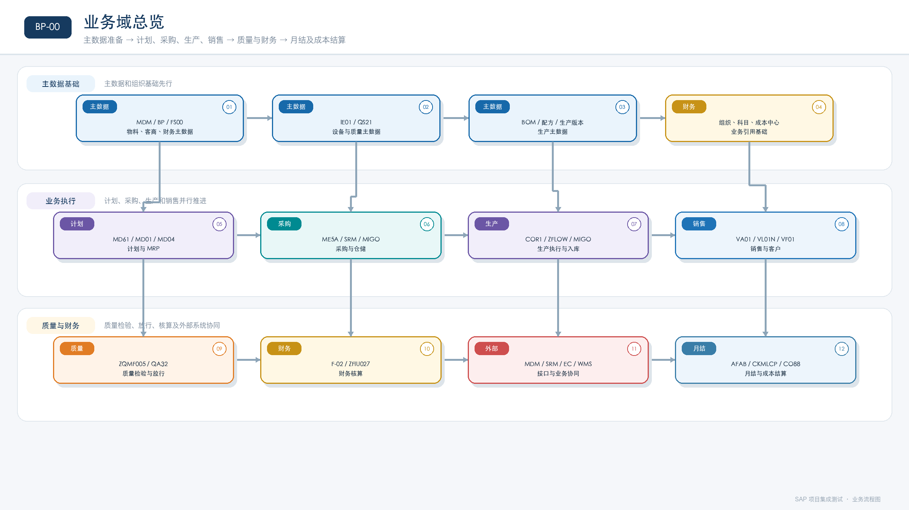

### 3.1 推荐的端到端测试顺序

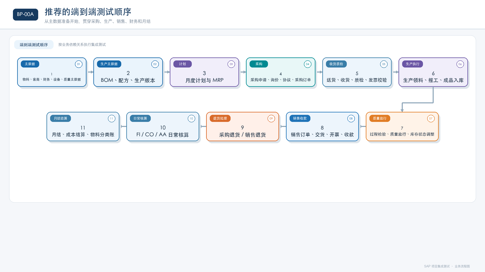

## 4. 重点业务流程图

### 4.1 主数据准备流程

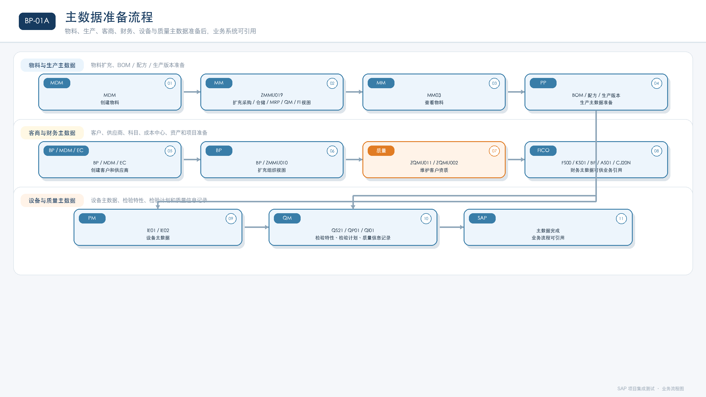

**相关场景：** `TSTA01`、`TSTA02`、`TSTA03`、`TSTA04`、`TSTA05`、`TSTA06`、`TSTAA01`、`TSTAA06`。

### 4.2 采购到付款流程（P2P）

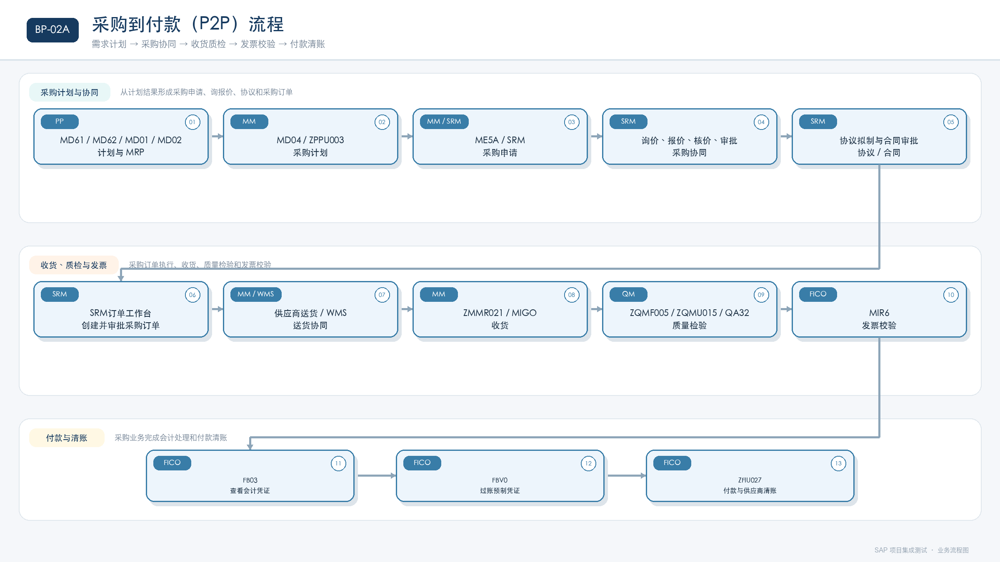

**相关场景：** `TSTA07`、`TSTA09`、`TSTA11`、`TSTA20`、`TSTA21`、`TSTAA04`、`TSTAA07`、`TSTAA09`。

### 4.3 生产执行与成品入库流程

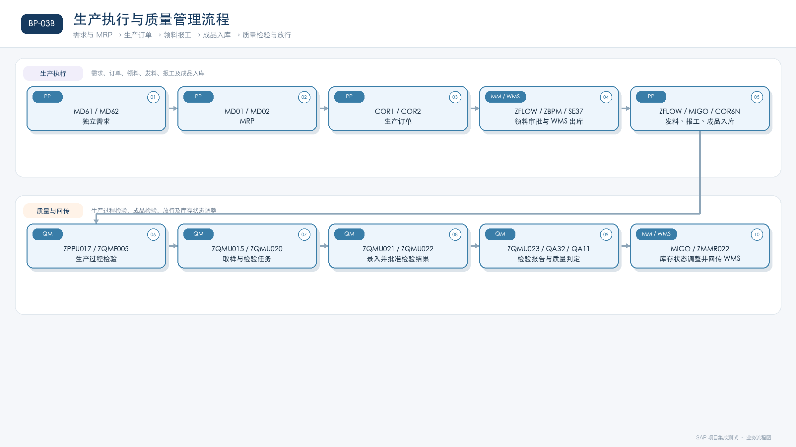

**相关场景：** `TSTA07`、`TSTA18`、`TSTA25`、`TSTA29`。

### 4.4 质量检验、取样、放行与库存状态流程

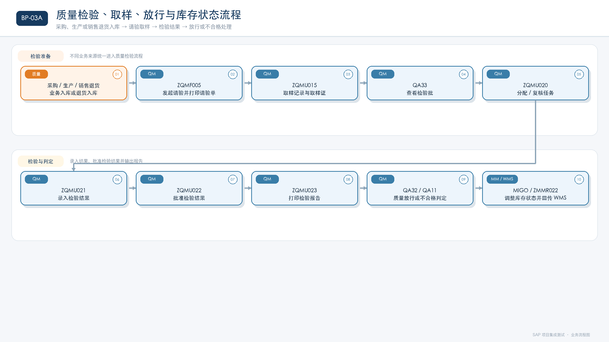

**相关场景：** `TSTA05`、`TSTA10`、`TSTA11`、`TSTA23`、`TSTA24`、`TSTA29`。

### 4.5 销售到收款流程（O2C）

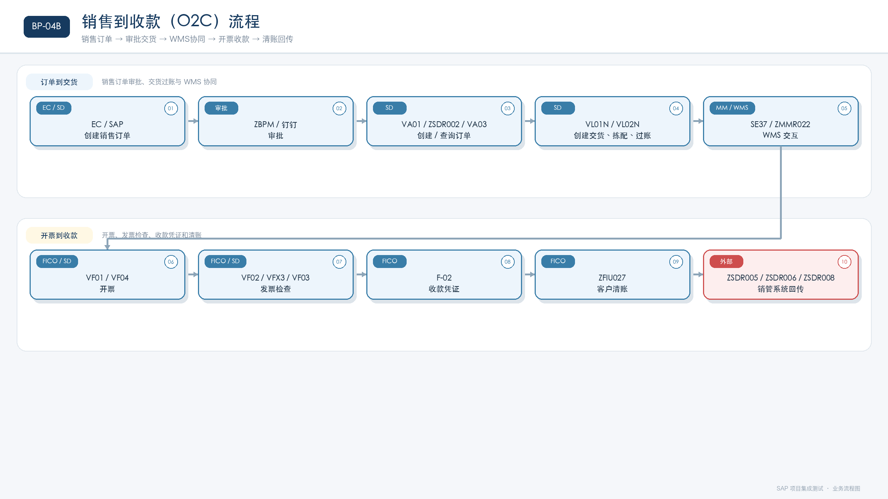

**相关场景：** `TSTA07`、`TSTA10`、`TSTAA02`、`TSTAA03`。

### 4.6 退货流程

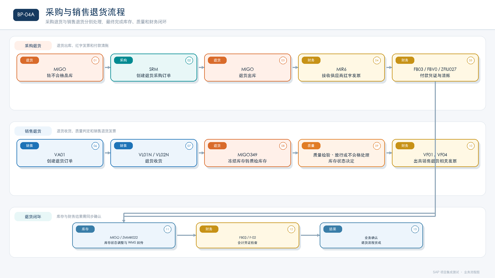

**相关场景：** `TSTA09`、`TSTA10`、`TSTAA02`。

### 4.7 财务日常作业流程

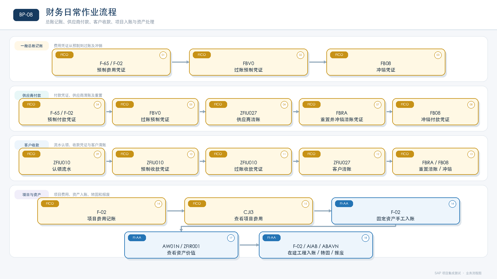

**相关场景：** `TSTA12`。

### 4.8 标准成本估算流程

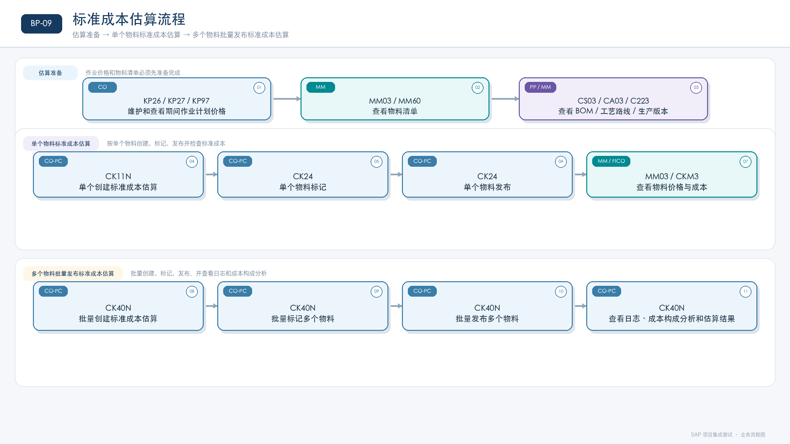

**相关场景：** `TSTA12`。

### 4.9 财务月结流程

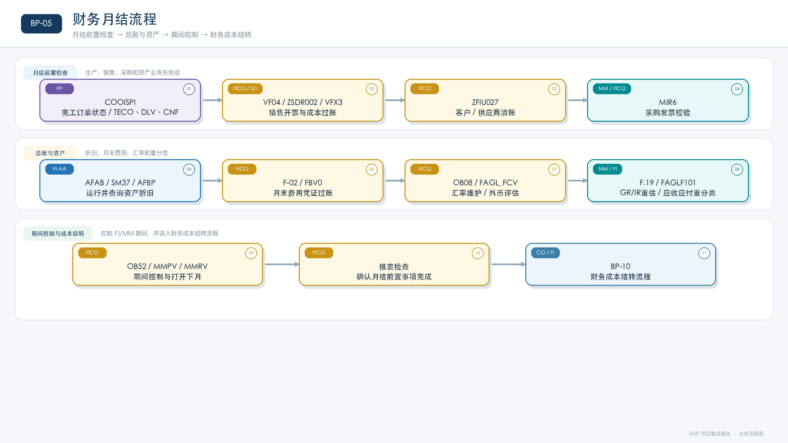

**相关场景：** `TSTA13`。

### 4.10 财务成本结转流程

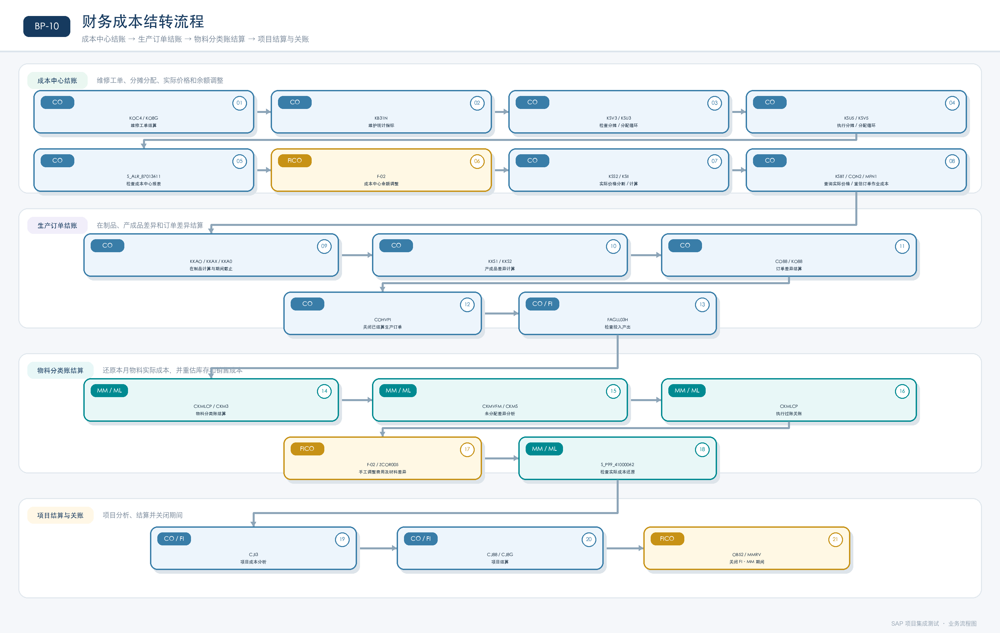

**相关场景：** `TSTA13`。

### 4.11 设备维护、维修、校准和验收流程

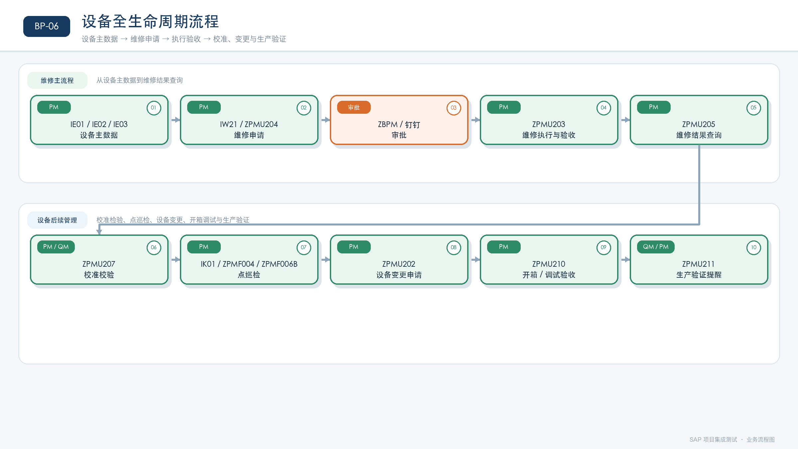

**相关场景：** `TSTA04`、`TSTA14`、`TSTA15`、`TSTA16`、`TSTA26`、`TSTA27`、`TSTA28`。

### 4.12 外部系统集成流程

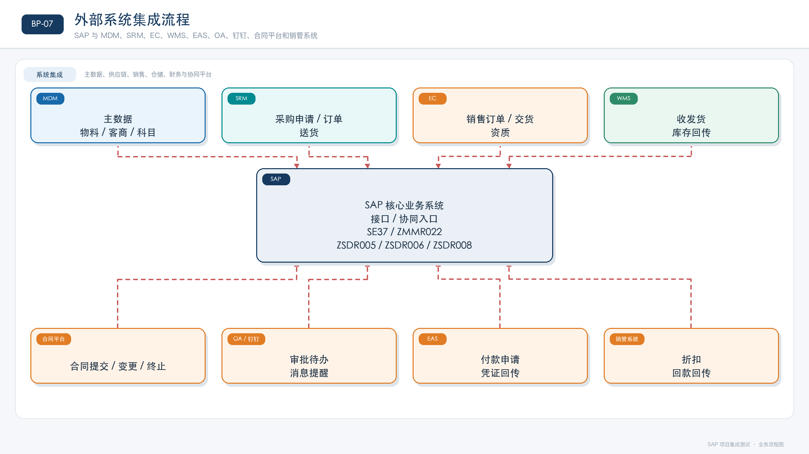

**相关场景：** `TSTAA01` 至 `TSTAA09`。

## 5. 事务码与工作台总览

> 下表为从明细工作表“事务代码”列提取的去重结果。Excel 中的组合值（例如 `VF01/VF04`）按原组合展示；外部系统工作台也保留，便于集成测试执行。

### 5.1 EAS（外部系统）

| 事务码/入口 | 出现的场景 |
|---|---|
| `EAS系统` | TSTAA09 |

### 5.2 EC（外部系统）

| 事务码/入口 | 出现的场景 |
|---|---|
| `E-C系统` | TSTA06, TSTAA01 |

### 5.3 FICO / 财务会计

| 事务码/入口 | 出现的场景 |
|---|---|
| `ABAVN` | TSTA12 |
| `AFAB` | TSTA13 |
| `AFBP` | TSTA13 |
| `AIAB` | TSTA12 |
| `AS01` | TSTA03, TSTAA05 |
| `AS02` | TSTA03 |
| `AS03` | TSTA03 |
| `AW01N` | TSTA12 |
| `BP` | TSTA03, TSTA06, TSTA07, TSTA09, TSTA10, TSTAA01 |
| `CJ20N` | TSTA03 |
| `CJ8G（多个）` | TSTA13 |
| `CJI3` | TSTA12, TSTA13 |
| `CK11N` | TSTA12 |
| `CK24` | TSTA12 |
| `CK40N` | TSTA12 |
| `CKM3` | TSTA13 |
| `CKMLCP` | TSTA13 |
| `CKMS` | TSTA13 |
| `CKMVFM` | TSTA13 |
| `CO88` | TSTA13 |
| `COHVPI(与生产确认可以关闭的工单）` | TSTA13 |
| `CON2` | TSTA13 |
| `F-02` | TSTA12, TSTA13, TSTAA03, TSTAA05 |
| `F-02预制凭证` | TSTA13 |
| `F-65` | TSTA12 |
| `F.19` | TSTA13 |
| `FAGL_FCV` | TSTA13 |
| `FAGLF101` | TSTA13 |
| `FAGLL03H` | TSTA13 |
| `FB03` | TSTA07, TSTA09 |
| `FB08` | TSTA12 |
| `FBRA` | TSTA12 |
| `FBV0` | TSTA07, TSTA09, TSTA12, TSTA13 |
| `FBV2` | TSTA07 |
| `FBV2  FBV0` | TSTAA05 |
| `FBV3` | TSTA09 |
| `FS00` | TSTA03, TSTAA01 |
| `IDCNACCTBLN` | TSTA13 |
| `KB31N` | TSTA13 |
| `KKA0` | TSTA13 |
| `KKAO` | TSTA13 |
| `KKAX（单个）` | TSTA13 |
| `KKS1` | TSTA13 |
| `KKS2（单个）` | TSTA13 |
| `KO88（单个）` | TSTA13 |
| `KO8G` | TSTA13 |
| `KOC4` | TSTA13 |
| `KP26` | TSTA12 |
| `KP27` | TSTA12 |
| `KP97` | TSTA12 |
| `KS01` | TSTA03 |
| `KS02` | TSTA03 |
| `KS03` | TSTA03 |
| `KSBT` | TSTA13 |
| `KSH3` | TSTA03 |
| `KSII` | TSTA13 |
| `KSS2` | TSTA13 |
| `KSU3` | TSTA13 |
| `KSU5` | TSTA13 |
| `KSV3` | TSTA13 |
| `KSV5` | TSTA13 |
| `MB52` | TSTA07, TSTA09, TSTA17 |
| `MFN1（单个）` | TSTA13 |
| `MI07` | TSTA17 |
| `MIGO` | TSTA07, TSTA09, TSTA10, TSTA17, TSTA19, TSTA20, TSTA21, TSTA23 |
| `MIR6` | TSTA07, TSTA09, TSTA13 |
| `MM03` | TSTA01, TSTA02, TSTA07, TSTA10, TSTA12 |
| `MM60` | TSTA12 |
| `MMPV` | TSTA13 |
| `MMRV` | TSTA13 |
| `OB08` | TSTA13 |
| `OB52` | TSTA13 |
| `S_ALR_87013611` | TSTA13 |
| `S_P99_41000062` | TSTA13 |
| `SM37` | TSTA13 |
| `VF01` | TSTA07, TSTA10, TSTAA03 |
| `VF02` | TSTA07, TSTA10, TSTAA03 |
| `VF03` | TSTA07, TSTA10 |
| `VF04` | TSTA07, TSTA10, TSTA13 |
| `VF05N` | TSTA10 |
| `VFX3` | TSTA07, TSTA10, TSTA13 |
| `VL03N` | TSTA07, TSTA10 |
| `WBS：CJ88（单个）` | TSTA13 |
| `ZBPM` | TSTA06, TSTA07, TSTA10, TSTA14, TSTA16, TSTA18, TSTA19, TSTA25, TSTA28, TSTAA02, TSTAA03 |
| `zcor005` | TSTA13 |
| `ZFIR001` | TSTA12 |
| `ZFIR002(现金流量表）` | TSTA13 |
| `zfir007` | TSTA03 |
| `ZFIR043` | TSTA07, TSTA10 |
| `ZFIU010` | TSTA07, TSTA12 |
| `ZFIU027` | TSTA07, TSTA09, TSTA13 |
| `zfiu027` | TSTA12 |
| `ZMMU019` | TSTA01 |
| `ZSDR002` | TSTA07, TSTA10, TSTA13, TSTAA02 |
| `评估类1：默认评估类` | TSTA01 |
| `评估类2：在途评估类` | TSTA01 |
| `金税盘开票` | TSTA07, TSTA10 |

### 5.4 MDM（外部系统）

| 事务码/入口 | 出现的场景 |
|---|---|
| `MDM` | TSTA01, TSTAA06 |
| `MDM系统` | TSTA06, TSTAA01 |

### 5.5 MM / 物料管理

| 事务码/入口 | 出现的场景 |
|---|---|
| `BP` | TSTA03, TSTA06, TSTA07, TSTA09, TSTA10, TSTAA01 |
| `MB51` | TSTA07 |
| `MB52` | TSTA07, TSTA09, TSTA17 |
| `ME11` | TSTA21 |
| `MI02` | TSTA17 |
| `MI05` | TSTA17 |
| `MI09` | TSTA17 |
| `MI22` | TSTA17 |
| `MIGO` | TSTA07, TSTA09, TSTA10, TSTA17, TSTA19, TSTA20, TSTA21, TSTA23 |
| `MIGO-322` | TSTA11 |
| `MM03` | TSTA01, TSTA02, TSTA07, TSTA10, TSTA12 |
| `MMBE` | TSTA07, TSTA10, TSTA11 |
| `SE37` | TSTA07, TSTA09, TSTA10, TSTA11, TSTA17, TSTA20, TSTA21, TSTA25 |
| `VL02N` | TSTA07, TSTA10, TSTAA02 |
| `ZFLOW` | TSTA07, TSTA11, TSTA18, TSTA19, TSTA25 |
| `ZMMF002` | TSTA07 |
| `ZMMR021` | TSTA07 |
| `ZMMR022` | TSTA07, TSTA09, TSTA10, TSTA11, TSTA17, TSTA20, TSTA21, TSTA25 |
| `ZMMR022（待开发）` | TSTA07, TSTA10 |
| `ZMMU019` | TSTA01 |
| `ZQMF005` | TSTA07, TSTA10, TSTA11 |
| `ZQMU015` | TSTA07, TSTA10, TSTA11, TSTA29 |
| `ZRF011` | TSTA19 |
| `ZRF012` | TSTA19 |
| `ZRF014` | TSTA19 |
| `函数名：ZWMSFU008` | TSTA07, TSTA10 |

### 5.6 OA（外部系统）

| 事务码/入口 | 出现的场景 |
|---|---|
| `OA` | TSTAA08 |

### 5.7 PM / 设备管理

| 事务码/入口 | 出现的场景 |
|---|---|
| `IE01` | TSTA04 |
| `IE02` | TSTA04 |
| `IE03` | TSTA04, TSTA14, TSTA16, TSTA28 |
| `IK01` | TSTA27 |
| `IK02` | TSTA27 |
| `IK03` | TSTA27 |
| `IW21` | TSTA14 |
| `IW22` | TSTA14 |
| `ZBPM` | TSTA06, TSTA07, TSTA10, TSTA14, TSTA16, TSTA18, TSTA19, TSTA25, TSTA28, TSTAA02, TSTAA03 |
| `ZFLOW` | TSTA07, TSTA11, TSTA18, TSTA19, TSTA25 |
| `ZPMF001` | TSTA27 |
| `ZPMF004` | TSTA27 |
| `ZPMF006A` | TSTA27 |
| `ZPMF006B` | TSTA27 |
| `ZPMF007A` | TSTA27 |
| `ZPMU202` | TSTA16 |
| `ZPMU203` | TSTA14 |
| `ZPMU204` | TSTA14 |
| `ZPMU205` | TSTA14 |
| `ZPMU207` | TSTA15 |
| `ZPMU210` | TSTA28 |
| `ZPMU211` | TSTA26 |
| `钉钉` | TSTA07, TSTA10, TSTA14, TSTA16, TSTA25, TSTA27, TSTA28, TSTAA02, TSTAA03, TSTAA08 |
| `顾问手工执行` | TSTA14 |

### 5.8 PP / 生产管理

| 事务码/入口 | 出现的场景 |
|---|---|
| `C201` | TSTA02 |
| `C202` | TSTA02 |
| `C203` | TSTA02, TSTA07 |
| `C223` | TSTA02, TSTA07, TSTA21 |
| `CC01` | TSTA02 |
| `CC02` | TSTA02 |
| `CC03` | TSTA02 |
| `COR1` | TSTA07 |
| `COR2` | TSTA07 |
| `COR6N` | TSTA07 |
| `CR05` | TSTA02 |
| `CRC1` | TSTA02 |
| `CRC2` | TSTA02 |
| `CRC3` | TSTA02 |
| `CS01` | TSTA02, TSTA21 |
| `CS02` | TSTA02 |
| `CS03` | TSTA02, TSTA07 |
| `CS13` | TSTA02 |
| `MD01` | TSTA07 |
| `MD02` | TSTA07 |
| `MD04` | TSTA07 |
| `MD16` | TSTA07 |
| `MD61` | TSTA07 |
| `MD62` | TSTA07 |
| `MD63` | TSTA07 |
| `ME5A` | TSTA07 |
| `MM02` | TSTA29 |
| `MM03` | TSTA01, TSTA02, TSTA07, TSTA10, TSTA12 |
| `ZBPM` | TSTA06, TSTA07, TSTA10, TSTA14, TSTA16, TSTA18, TSTA19, TSTA25, TSTA28, TSTAA02, TSTAA03 |
| `ZFLOW` | TSTA07, TSTA11, TSTA18, TSTA19, TSTA25 |
| `ZMMU019` | TSTA01 |
| `ZPPF001` | TSTA07 |
| `ZPPU001` | TSTA02 |
| `ZPPU003` | TSTA07 |
| `ZPPU013` | TSTA07 |
| `ZPPU014` | TSTA25 |
| `ZPPU017` | TSTA07 |
| `ZPPU019` | TSTA07, TSTA29 |
| `ZQMF005` | TSTA07, TSTA10, TSTA11 |
| `钉钉` | TSTA07, TSTA10, TSTA14, TSTA16, TSTA25, TSTA27, TSTA28, TSTAA02, TSTAA03, TSTAA08 |

### 5.9 QM / 质量管理

| 事务码/入口 | 出现的场景 |
|---|---|
| `C202` | TSTA02 |
| `MIGO349` | TSTA10 |
| `MM03` | TSTA01, TSTA02, TSTA07, TSTA10, TSTA12 |
| `MMBE` | TSTA07, TSTA10, TSTA11 |
| `QA11` | TSTA07, TSTA10, TSTA11 |
| `QA13` | TSTA07, TSTA10, TSTA11 |
| `QA32` | TSTA07, TSTA10, TSTA11 |
| `QA33` | TSTA07, TSTA10, TSTA11 |
| `QI01` | TSTA05 |
| `QI02` | TSTA05 |
| `QI03` | TSTA05 |
| `QP01` | TSTA05 |
| `QP02` | TSTA05 |
| `QP03` | TSTA05, TSTA07, TSTA10 |
| `QS21` | TSTA05 |
| `QS23` | TSTA05 |
| `QS28` | TSTA05 |
| `ZBPM` | TSTA06, TSTA07, TSTA10, TSTA14, TSTA16, TSTA18, TSTA19, TSTA25, TSTA28, TSTAA02, TSTAA03 |
| `ZFLOW` | TSTA07, TSTA11, TSTA18, TSTA19, TSTA25 |
| `ZMMU019` | TSTA01 |
| `ZPMU211` | TSTA26 |
| `ZQMB001` | TSTA24 |
| `ZQMR005` | TSTA05 |
| `ZQMRF` | TSTA23 |
| `ZQMRF25` | TSTA23 |
| `ZQMRF35` | TSTA23 |
| `ZQMU002` | TSTA05, TSTA06, TSTAA02 |
| `ZQMU012` | TSTA05 |
| `ZQMU015` | TSTA07, TSTA10, TSTA11, TSTA29 |
| `ZQMU017` | TSTA23 |
| `ZQMU018` | TSTA24 |
| `ZQMU019` | TSTA24 |
| `ZQMU020` | TSTA07, TSTA10, TSTA11, TSTA24, TSTA29 |
| `ZQMU021` | TSTA07, TSTA10, TSTA11, TSTA24, TSTA29 |
| `ZQMU022` | TSTA07, TSTA10, TSTA11, TSTA24, TSTA29 |
| `ZQMU023` | TSTA07, TSTA10, TSTA11, TSTA24, TSTA29 |
| `ZQMU031` | TSTA23 |
| `ZQMU032` | TSTA23 |

### 5.10 SD / 销售与分销

| 事务码/入口 | 出现的场景 |
|---|---|
| `BP` | TSTA03, TSTA06, TSTA07, TSTA09, TSTA10, TSTAA01 |
| `F-02` | TSTA12, TSTA13, TSTAA03, TSTAA05 |
| `MM03` | TSTA01, TSTA02, TSTA07, TSTA10, TSTA12 |
| `VA01` | TSTA07, TSTA10, TSTAA03 |
| `VA02` | TSTA10, TSTAA02 |
| `VA03` | TSTA07, TSTAA02 |
| `VA05` | TSTAA02 |
| `VCUST` | TSTA06, TSTAA01 |
| `VF01` | TSTA07, TSTA10, TSTAA03 |
| `VF02` | TSTA07, TSTA10, TSTAA03 |
| `VL01N` | TSTA07, TSTA10, TSTAA02 |
| `VL02N` | TSTA07, TSTA10, TSTAA02 |
| `VL09` | TSTAA02 |
| `VLPOD` | TSTA07, TSTAA02 |
| `ZBPM` | TSTA06, TSTA07, TSTA10, TSTA14, TSTA16, TSTA18, TSTA19, TSTA25, TSTA28, TSTAA02, TSTAA03 |
| `ZMMU010` | TSTA06, TSTAA01 |
| `ZQMU002` | TSTA05, TSTA06, TSTAA02 |
| `ZQMU011` | TSTA06 |
| `ZSDF001` | TSTA07 |
| `ZSDR002` | TSTA07, TSTA10, TSTA13, TSTAA02 |
| `ZSDR005` | TSTAA03 |
| `ZSDR006` | TSTAA03 |
| `ZSDR008` | TSTAA03 |
| `钉钉` | TSTA07, TSTA10, TSTA14, TSTA16, TSTA25, TSTA27, TSTA28, TSTAA02, TSTAA03, TSTAA08 |

### 5.11 SD/WMS（接口或外部入口）

| 事务码/入口 | 出现的场景 |
|---|---|
| `VL02N` | TSTA07, TSTA10, TSTAA02 |

### 5.12 SHE（外部系统/工作台）

| 事务码/入口 | 出现的场景 |
|---|---|
| `ZBPM` | TSTA06, TSTA07, TSTA10, TSTA14, TSTA16, TSTA18, TSTA19, TSTA25, TSTA28, TSTAA02, TSTAA03 |
| `ZFLOW` | TSTA07, TSTA11, TSTA18, TSTA19, TSTA25 |

### 5.13 SRM（外部系统/工作台）

| 事务码/入口 | 出现的场景 |
|---|---|
| `SRM工作台首页` | TSTAA08 |
| `UX-采购方结算单工作台` | TSTA07, TSTA09 |
| `UX采购方结算单工作台` | TSTAA09 |
| `供应商录入` | TSTAA06 |
| `协议拟制` | TSTA07, TSTAA07 |
| `协议控制` | TSTAA07 |
| `审批工作台` | TSTA07, TSTAA06 |
| `客户收货记录` | TSTA07 |
| `寻源结果查询` | TSTA07 |
| `我发起的协议` | TSTA07 |
| `我收到的订单` | TSTA07, TSTA09 |
| `我的送货单` | TSTA07 |
| `收货工作台` | TSTA07 |
| `线下寻源结果录入` | TSTA07 |
| `订单工作台` | TSTA07, TSTA09 |
| `订单工作台（账户分配类别Q？？）` | TSTA07 |
| `订单确认` | TSTA07 |
| `询价工作台` | TSTA07 |
| `送货单创建` | TSTA07 |
| `送货单取消` | TSTA07 |
| `送货单查询` | TSTA07 |
| `采购申请审批工作台` | TSTAA08 |
| `采购申请工作台` | TSTA07 |

### 5.14 PP（原表模块小写）

| 事务码/入口 | 出现的场景 |
|---|---|
| `COOISPI` | TSTA13 |

### 5.15 合同平台（外部系统）

| 事务码/入口 | 出现的场景 |
|---|---|
| `合同平台` | TSTAA07 |

### 5.16 技术部/未分类入口

| 事务码/入口 | 出现的场景 |
|---|---|
| `ZBPM` | TSTA06, TSTA07, TSTA10, TSTA14, TSTA16, TSTA18, TSTA19, TSTA25, TSTA28, TSTAA02, TSTAA03 |
| `ZFLOW` | TSTA07, TSTA11, TSTA18, TSTA19, TSTA25 |

### 5.17 未填写模块/场景步骤

| 事务码/入口 | 出现的场景 |
|---|---|
| `MDM` | TSTA01, TSTAA06 |
| `MIGO` | TSTA07, TSTA09, TSTA10, TSTA17, TSTA19, TSTA20, TSTA21, TSTA23 |
| `ZFLOW` | TSTA07, TSTA11, TSTA18, TSTA19, TSTA25 |
| `ZMMU019` | TSTA01 |

### 5.18 钉钉（外部系统）

| 事务码/入口 | 出现的场景 |
|---|---|
| `钉钉` | TSTA07, TSTA10, TSTA14, TSTA16, TSTA25, TSTA27, TSTA28, TSTAA02, TSTAA03, TSTAA08 |

## 6. 各测试场景的步骤与事务码明细

> “输入/关键数据”和“凭证/结果”仅在 Excel 已填写时列出；空白不代表流程不需要该数据，而是原测试脚本没有填写。

### TSTA01｜物料主数据工厂视图扩充

- 来源工作表：`TSTA01-物料主数据工厂视图扩充`

| 步骤 | 模块/系统 | 业务动作 | 事务码/工作台 | 输入/关键数据 | 凭证/结果 |
|---|---|---|---|---|---|
| **** |  | **物料主数据新建** |  |  |  |
|  |  | 物料主数据新建 | MDM |  |  |
| **** |  | **采购视图维护** |  |  |  |
| MM | MM | 仓储视图维护 | ZMMU019 |  |  |
| **** |  | **MRP视图维护** |  |  |  |
| PP | PP | MRP视图维护 | ZMMU019 |  |  |
| **** |  | **质量视图维护** |  |  |  |
| QM | QM | 质量视图维护 | ZMMU019 |  |  |
| **** |  | **财务视图维护** |  |  |  |
| FICO | FICO | 财务视图维护 | ZMMU019 / 评估类1：默认评估类 / 评估类2：在途评估类 |  |  |
| **** |  | **本地IT审核** |  |  |  |
|  |  | 本地IT审核 | ZMMU019 |  |  |
| **** |  | **MM03查看** |  |  |  |
| MM | MM | 物料查看 | MM03 |  |  |

### TSTA02｜生产主数据维护场景

- 来源工作表：`TSTA02-PP生产主数据`

| 步骤 | 模块/系统 | 业务动作 | 事务码/工作台 | 输入/关键数据 | 凭证/结果 |
|---|---|---|---|---|---|
| **1** |  | **BOM创建/修改** |  |  |  |
| 1.01 | PP | 查询物料数据是否存在 | MM03 |  |  |
| 1.02 | PP | 创建BOM | CS01 |  |  |
| 1.03 | PP | 查询BOM | CS03 |  |  |
| 1.04 | PP | 审批BOM | ZPPU001 |  |  |
| 1.05 | PP | 创建ECN号 | CC01 |  |  |
| 1.06 | PP | 查询ECN号 | CC03 |  |  |
| 1.07 | PP | 变更ECN | CC02 |  |  |
| 1.08 | PP | 维护BOM | CS02 |  |  |
| 1.09 | PP | 审批BOM | ZPPU001 |  |  |
| 1.1 | PP | 查询BOM | CS03/CS13 |  |  |
| **2** |  | **主配方维护流程** |  |  |  |
| 2.01 | PP | 查询资源是否存在 | CR05 |  |  |
| 2.02 | PP | 创建资源 | CRC1 |  |  |
| 2.03 | PP | 维护资源 | CRC2 |  |  |
| 2.04 | PP | 查询资源是否存在 | CRC3 |  |  |
| 2.05 | PP | 创建主配方 | C201 |  |  |
| 2.06 | PP | 维护主配方 | C202 |  |  |
| 2.07 | QM | 维护主配方检验特性 | C202 |  |  |
| 2.08 | PP | 查询主配方 | C203 |  |  |
| **3** |  | **主配方维护流程** |  |  |  |
| 3.01 | PP | 查询生产版本是否存在 | C223 |  |  |
| 3.02 | PP | 创建生产版本 | C223 |  |  |
| 3.03 | PP | 修改生产版本 | C223 |  |  |

### TSTA04｜设备主数据维护

- 来源工作表：`TSTA04-设备主数据维护`

| 步骤 | 模块/系统 | 业务动作 | 事务码/工作台 | 输入/关键数据 | 凭证/结果 |
|---|---|---|---|---|---|
| **1** |  | **设备信息** |  |  |  |
| 1.01 | PM | 创建设备信息 | IE01 |  |  |
| 1.02 | PM | 修改设备信息 | IE02 |  |  |
| 1.03 | PM | 查看设备 | IE03 |  |  |

### TSTA03｜财务主数据维护

- 来源工作表：`TSTA03-财务主数据维护`

| 步骤 | 模块/系统 | 业务动作 | 事务码/工作台 | 输入/关键数据 | 凭证/结果 |
|---|---|---|---|---|---|
| **1** |  | **科目主数据** |  |  |  |
| 1.01 | FICO | 科目查询 | FS00 |  |  |
| 1.02 | FICO | 科目清单查询 | zfir007 |  |  |
| **2** |  | **成本中心** |  |  |  |
| 2.01 | FICO | 成本中心创建 | KS01 |  |  |
| 2.02 | FICO | 成本中心修改 | KS02 |  |  |
| 2.03 | FICO | 成本中心显示 | KS03 |  |  |
| 2.04 | FICO | 成本中心组查看 | KSH3 |  |  |
| **3** |  | **客商主数据** |  |  |  |
| 3.01 | FICO | 财务客商创建 | BP |  |  |
| 3.02 | FICO | 客商查看 | BP |  |  |
| **4** |  | **资产主数据** |  |  |  |
| 4.01 | FICO | 创建资产卡片 | AS01 |  |  |
| 4.02 | FICO | 修改资产卡片 | AS02 |  |  |
| 4.03 | FICO | 显示资产卡片 | AS03 |  |  |
| **5** |  | **项目主数据** |  |  |  |
| 5.01 | FICO | 创建WBS | CJ20N |  |  |
| 5.02 | FICO | 维护WBS结算规则 | CJ20N |  |  |

### TSTA05｜质量主数据维护

- 来源工作表：`TSTA05-质量主数据维护`

| 步骤 | 模块/系统 | 业务动作 | 事务码/工作台 | 输入/关键数据 | 凭证/结果 |
|---|---|---|---|---|---|
| **1** |  | **检验特性维护** |  |  |  |
| 1.01 | QM | 查询检验特性最大编码 | QS28 |  |  |
| 1.02 | QM | 检验特性创建 | QS21 |  |  |
| 1.03 | QM | 检验特性修改 | QS23 |  |  |
| **2** |  | **检验计划维护** |  |  |  |
| 2.01 | QM | 查询检验计划是否存在 | QP03 |  |  |
| 2.02 | QM | 单个创建检验计划 | QP01/QP02/QP03 |  |  |
| 2.03 | QM | 检验计划修改 | QP02 |  |  |
| 2.04 | QM | 检验计划禁用 | QP02 |  |  |
| 2.05 | QM | 检验计划批量维护 | ZQMU012 |  |  |
| 2.06 | QM | 检验计划查询 | QP03 |  |  |
| **3** |  | **质量信息记录维护** |  |  |  |
| 3.01 | QM | 根据物料+供应商+工厂，查询质量信息记录是否存在 | QI03 |  |  |
| 3.02 | QM | 根据物料+供应商+工厂，创建质量信息记录 | QI01 |  |  |
| 3.03 | QM | 根据物料+供应商+工厂，修改质量信息记录 | QI02 |  |  |
| 3.04 | QM | 根据物料+供应商+工厂，查询质量信息记录报表 | ZQMR005 |  |  |
| 3.05 | QM | 根据物料供应商工厂，查询维护资质 | ZQMU002 |  |  |

### TSTA06｜客商主数据及资质维护

- 来源工作表：`TSTA06-客商主数据及资质维护`

| 步骤 | 模块/系统 | 业务动作 | 事务码/工作台 | 输入/关键数据 | 凭证/结果 |
|---|---|---|---|---|---|
| **1** |  | **客户信息收集** |  |  |  |
| 1.01 | SD | 客户基础信息 |  |  |  |
| 1.02 | SD | 客户GSP信息 |  |  |  |
| 1.03 | SD | 客户查询 | VCUST/BP |  |  |
| **2** |  | **统销客户基础信息维护** |  |  |  |
| 2.01 | EC | 在E-C系统维护客户基础信息 | E-C系统 |  |  |
| 2.02 | MDM | MDM系统创建客户并下发SAP | MDM系统 |  |  |
| 2.03 | SD | 查询客户信息 | VCUST/BP |  |  |
| **3** |  | **自销客户基础信息维护** |  |  |  |
| 3.01 | MDM | 在MDM系统创建客户并下发SAP | MDM系统 |  |  |
| 3.02 | SD | 查询客户信息 | VCUST/BP |  |  |
| **4** |  | **扩充客户公司代码、销售视图** |  |  |  |
| 4.01 | SD | 扩充客户公司代码、销售视图 | BP/ZMMU010 |  |  |
| 4.02 | SD | 修改客户公司代码、销售视图 | BP |  |  |
| 4.03 | SD | 查询客户信息 | VCUST/BP |  |  |
| **5** |  | **客商GSP信息维护** |  |  |  |
| 5.01 | SD | 维护客户经营范围并提交流程审批 | ZQMU011 |  |  |
| 5.02 | SD | 经营范围审批 | ZBPM |  |  |
| 5.03 | SD | 维护客户GSP资质信息 | ZQMU002 |  |  |
| 5.04 | SD | 审批客户GSP资质信息 | ZBPM |  |  |
| 5.05 | SD | 查询客户资质信息 | ZQMU002 |  |  |
| 5.06 | FICO | 维护客户开票信息 | ZBPM |  |  |
| 5.07 | FICO | 审批客户开票信息 | ZBPM |  |  |

### TSTA07｜采购到销售场景

- 来源工作表：`TSTA07-采购到销售场景`

| 步骤 | 模块/系统 | 业务动作 | 事务码/工作台 | 输入/关键数据 | 凭证/结果 |
|---|---|---|---|---|---|
| **1** |  | **主数据查询** |  |  |  |
| 1.01 | MM | 物料主数据查询 | MM03 |  |  |
| 1.02 | PP | BOM查询 | CS03 |  |  |
| 1.03 | PP | 主配方查询 | C203 |  |  |
| 1.04 | PP | 生产版本查询 | C223 |  |  |
| 1.05 | SD | 客户查询 | BP |  |  |
| 1.06 | MM | 供应商查询 | BP |  |  |
| 1.07 | QM | 检验计划查询(检验标准) | QP03 |  |  |
| **2** |  | **月度计划处理** |  |  |  |
| 2.01 | PP | 创建月度生产计划 | MD61 |  |  |
| 2.02 | PP | 独立需求修改 | MD62 |  |  |
| 2.03 | PP | 独立需求查询 | MD63 |  |  |
| 2.04 | PP | 运行MRP | MD01/MD02 |  |  |
| 2.05 | PP | 查询MRP运行结果 | MD04 |  |  |
| 2.06 | PP | 采购计划重分配 | ZPPU003 |  |  |
| **3** |  | **生产物料采购申请维护** |  |  |  |
| 3.01 | PP | 采购计划查询 | MD04 |  |  |
| 3.02 | PP | 采购计划修订 |  |  |  |
| 3.03 | PP | 采购计划重分配 | ZPPU013 |  |  |
| 3.04 | PP | 查询采购申请 | ME5A |  |  |
| **4** |  | **生产耗材采购申请维护** |  |  |  |
| 4.01 | SRM | 创建非生产物资采购申请 | 采购申请工作台 |  |  |
| 4.02 | SRM | 审批非生产物资采购申请 | 审批工作台 |  |  |
| **5** |  | **采购申请转询价** |  |  |  |
| 5.01 | SRM | 引用采购申请创建询价单，维护询价单内容后点击发布 / 注：选择生产类采购申请询比价模板，供应商选择10月10日测试时添加的供应商 | 询价工作台 |  |  |
| 5.02 | SRM | 报价，非协同供应商使用由采购员录入价格，协同供应商则登录供应商账号进行报价 | 线下寻源结果录入 |  |  |
| 5.03 | SRM | 核价 | 询价工作台 |  |  |
| 5.04 | SRM | 核价结果审批 | 审批工作台 |  |  |
| 5.05 | SRM | 询比价结果查询 | 寻源结果查询 |  |  |
| **6** |  | **询价转协议** |  |  |  |
| 6.01 | SRM | 引用寻源结果拟制协议 / 注：须使用JMKX011725/Hand1234该账号才能成功跳转至合同平台 | 协议拟制 |  |  |
| 6.02 | 合同平台 | 合同审批及用印 |  |  |  |
| 6.03 | SRM | 协议查询 | 我发起的协议 |  |  |
| **7** |  | **生产物料采购申请转采购订单** |  |  |  |
| 7.01 | SRM | 创建采购订单 | 订单工作台 |  |  |
| 7.02 | SRM | 手工创建免费采购订单 | 订单工作台 |  |  |
| 7.03 | SRM | 提交采购订单 | 订单工作台（账户分配类别Q？？） |  |  |
| 7.04 | SRM | 采购订单查询 | 订单工作台 |  |  |
| 7.05 | SRM | 供应商确认订单 | 订单确认 |  |  |
| 7.06 | SRM | 供应商查询订单 | 我收到的订单 |  |  |
| 7.07 | SRM | 变更已生成的采购订单 | 订单工作台 |  |  |
| 7.08 | SRM | 取消“已提交”的采购订单 | 订单工作台 |  |  |
| 7.09 | SRM | 取消“已发布”的采购订单 | 订单工作台 |  |  |
| 7.1 | SRM | 取消“已确认”的采购订单 | 订单工作台 |  |  |
| 7.11 | SRM | 关闭“已确认”的采购订单 | 订单工作台 |  |  |
| 7.12 | SRM | 协同供应商创建送货单 | 送货单创建 |  |  |
| 7.13 | SRM | 供应商打印送货单 | 我的送货单 |  |  |
| 7.14 | SRM | 供应商查询送货单 | 我的送货单 |  |  |
| 7.15 | SRM | 供应商取消送货单 | 送货单取消 |  |  |
| 7.16 | SRM | 采购员查询送货单 | 送货单查询 |  |  |
| **8** |  | **非生产采购订单下达** |  |  |  |
| 8.01 | SRM | 创建采购订单 | 订单工作台 |  |  |
| 8.02 | SRM | 手工创建免费采购订单 | 订单工作台 |  |  |
| 8.03 | SRM | 提交采购订单 | 订单工作台 |  |  |
| 8.04 | SRM | 采购订单查询 | 订单工作台 |  |  |
| 8.05 | SRM | 供应商确认订单 | 订单确认 |  |  |
| 8.06 | SRM | 供应商查询订单 | 我收到的订单 |  |  |
| 8.07 | SRM | 变更已生成的采购订单 | 订单工作台 |  |  |
| 8.08 | SRM | 协同供应商创建送货单 | 送货单创建 |  |  |
| 8.09 | SRM | 供应商打印送货单 | 我的送货单 |  |  |
| 8.1 | SRM | 供应商查询送货单 | 我的送货单 |  |  |
| 8.11 | SRM | 供应商取消送货单 | 送货单取消 |  |  |
| 8.12 | SRM | 采购员查询送货单 | 送货单查询 |  |  |
| **9** |  | **采购订单收货** |  |  |  |
| 9.01 | MM | 打印验收单 | ZMMR021 |  |  |
| 9.02 | MM | 采购订单收货 | MIGO |  |  |
| 9.03 | MM | 打印货位卡 | ZMMF002 |  |  |
| 9.04 | MM | 发起请验并打印请验单 | ZQMF005 |  |  |
| 9.05 | MM | WMS接收SAP入库数据后上架 | SE37 |  |  |
| 9.06 | MM | 查看WMS上架结果 | ZMMR022 |  |  |
| 9.07 | QM | 提交并打印取样证 | ZQMU015 |  |  |
| 9.08 | MM | 针对取样证进行复核过账 | ZQMU015 |  |  |
| 9.09 | QM | 查看检验批/检查样品消耗 | QA33 |  |  |
| 9.1 | QM | 分配检验任务至检验员 | ZQMU020 |  |  |
| 9.11 | QM | 录入检验结果并签名 | ZQMU021 |  |  |
| 9.12 | QM | 复核检验结果 | ZQMU020 |  |  |
| 9.13 | QM | 批准检验结果 | ZQMU022 |  |  |
| 9.14 | QM | 维护检验报告单数据，并打印检验报告单 | ZQMU023 |  |  |
| 9.15 | QM | 创建并提交质量放行单 | QA32/QA11 |  |  |
| 9.16 | MM | 传输质量状态转换单至WMS | SE37 |  |  |
| 9.17 | MM | WMS调整完成后回传调整结果至SAP | ZMMR022 |  |  |
| 9.18 | QM | 查看检验批是否已经自动判定接受放行，库存是否已经自动过账至非限制库存 | QA33 |  |  |
| 9.19 | QM | 查看检验批是否已经自动判定接受放行，库存是否已经自动过账至非限制库存 | QA32 |  |  |
| 9.2 | MM | 非生产采购订单收货 | MIGO |  |  |
| 9.21 | MM | 库存查询 | MMBE/MB52 |  |  |
| 9.22 | MM | 冲销收货 | MIGO |  |  |
| 9.23 | MM | 物料凭证查询 | MB51 |  |  |
| 9.24 | FICO | 查询收货会计凭证 | MIGO |  |  |
| 9.25 | SRM | 采购方查看收货记录 | 收货工作台 |  |  |
| 9.26 | SRM | 供应商查看收货记录 | 客户收货记录 |  |  |
| **10** |  | **发票校验** |  |  |  |
| 10.01 | SRM | 采购发票预制-SRM | UX-采购方结算单工作台 |  |  |
| 10.02 | FICO | 采购发票过账 | MIR6 |  |  |
| 10.03 | FICO | 检查会计凭证 | FB03 |  |  |
| 10.04 | EAS | EAS付款申请流程生成预制付款会计凭证 |  |  |  |
| 10.05 | FICO | SAP查询并过账付款凭证 | FBV2&FBV0 |  |  |
| 10.06 | FICO | 付款清账 | ZFIU027 |  |  |
| **11** |  | **生产执行** |  |  |  |
| 11.01 | PP | 生产计划转流程订单/直接创建指令单 | MD04/MD16/COR1 |  |  |
| 11.02 | PP | 流程订单物料齐套性检查下达及推送审批 | COR2 |  |  |
| 11.03 | PP | 指令单审批 | ZBPM |  |  |
| 11.04 | PP | 指令单打印 | ZPPF001 |  |  |
| 11.05 | PP | 生产领料单创建 | ZFLOW |  |  |
| 11.06 | PP | 生产领料单打印 | ZFLOW |  |  |
| 11.07 | MM | SAP推送出库单至WMS | SE37 |  |  |
| 11.08 | MM | WMS出库完成回传出库结果至SAP | ZMMR022 |  |  |
| 11.09 | MM | 参考WMS出库结果发料 | ZFLOW |  |  |
| 11.1 | PP | 生产过程检请验 | ZPPU019 |  |  |
| 11.11 | PP | 生产报工 | COR6N |  |  |
| 11.12 | PP | 线边盘点 | ZPPU017 |  |  |
| 11.13 | PP | 生产退料 | ZFLOW |  |  |
| 11.14 | PP | 生产退料QA审核 | ZBPM |  |  |
| 11.15 | MM | SAP推送入库单至WMS | SE37 |  |  |
| 11.16 | MM | WMS入库完成回传出库结果至SAP | ZMMR022 |  |  |
| 11.17 | MM | 参考WMS入库结果收料 | ZFLOW |  |  |
| 11.18 |  | 半成品生产入库/成品生产寄库 | MIGO\ZFLOW |  |  |
| 11.19 | PP | 半成品寄库 | ZFLOW |  |  |
| 11.2 | MM | SAP推送入库单至WMS | SE37 |  |  |
| 11.21 | MM | WMS入库完成回传出库结果至SAP | ZMMR022 |  |  |
| 11.22 | MM | 参考WMS入库结果收料 | ZFLOW |  |  |
| 11.23 | PP | 发起成品请验并打印请验单 | ZQMF005 |  |  |
| 11.24 | QM | 提交并打印取样证(如需) | ZQMU015 |  |  |
| 11.25 | QM | 进行二次取样，再次提交并打印取样证(如需) | ZQMU015 |  |  |
| 11.26 | MM | SAP推送出库单至WMS | SE37 |  |  |
| 11.27 | MM | WMS出库完成回传出库结果至SAP | ZMMR022 |  |  |
| 11.28 | MM | 参考WMS出库结果发料 | ZFLOW |  |  |
| 11.29 | MM | 针对取样证进行复核过账 | ZQMU015 |  |  |
| 11.3 | QM | 查看检验批/检查样品消耗 | QA32 |  |  |
| 11.31 | QM | 分配检验任务至检验员 | ZQMU020 |  |  |
| 11.32 | QM | 录入检验结果并签名 | ZQMU021 |  |  |
| 11.33 | QM | 复核检验结果 | ZQMU020 |  |  |
| 11.34 | QM | 批准检验结果 | ZQMU022 |  |  |
| 11.35 | QM | 维护检验报告单数据，并打印检验报告单 | ZQMU023 |  |  |
| 11.36 | QM | 质量进行放行 | QA32/QA11 |  |  |
| 11.37 | QM | 查看检验批是否已经自动判定接受放行，库存是否已经自动过账至非限制库存 | QA33/QA13 |  |  |
| 11.38 | MM | 传输质量状态转换单至WMS | SE37 |  |  |
| 11.39 | MM | WMS调整完成后回传调整结果至SAP | ZMMR022 |  |  |
| **12** |  | **销售订单** |  |  |  |
| 10.01 | SD | 创建销售订单 | VA01 |  |  |
| 10.02 | SD | 审批销售订单 | 钉钉/ZBPM |  |  |
| 10.03 | SD | 查询销售订单 | ZSDR002/VA03 |  |  |
| **13** |  | **仓储发货** |  |  |  |
| 13.01 | SD | 创建销售出库单 | VL01N |  |  |
| 13.02 | SD/WMS | 修改/拣配销售出库单 / 艾施特库位发货 | VL02N |  |  |
| 13.03 | SD | 提交销售出库单审批 | VL02N |  |  |
| 13.04 | SD | 审批销售出库单 | 钉钉/ZBPM |  |  |
| 13.05 | SD/WMS | 过帐销售出库单 | VL02N |  |  |
| 13.06 | MM | SAP推送出库单至WMS | SE37 / 函数名：ZWMSFU008 |  |  |
| 13.07 | MM | WMS出库完成回传出库结果至SAP | ZMMR022（待开发） |  |  |
| 13.08 | SD | 打印随货同行单 | ZSDF001 |  |  |
| 13.09 | SD | 销售出库单确认收货（实际操作系统自动确认） | VLPOD |  |  |
| 13.1 | FICO | 查询交货会计凭证 | VL03N |  |  |
| **14** |  | **出具销售发票** |  |  |  |
| 14.01 | FICO | 出具销售发票 | VF01/VF04 |  |  |
| 14.02 | FICO | 下达销售发票 | VF02/VFX3 |  |  |
| 14.03 | FICO | 查询发票凭证 | VF03 |  |  |
| 14.04 | FICO | 开具金税发票 | 金税盘开票 |  |  |
| 14.05 | FICO | 维护金税票和系统票关系 | ZFIR043 |  |  |
| 14.06 | FICO | 出纳回款确认 | ZFIU010 |  |  |
| 14.07 | FICO | 往来会计预制 | ZFIU010 |  |  |
| 14.08 | FICO | 往来会计过账 | ZFIU010 |  |  |
| 14.09 | FICO | 收款清账 | ZFIU027 |  |  |

### TSTA09｜采购退货场景

- 来源工作表：`TSTA09-采购退货场景`

| 步骤 | 模块/系统 | 业务动作 | 事务码/工作台 | 输入/关键数据 | 凭证/结果 |
|---|---|---|---|---|---|
| **1** |  | **主数据查询** |  |  |  |
| 1.01 | MM | 供应商查询 | BP |  |  |
| 1.02 | MM | 库存主数据查询 | MB52 |  |  |
| **2** |  | **库存转移** |  |  |  |
| 2.01 | MM | 转移到不合格品库 | MIGO |  |  |
| 2.02 | MM | WMS接收SAP移库数据 | SE37 |  |  |
| 2.03 | MM | 查看WMS移库结果 | ZMMR022 |  |  |
| **3** |  | **外部供应商退货** |  |  |  |
| 3.01 | SRM | 手工创建退货采购订单 | 订单工作台 |  |  |
| 3.02 | SRM | 采购方退货采购订单查询 | 订单工作台 |  |  |
| 3.03 | SRM | 供应商退货采购订单查询 | 我收到的订单 |  |  |
| 3.04 | SRM | 修改退货采购订单 | 订单工作台 |  |  |
| 3.05 | SRM | 取消已确认的退货采购订单 | 订单工作台 |  |  |
| 3.06 | SRM | 关闭已确认的退货采购订单 | 订单工作台 |  |  |
| 3.07 | MM | 采购退货出库 | MIGO |  |  |
| 3.08 | MM | WMS接收SAP出库数据后下架 | SE37 |  |  |
| 3.09 | MM | 查看WMS下架结果 | ZMMR022 |  |  |
| 3.08 | FICO | 查询会计凭证 | MIGO |  |  |
| **4** |  | **发票校验（接收供应商红字发票）** |  |  |  |
| 4.01 | SRM | 采购发票预制-SRM | UX-采购方结算单工作台 |  |  |
| 4.02 | FICO | 采购发票过账 | MIR6 |  |  |
| 4.03 | FICO | 检查会计凭证 | FB03 |  |  |
| 4.04 | EAS | EAS付款申请流程,生成SAP预制付款会计凭证 |  |  |  |
| 4.05 | FICO | SAP查询并过账付款凭证 | FBV3&FBV0 |  |  |
| 4.06 | FICO | 付款清账 | ZFIU027 |  |  |

### TSTA10｜销售退货业务场景

- 来源工作表：`TSTA10-销售退货业务场景`

| 步骤 | 模块/系统 | 业务动作 | 事务码/工作台 | 输入/关键数据 | 凭证/结果 |
|---|---|---|---|---|---|
| **1** |  | **主数据查询** |  |  |  |
| 1.01 | SD | 物料主数据查询 | MM03 |  |  |
| 1.02 | SD | 客户查询 | BP |  |  |
| 1.03 | QM | 查看物料主数据检验类型及检验计划 | MM03/QP03 |  |  |
| **2** |  | **创建销售退货订单** |  |  |  |
| 2.01 | SD | 创建销售退货订单 / 退货到艾施特仓库 | VA01 |  |  |
| 2.02 | SD | 审批退货订单 | ZBPM |  |  |
| 2.03 | SD | 查询销售订单 | VA02/ZSDR002 |  |  |
| **3** |  | **仓储发货** |  |  |  |
| 3.01 | SD | 创建销售出库单 | VL01N |  |  |
| 3.02 | SD | 拣配销售出库单 | VL02N |  |  |
| 3.03 | SD | 提交销售出库单审批 | VL02N |  |  |
| 3.04 | SD | 审批销售出库单 | ZBPM/钉钉 |  |  |
| 3.05 | MM | 过帐销售出库单 / 退货到质检（艾施特 wms 库） | VL02N |  |  |
| 3.06 | MM | SAP过账收货推送物料凭证至WMS | SE37 / 函数名：ZWMSFU008 |  |  |
| 3.07 | MM | WMS入库完成回传出库结果至SAP | ZMMR022（待开发） |  |  |
| 3.08 | FICO | 查询交货会计凭证 | VL03N |  |  |
| **4** |  | **冻结库存转移** |  |  |  |
| 4.01 | QM | 查询退货成品是否在冻结库存 | MMBE |  |  |
| 4.02 | QM | 将冻结库存转为质检库存并自动生成检验批 | MIGO349 |  |  |
| 4.03 | MM | 发起请验并打印请验单 | ZQMF005 |  |  |
| 4.04 | QM | 提交并打印取样证 | ZQMU015 |  |  |
| 4.05 | MM | SAP推送出库单至WMS | SE37 |  |  |
| 4.06 | MM | WMS出库完成回传出库结果至SAP | ZMMR022 |  |  |
| 4.05 | MM | 针对取样证进行复核过账 | ZQMU015 |  |  |
| 4.06 | QM | 查看检验批并确认样品已消耗过账 | QA33 |  |  |
| 4.07 | QM | 分配检验任务 | ZQMU020 |  |  |
| 4.08 | QM | 录入检验结果并签名 | ZQMU021 |  |  |
| 4.09 | QM | 复核检验结果 | ZQMU020 |  |  |
| 4.1 | QM | 批准检验结果 | ZQMU022 |  |  |
| 4.11 | QM | 维护检验报告数据并打印检验报告单 | ZQMU023 |  |  |
| 4.12 | QM | 质量放行 | QA32/QA11 |  |  |
| 4.13 | MM | 传输质量状态转换单至WMS | SE37 |  |  |
| 4.14 | MM | WMS调整完成后回传调整结果至SAP | ZMMR022 |  |  |
| 4.13 | QM | 检查质量放行结果 | QA33/QA13 |  |  |
| 4.14 | FICO | 查询会计凭证 | MIGO |  |  |
| **5** |  | **出具销售发票** |  |  |  |
| 5.01 | FICO | 出具销售发票 | VF01/VF04 |  |  |
| 5.02 | FICO | 下达销售发票 | VF02/VFX3 |  |  |
| 5.03 | FICO | 查询发票凭证 | VF03/VF05N |  |  |
| 5.04 | FICO | 开具金税发票 | 金税盘开票 |  |  |
| 5.05 | FICO | 维护金税票和系统票关系 | ZFIR043 |  |  |

### TSTA11｜可疑库存及不合格判定场景

- 来源工作表：`TSTA11-可疑库存以及不合格判定场景`

| 步骤 | 模块/系统 | 业务动作 | 事务码/工作台 | 输入/关键数据 | 凭证/结果 |
|---|---|---|---|---|---|
| **1** |  | **采购入库检验不合格** |  |  |  |
| 1.01 | MM | 采购订单收货 |  |  |  |
| 1.02 | MM | SAP推送入库单至WMS | SE37 |  |  |
| 1.03 | MM | WMS入库完成回传入库结果至SAP | ZMMR022 |  |  |
| 1.04 | MM | 发起请验并打印请验单 | ZQMF005 |  |  |
| 1.05 | QM | 提交并打印取样证 | ZQMU015 |  |  |
| 1.06 | MM | SAP推送出库单至WMS | SE37 |  |  |
| 1.07 | MM | WMS出库完成回传出库结果至SAP | ZMMR022 |  |  |
| 1.08 | MM | 针对取样证进行复核过账 | ZQMU015 |  |  |
| 1.09 | QM | 查看检验批并确认样品已消耗过账 | QA33/QA13 |  |  |
| 1.1 | QM | 分配检验任务 | ZQMU020 |  |  |
| 1.11 | QM | 录入检验结果并签名 | ZQMU021 |  |  |
| 1.12 | QM | 复核检验结果 | ZQMU020 |  |  |
| 1.13 | QM | 批准检验结果 | ZQMU022 |  |  |
| 1.14 | QM | 维护检验报告数据并打印检验报告单 | ZQMU023 |  |  |
| 1.15 | QM | 质量放行/拒绝放行 | QA32/QA11 |  |  |
| 1.16 | QM | 检查质量拒绝放行结果 | QA33/QA13 |  |  |
| 1.17 | MM | 传输质量状态转换单至WMS | SE37 |  |  |
| 1.18 | MM | WMS调整完成后回传调整结果至SAP | ZMMR022 |  |  |
| 1.19 | MM | 查看冻结库存 | MMBE |  |  |
| 2 | MM | 可疑库存抽检不合格 |  |  |  |
| 2.01 | MM | 将可疑库存转为质检库存并自动生成检验批 | MIGO-322 |  |  |
| 2.02 | MM | 传输质量状态转换单至WMS | SE37 |  |  |
| 2.03 | MM | WMS调整完成后回传调整结果至SAP | ZMMR022 |  |  |
| 2.04 | MM | 发起请验并打印请验单 | ZQMF005 |  |  |
| 2.05 | QM | 提交并打印取样证 | ZQMU015 |  |  |
| 2.06 | MM | SAP推送出库单至WMS | SE37 |  |  |
| 2.07 | MM | WMS出库完成回传出库结果至SAP | ZMMR022 |  |  |
| 2.08 | MM | 针对取样证进行复核过账 | ZQMU015 |  |  |
| 2.09 | QM | 查看检验批并确认样品已消耗过账 | QA33 |  |  |
| 2.1 | QM | 分配检验任务 | ZQMU020 |  |  |
| 2.11 | QM | 录入检验结果并签名 | ZQMU021 |  |  |
| 2.12 | QM | 复核检验结果 | ZQMU020 |  |  |
| 2.13 | QM | 批准检验结果 | ZQMU022 |  |  |
| 2.14 | QM | 维护检验报告数据并打印检验报告单 | ZQMU023 |  |  |
| 2.15 | QM | 质量放行/拒绝放行 | QA32/QA11 |  |  |
| 2.16 | QM | 检查质量拒绝放行结果 | QA33/QA13 |  |  |
| 2.17 | MM | 传输质量状态转换单至WMS | SE37 |  |  |
| 2.18 | MM | WMS调整完成后回传调整结果至SAP | ZMMR022 |  |  |
| 2.19 | MM | 查看冻结库存 | MMBE |  |  |
| **3** |  | **生产入库不合格** |  |  |  |
| 3.01 | PP | 查找生产检验批 / （IT 创建生产工单，用户收货产生检验批） |  |  |  |
| 3.04 | PP | 生产入库 | ZFLOW |  |  |
| 3.02 | PP | 发起请验并打印请验单 | ZQMF005 |  |  |
| 3.03 | QM | 提交并打印取样证 | ZQMU015 |  |  |
| 3.04 | QM | 分配检验任务 | ZQMU020 |  |  |
|  | MM | 仓库入库 | ZFLOW |  |  |
| 3.05 | QM | 录入检验结果并签名 | ZQMU021 |  |  |
| 3.06 | QM | 复核检验结果 | ZQMU020 |  |  |
| 3.07 | QM | 批准检验结果 | ZQMU022 |  |  |
| 3.08 | QM | 维护检验报告数据并打印检验报告单 | ZQMU023 |  |  |
| 3.09 | QM | 质量放行/拒绝放行 | QA32/QA11 |  |  |
| 3.1 | QM | 检查质量拒绝放行结果 | QA33/QA13 |  |  |
| 3.11 | MM | 传输质量状态转换单至WMS | SE37 |  |  |
| 3.12 | MM | WMS调整完成后回传调整结果至SAP | ZMMR022 |  |  |
| 3.13 | MM | 查看冻结库存 | MMBE |  |  |
| 3.14 | MM | 查看冻结库存 | MMBE |  |  |

### TSTA12｜财务日常作业

- 来源工作表：`TSTA12-财务日常作业`

| 步骤 | 模块/系统 | 业务动作 | 事务码/工作台 | 输入/关键数据 | 凭证/结果 |
|---|---|---|---|---|---|
| **1** |  | **标准成本估算（成品，半成品）** |  |  |  |
| 1.01 | FICO | 更新维护和查看期间作业计划价格 | KP26,KP27,KP97 |  |  |
| 1.02 | FICO | 查看物料清单 | MM03/MM60 |  |  |
| 1.03 | FICO | 运行标准成本 | CK40N、CK11N |  |  |
| 1.04 | FICO | 标准成本标记 | CK40N、CK24 |  |  |
| **2** |  | **一般总账记账(费用）** |  |  |  |
| 2.01 | FICO | 预制凭证 | F-65/F-02 |  |  |
| 2.02 | FICO | 过账预制凭证 | FBV0 |  |  |
| 2.03 | FICO | 冲销凭证 | FB08 |  |  |
| **3** |  | **供应商付款** |  |  |  |
| 3.01 | FICO | 预制凭证 | F-65/F-02 |  |  |
| 3.02 | FICO | 过账预制凭证 | FBV0 |  |  |
| 3.03 | FICO | 供应商清账 | zfiu027 |  |  |
| 3.04 | FICO | 重置并冲销清账凭证 | FBRA |  |  |
| 3.05 | FICO | 冲销付款凭证 | FB08 |  |  |
| **3** |  | **客户收款** |  |  |  |
| 1.01 | FICO | 认领流水 | ZFIU010 |  |  |
| 1.02 | FICO | 预制收款凭证 | ZFIU010 |  |  |
| 1.03 | FICO | 过账收款凭证 | ZFIU010 |  |  |
| 1.04 | FICO | 客户清账 | zfiu027 |  |  |
| 1.01 | FICO | 重置并冲销清账凭证 | FBRA |  |  |
| 1.02 | FICO | 冲销付款凭证 | FB08 |  |  |
| **4** |  | **项目入账** |  |  |  |
| 1.01 | FICO | 项目费用记账 | F-02 |  |  |
| 1.02 | FICO | 查看项目费用情况 | CJI3 |  |  |
| **5** |  | **资产业务** |  |  |  |
| 1.01 | FICO | 固定资产手工入账 | F-02 |  |  |
| 1.02 | FICO | 查看资产价值 | AW01N/ZFIR001 |  |  |
| 1.03 | FICO | 在建工程手工入账 | F-02 |  |  |
| 1.04 | FICO | 在建工程转固 | AIAB |  |  |
| 1.05 | FICO | 资产报废 | ABAVN |  |  |

### TSTA13｜财务月结

- 来源工作表：`TSTA13-财务月结`

| 步骤 | 模块/系统 | 业务动作 | 事务码/工作台 | 输入/关键数据 | 凭证/结果 |
|---|---|---|---|---|---|
| 2 |  | 生产相关 |  | 检查工单报工情况和状态 |  |
| 2.01 | pp | 确认生产指令单状态，确认本月完工订单完整处理（TECO、DLV、CNF)    结账月最后一天必须完成 | COOISPI |  |  |
| 3 |  | 销售相关 |  | 销售开票及过账清账 |  |
| 3.01 | FICO | 确认系统销售开票完成 | VF04,ZSDR002 |  |  |
| 3.02 | FICO | 确认系统成本已结转、销售发票均已过账 | VFX3 |  |  |
| 3.03 | FICO | 确认客户清账完成 | ZFIU027 |  |  |
| 4 |  | 采购相关 |  | 确认仓库本期移库完成，并完成采购发票校验，付款清账等 |  |
| 4.01 | FICO | 确认供应商发票都已校验完成 | MIR6 |  |  |
| 4.02 | FICO | 确认供应商清账完成 | ZFIU027 |  |  |
| 5 |  | 资产相关 |  | 确认本期资产业务完毕，进行折旧操作 |  |
| 5.01 | FICO | 运行资产折旧处理 | AFAB |  |  |
| 5.02 | FICO | 运行资产折旧处理查询 | SM37，AFBP |  |  |
| 6 |  | 总账业务 |  | 确认本月月末费用入账，预制凭证过账，外币评估，GR/IR清理及应收应付重分类 |  |
| 6.01 | FICO | 录入月末费用凭证（如工资预提等） | F-02预制凭证 |  |  |
| 6.02 | FICO | 检查是否存在未过账预制凭证 | FBV0 |  |  |
| 6.03 | FICO | 打开下月MM、FI | MMPV、MMRV、OB52 |  |  |
| 6.04 | FICO | 维护汇率（上月最后一天） | OB08 |  |  |
| 6.05 | FICO | 外币评估 | FAGL_FCV |  |  |
| 6.06 | FICO | GR/IR重估 | F.19 |  |  |
| 6.08 | FICO | 应收应付重分类 | FAGLF101 |  |  |
| 7 |  | 成本中心结账 |  | 确认业务单据与成本中心费用相关的结算完成，维护分摊分配使用的当月统计指标，进行月末成本分摊分配及实际作业价格计算 |  |
| 7.01 | FICO | 查看需要结转的维修工单 | KOC4 |  |  |
| 7.02 | FICO | 设备维修工单结算 | KO8G |  |  |
| 7.04 | FICO | 维护统计指标值 / （成本会计每月录入更新水电气指标在各车间的数据） | KB31N |  |  |
| 7.05 | FICO | 检查在用分摊，分配循环 | KSV3,KSU3 |  |  |
| 7.06 | FICO | 执行费用分摊循环（人工工时,其他作业） | KSU5 |  |  |
| 7.07 | FICO | 执行费用分配循环（暂无需求） | KSV5 |  |  |
| 7.08 | FICO | 检查成本中心报表 | S_ALR_87013611 |  |  |
| 7.09 | FICO | 成本中心报表余额调整 | F-02 |  |  |
| 7.1 | FICO | 实际价格分割 | KSS2 |  |  |
| 7.11 | FICO | 实际价格计算 | KSII |  |  |
| 7.12 | FICO | 查询实际价格报表 | KSBT |  |  |
| 7.13 | FICO | 重估订单作业成本 | CON2/MFN1（单个） |  |  |
| 7.14 | FICO | 检查生产类成本中心余额，有尾差则需要调整 | S_ALR_87013611 |  |  |
| 7.15 | FICO | 调整生产类成本中心余额 | F-02，zcor005 |  |  |
| 8 |  | 生产订单结账 |  | 生产订单实际价格重估，计算在制品及工单差异并结算过账 |  |
| 8.01 | FICO | 在制品计算实际成本（显示KKAG/KKAY） | KKAO/KKAX（单个） |  |  |
| 8.02 | FICO | 改变在制品期间截止期间（显示KKG0） | KKA0 |  |  |
| 8.03 | FICO | 产成品差异计算 | KKS1/KKS2（单个） |  |  |
| 8.04 | FICO | 订单差异结算 | CO88/KO88（单个） |  |  |
| 8.05 | FICO | 检查投入产出是否一致 | FAGLL03H |  |  |
| 9 |  | 执行物料分类账 |  | 执行物料分类账，还原本月物料实际成本，重估实际库存成本和销售成本过账。库存商品的差异还原在次月自动冲回 |  |
| 9.01 | FICO | 执行物料分类账结算 | CKMLCP/CKM3 |  |  |
| 9.02 | FICO | 检查是否有异常的未分配差异，分析原因并进行处理 | CKMVFM/CKMS |  |  |
| 9.03 | FICO | 执行过账关账 | CKMLCP |  |  |
| 9.04 | FICO | 查看本期物料实际成本还原是否正常 | S_P99_41000062 |  |  |
| 9.05 | FICO | 手工调整重分摊的费用（制费，研发费等） / 手工结转材料成本差异 | F-02，zcor005 |  |  |
| 9.06 | FICO | 关闭已结算生产订单 | COHVPI(与生产确认可以关闭的工单） |  |  |
| 10 |  | 项目结账 |  | 重估项目网络当月实际投入成本，根据项目结算规则将余额结算到研发费用或在建工程 |  |
| 10.01 | FICO | 项目成本分析报表 | CJI3 |  |  |
| 10.02 | FICO | 项目结算 | WBS：CJ88（单个）/CJ8G（多个） |  |  |
| 10.03 | FICO | 查看结算后余额 | CJI3 |  |  |
| 11 |  | 报表运行 |  | 检查财务三大报表数据，关闭财务账期 |  |
| 11.01 | FICO | 关闭上月FI期间 | OB52 |  |  |
| 11.02 | FICO | 关闭上月MM期间 | MMRV |  |  |
| 11.03 | FICO | 运行并检查上月财务报表 | IDCNACCTBLN / ZFIR002(现金流量表） |  |  |

### TSTA14｜设备维护维修处理场景

- 来源工作表：`TSTA14-设备维护维修处理场景`

| 步骤 | 模块/系统 | 业务动作 | 事务码/工作台 | 输入/关键数据 | 凭证/结果 |
|---|---|---|---|---|---|
| **1** |  | **主数据查询** |  |  |  |
| 1.01 | PM | 设备主数据查询 | IE03 |  |  |
| **2** |  | **设备缺陷报修管理** |  |  |  |
| 2.01 | PM | 录入缺陷报修单 | IW21/钉钉 |  |  |
| 2.02 | PM | 缺陷报修修改 | IW22 |  |  |
| 2.03 | PM | 下达工单（钉钉创建的无需该步骤） | ZPMU204 |  |  |
| 2.04 | PM | 维修结果录入 | ZPMU204 |  |  |
| 2.05 | PM | 工单复核 | ZBPM |  |  |
| **3** |  | **设备预防性维护管理** |  |  |  |
| 3.01 | PM | 预防性维护计划制定 | ZPMU203 |  |  |
| 3.02 | PM | 预防性维护修改 | ZPMU203 |  |  |
| 3.03 | PM | 自动生成工单 | 顾问手工执行 |  |  |
| 3.04 | PM | 下达工单 | ZPMU204 |  |  |
| 3.05 | PM | 工单完成 | ZPMU204 |  |  |
| 3.06 | PM | 工单复核通过 | ZBPM |  |  |
| 3.07 | PM | 查询预防性维护计划完成情况 | ZPMU205 |  |  |

### TSTA15｜设备检验校准场景测试

- 来源工作表：`TSTA15-校准校验场景`

| 步骤 | 模块/系统 | 业务动作 | 事务码/工作台 | 输入/关键数据 | 凭证/结果 |
|---|---|---|---|---|---|
| **1** |  | **新增计划** |  |  |  |
| 1.01 | PM | 新增校准校验计划 | ZPMU207 |  |  |
| **2** |  | **修改计划** |  |  |  |
| 2.01 | PM | 修改校准校验计划 | ZPMU207 |  |  |
| **3** |  | **完成计划** |  |  |  |
| 3.01 | PM | 完成校准校验计划 | ZPMU207 |  |  |
| **4** |  | **查询计划计划** |  |  |  |
| 4.01 | PM | 查询校准校验计划完成情况 | ZPMU207 |  |  |

### TSTA16｜设备变更场景测试

- 来源工作表：`TSTA16-设备变更测试`

| 步骤 | 模块/系统 | 业务动作 | 事务码/工作台 | 输入/关键数据 | 凭证/结果 |
|---|---|---|---|---|---|
| **1** |  | **设备借用流程** |  |  |  |
| 1.01 | PM | 新增设备借用流程 | ZPMU202 |  |  |
| 1.02 | PM | 借用流程审批 | ZBPM/钉钉 |  |  |
| 1.03 | PM | 流程拒绝 | ZBPM/钉钉 |  |  |
| 1.04 | PM | 新增设备借用流程 | ZPMU202 |  |  |
| 1.05 | PM | 流程审批 | ZBPM/钉钉 |  |  |
| 1.06 | PM | 流程撤回 | ZBPM |  |  |
| 1.07 | PM | 新增设备借用流程 | ZPMU202 |  |  |
| 1.08 | PM | 流程审批通过 | ZBPM/钉钉 |  |  |
| 1.09 | PM | 查看设备信息 | IE03 |  |  |
| **3** |  | **设备退役、闲置流程** |  |  |  |
| 3.01 | PM | 新增设备退役、闲置流程 | ZPMU202 |  |  |
| 3.02 | PM | 流程审批 | ZBPM/钉钉 |  |  |
| 3.03 | PM | 流程拒绝 | ZBPM/钉钉 |  |  |
| 3.04 | PM | 新增设备退役、闲置流程 | ZPMU202 |  |  |
| 3.05 | PM | 流程审批 | ZBPM/钉钉 |  |  |
| 3.06 | PM | 流程撤回 | ZBPM |  |  |
| 3.07 | PM | 新增设备退役闲置流程 | ZPMU202 |  |  |
| 3.08 | PM | 流程审批通过 | ZBPM/钉钉 |  |  |
| 3.09 | PM | 查看设备信息 | IE03 |  |  |
| **4** |  | **设备恢复重启流程** |  |  |  |
| 4.01 | PM | 新增设备恢复重启流程 | ZPMU202 |  |  |
| 4.02 | PM | 流程审批 | ZBPM/钉钉 |  |  |
| 4.03 | PM | 流程拒绝 | ZBPM/钉钉 |  |  |
| 4.04 | PM | 新增设备恢复重启流程 | ZPMU202 |  |  |
| 4.05 | PM | 流程审批 | ZBPM/钉钉 |  |  |
| 4.06 | PM | 流程撤回 | ZBPM |  |  |
| 4.07 | PM | 新增设备恢复重启流程 | ZPMU202 |  |  |
| 4.08 | PM | 流程审批通过 | ZBPM/钉钉 |  |  |
| 4.09 | PM | 查看设备信息 | IE03 |  |  |
| **5** |  | **设备异动流程** |  |  |  |
| 5.01 | PM | 新增转移设备流程 | ZPMU202 |  |  |
| 5.02 | PM | 流程审批 | ZBPM/钉钉 |  |  |
| 5.03 | PM | 流程拒绝 | ZBPM/钉钉 |  |  |
| 5.04 | PM | 新增转移设备流程 | ZPMU202 |  |  |
| 5.05 | PM | 流程审批 | ZBPM/钉钉 |  |  |
| 5.06 | PM | 流程撤回 | ZBPM |  |  |
| 5.07 | PM | 新增转移设备流程 | ZPMU202 |  |  |
| 5.08 | PM | 流程审批通过 | ZBPM/钉钉 |  |  |
| 5.09 | PM | 收到消息通知 | ZBPM/钉钉 |  |  |
| 5.1 | PM | 查看设备信息 | IE03 |  |  |

### TSTA17｜库存盘点执行场景

- 来源工作表：`TSTA17-库存盘点执行场景`

| 步骤 | 模块/系统 | 业务动作 | 事务码/工作台 | 输入/关键数据 | 凭证/结果 |
|---|---|---|---|---|---|
| **1** |  | **生产主数据查询** |  |  |  |
| 1.01 | MM | 库存查询 | MB52 |  |  |
| **2** |  | **非限制库存盘点执行** |  |  |  |
| 2.01 | MM | 创建不带参考的凭证 | MI09 |  |  |
| 2.02 | MM | 修改盘点凭证数据 | MI05 |  |  |
| 2.03 | MM | 删除盘点凭证 | MI02 |  |  |
| 2.04 | MM | 查询盘点凭证 | MI22 |  |  |
| 2.05 | FICO |  | MI07 |  |  |
| 2.06 | MM | SAP推送出/入库单至WMS | SE37 |  |  |
| 2.07 | MM | WMS出/入库完成回传出/入库结果至SAP | ZMMR022 |  |  |
| 2.08 | FICO | 查询盘点后库存 | MB52 |  |  |
| 2.09 | FICO | 查询盘点会计凭证 | MIGO |  |  |
| **3** |  | **冻结库存盘点执行** |  |  |  |
| 3.01 | MM | 创建不带参考的凭证 | MI09 |  |  |
| 3.02 | MM | 修改盘点凭证数据 | MI05 |  |  |
| 3.03 | MM | 删除盘点凭证 | MI02 |  |  |
| 3.04 | MM | 查询盘点凭证 | MI22 |  |  |
| 3.05 | FICO | 盘点差异过账 | MI07 |  |  |
| 3.06 | MM | SAP推送出/入库单至WMS | SE37 |  |  |
| 3.07 | MM | WMS出/入库完成回传出/入库结果至SAP | ZMMR022 |  |  |
| 3.08 | FICO | 查询盘点后库存 | MB52 |  |  |
| 3.09 | FICO | 查询盘点会计凭证 | MIGO |  |  |

### TSTA18｜ZFLOW领退料业务测试

- 来源工作表：`TSTA18-ZFLOW领退料业务测试`

| 步骤 | 模块/系统 | 业务动作 | 事务码/工作台 | 输入/关键数据 | 凭证/结果 |
|---|---|---|---|---|---|
| **1** |  | **创建非生产/研发领料单** |  |  |  |
| 1.01 | QM | 创建非生产领料单 | ZFLOW |  |  |
| 1.02 | QM | 直属领导审批 | ZBPM |  |  |
| 1.03 | QM | 打印领料单 | ZFLOW |  |  |
| 1.04 | MM | 过账 | ZFLOW |  |  |
| **2** |  | **创建非生产/研发领料单** |  |  |  |
| 2.01 | SHE | 创建非生产领料单 | ZFLOW |  |  |
| 2.02 | SHE | 直属领导审批 | ZBPM |  |  |
| 2.03 | SHE | 打印领料单 | ZFLOW |  |  |
| 2.04 | MM | 过账 | ZFLOW |  |  |
| **3** |  | **创建非生产/研发领料单** |  |  |  |
| 3.01 | 技术部 | 创建非生产领料单 | ZFLOW |  |  |
| 3.02 | 技术部 | 直属领导审批 | ZBPM |  |  |
| 3.03 | 技术部 | 打印领料单 | ZFLOW |  |  |
| 3.04 | MM | 过账 | ZFLOW |  |  |
| **4** |  | **创建非生产/研发领料单** |  |  |  |
| 4.01 | PP | 创建非生产领料单 | ZFLOW |  |  |
| 4.02 | PP | 直属领导审批 | ZBPM |  |  |
| 4.03 | PP | 打印领料单 | ZFLOW |  |  |
| 4.04 | MM | 过账 | ZFLOW |  |  |
| **5** |  | **创建非生产/研发领料单** |  |  |  |
| 5.01 | PM | 创建非生产领料单 | ZFLOW |  |  |
| 5.02 | PM | 直属领导审批 | ZBPM |  |  |
| 5.03 | PM | 打印领料单 | ZFLOW |  |  |
| 5.04 | MM | 过账 | ZFLOW |  |  |

### TSTA19｜PDA业务

- 来源工作表：`TSTA19-PDA业务`

| 步骤 | 模块/系统 | 业务动作 | 事务码/工作台 | 输入/关键数据 | 凭证/结果 |
|---|---|---|---|---|---|
| **1** |  | **参考采购订单收货** |  |  |  |
| 1.01 | SRM | 创建采购订单 |  |  |  |
| 1.02 | MM | 参考采购订单入库 | ZRF011 |  |  |
| 1.03 | MM | 查看物料凭证 | MIGO |  |  |
| **2** |  | **参考交货单收货** |  |  |  |
| 2.01 | SRM | 创建采购订单 |  |  |  |
| 2.02 | SRM | 创建交货单 |  |  |  |
| 2.03 | MM | 参考采购订单入库 | ZRF012 |  |  |
| 2.04 | MM | 查看物料凭证 | MIGO |  |  |
| **3** |  | **创建非生产领料单** |  |  |  |
| 3.01 | PP | 创建非生产领料单 | ZFLOW |  |  |
| 3.02 | PP | 部门领导审批 | ZBPM |  |  |
| 3.03 | MM | 过账 | ZRF014 |  |  |
| 3.04 | PP | 打印领料单 | ZFLOW |  |  |

### TSTA20｜仓库日常业务

- 来源工作表：`TSTA20-仓库日常业务`

| 步骤 | 模块/系统 | 业务动作 | 事务码/工作台 | 输入/关键数据 | 凭证/结果 |
|---|---|---|---|---|---|
| **1** |  | **物料移库** |  |  |  |
| 1.01 | MM | 库存地点调整 | MIGO |  |  |
| 1.02 | MM | SAP推送移库单至WMS | SE37 |  |  |
| 1.03 | MM | WMS移库完成回传出库结果至SAP | ZMMR022 |  |  |
| 1.04 | MM | 查看物料凭证 | MIGO |  |  |
| **2** |  | **物料转换** |  |  |  |
| 2.01 | MM | 物料编码调整 | MIGO |  |  |
| 2.02 | MM | SAP推送物料转换单单至WMS | SE37 |  |  |
| 2.03 | MM | WM物料转换完成回传出库结果至SAP | ZMMR022 |  |  |
| 2.04 | MM | 查看物料凭证 | MIGO |  |  |
| **3** |  | **库存状态调整** |  |  |  |
| 3.01 | MM | 非限制状态转冻结状态 | MIGO |  |  |
| 3.02 | MM | SAP推送状态转换单单至WMS | SE37 |  |  |
| 3.03 | MM | WMS状态转换完成回传出库结果至SAP | ZMMR022 |  |  |
| 3.04 | MM | 查看物料凭证 | MIGO |  |  |
| 3.05 | MM | 非限制状态转质检状态 | MIGO |  |  |
| 3.06 | MM | SAP推送状态转换单单至WMS | SE37 |  |  |
| 3.07 | MM | WMSZ状态转换完成回传出库结果至SAP | ZMMR022 |  |  |
| 3.08 | MM | 查看物料凭证 | MIGO |  |  |
| 3.09 | MM | 冻结状态转非限制状态 | MIGO |  |  |
| 3.1 | MM | SAP推送状态转换单单至WMS | SE37 |  |  |
| 3.11 | MM | WMS状态转换完成回传出库结果至SAP | ZMMR022 |  |  |
| 3.12 | MM | 查看物料凭证 | MIGO |  |  |
| 3.13 | MM | 冻结状态转质检状态 | MIGO |  |  |
| 3.14 | MM | SAP推送状态转换单单至WMS | SE37 |  |  |
| 3.15 | MM | WMS状态转换完成回传出库结果至SAP | ZMMR022 |  |  |
| 3.16 | MM | 查看物料凭证 | MIGO |  |  |
| **4** |  | **创建库存类型调整单** |  |  |  |
| 4.01 | MM | 非项目库存转项目库存 | MIGO |  |  |
| 4.02 | MM | 查看物料凭证 | MIGO |  |  |
| 4.03 | MM | 项目库存转非项目库存 | MIGO |  |  |
| 4.04 | MM | 查看物料凭证 | MIGO |  |  |
| 4.05 | MM | 项目库存转项目库存 | MIGO |  |  |
| 4.06 | MM | 查看物料凭证 | MIGO |  |  |
| 4.07 | MM | 非限制库存转供应商库存 | MIGO |  |  |
| 4.08 | MM | SAP推送出库单至WMS | SE37 |  |  |
| 4.09 | MM | WMS出库完成回传出库结果至SAP | ZMMR022 |  |  |
| **5** |  | **无参考免费入库** |  |  |  |
| 5.01 | MM | 创建无参考入库单 | MIGO |  |  |
| 5.02 | MM | SAP推送入库单至WMS | MIGO |  |  |
| 5.03 | MM | WMS入库完成回传出库结果至SAP | MIGO |  |  |

### TSTA21｜委外加工业务测试

- 来源工作表：`TSTA21-委外加工业务测试`

| 步骤 | 模块/系统 | 业务动作 | 事务码/工作台 | 输入/关键数据 | 凭证/结果 |
|---|---|---|---|---|---|
| **1** |  | **主数据创建** |  |  |  |
| 1.01 | PP | 委外采购BOM搭建 | CS01 |  |  |
| 1.02 | PP | 生产版本创建 | C223 |  |  |
| 1.03 | MM | 创建委外采购信息记录 | ME11 |  |  |
| **2** |  | **委外采购订单创建** |  |  |  |
| 2.01 | SRM | 创建委外采购订单 |  |  |  |
| **3** |  | **委外采购业务处理** |  |  |  |
| 3.01 | MM | 非限制库存转供应商库存(参考委外采购订单) | MIGO |  |  |
| 3.02 | MM | SAP推送出库单至WMS | SE37 |  |  |
| 3.03 | MM | WMS出库完成回传出库结果至SAP | ZMMR022 |  |  |
| 3.04 | MM | 成品采购收货/供应商库存扣料 | MIGO |  |  |
| 3.05 | MM | SAP推送入库单至WMS | SE37 |  |  |
| 3.06 | MM | WMS入库完成回传出库结果至SAP | ZMMR022 |  |  |
| **4** |  | **委外加工采购订单发票校验（（SRM创建））** |  |  |  |
| 401 | SRM | 创建发票 |  |  |  |

### TSTA23｜库存质量管理场景

- 来源工作表：`TSTA23-质量库存管理场景`

| 步骤 | 模块/系统 | 业务动作 | 事务码/工作台 | 输入/关键数据 | 凭证/结果 |
|---|---|---|---|---|---|
| **1** |  | **样品管理流程** |  |  |  |
| 1.01 | QM | 建立样品主数据并打印标签 | ZQMU017 | 通过ZQMU015跳转 |  |
| 1.02 | QM | 样品入库 | ZQMRF |  |  |
| 1.03 | QM | 样品领用 | ZQMRF |  |  |
| 1.04 | QM | 样品退回 | ZQMRF |  |  |
| 1.05 | QM | 样品台账 | ZQMRF |  |  |
| **2** |  | **试剂管理** |  |  |  |
| 2.01 | MM | 试剂移库 | MIGO | 移库-领用试剂 |  |
| 2.02 | QM | 试剂标签打印、收货入库 | ZQMU031 |  |  |
| 2.03 | QM | 试剂领用-整瓶 | ZQMRF |  |  |
| 2.04 | QM | 试剂领用-部分 | ZQMRF |  |  |
| 2.05 | QM | 试剂退回 | ZQMRF |  |  |
| 2.06 | QM | 试剂台账 | ZQMRF25 |  |  |
| **3** |  | **对照品标准品管理** |  |  |  |
| 3.01 | MM | 对照品标准品移库 | MIGO |  |  |
| 3.02 | QM | 对照品标准品标签打印、查证接收 | ZQMU032 |  |  |
| 3.03 | QM | 对照品标准品标签打印、检验接收 | ZQMU032 |  |  |
| 3.04 | QM | 对照品标准品领用 | ZQMRF |  |  |
| 3.05 | QM | 对照品标准品退回 | ZQMRF |  |  |
| 3.06 | QM | 对照品标准品查新更新 | ZQMRF |  |  |
| 3.07 | QM | 对照品标准品复标 | ZQMU032 |  |  |
| 3.08 | QM | 对照品标准品数据修改 | ZQMU032 |  |  |
| 3.09 | QM | 对照品标准品分装 | ZQMU032 |  |  |
| 3.1 | QM | 对照品标准品报表 | ZQMRF |  |  |
| 3.11 | QM | 对照品标准品台账 | ZQMRF35 |  |  |
| **4** |  | **参比制剂管理** |  |  |  |
| 4.01 | MM | 参比制剂移库 | MIGO |  |  |
| 4.02 | QM | 参比制剂入库 | ZQMRF |  |  |
| 4.03 | QM | 参比制剂领用 | ZQMRF |  |  |
| 4.04 | QM | 参比制剂归还 | ZQMRF |  |  |
| 4.05 | QM | 参比制剂台账 | ZQMRF |  |  |

### TSTA24｜手工检验批创建及检验计划

- 来源工作表：`TSTA24-手工检验批创建及检验计划`

| 步骤 | 模块/系统 | 业务动作 | 事务码/工作台 | 输入/关键数据 | 凭证/结果 |
|---|---|---|---|---|---|
| **1** |  | **检验批手工创建** |  |  |  |
| 1.01 | QM | 为物料批次创建检验批 | ZQMU018 | 96800032，批次20260616 | 890000000529 |
| 1.02 | QM | 为物料依日期为批次创建检验批 | ZQMU018 | 96800032，批次20260616 | 890000000529 |
| 1.03 | QM | 分配检验任务 | ZQMU020 | 96800032，批次20260616 | 890000000529 |
| 1.04 | QM | 录入检验结果 | ZQMU021 | 96800032，批次20260616 | 890000000529 |
| 1.05 | QM | 复核检验结果 | ZQMU020 | 96800032，批次20260616 | 890000000529 |
| 1.06 | QM | 批准检验结果 | ZQMU022 | 96800032，批次20260616 | 890000000529 |
| 1.07 | QM | 打印检验报告 | ZQMU023 | 96800032，批次20260616 | 890000000529 |
| **2** |  | **检验批自动生成计划** |  |  |  |
| 2.01 | QM | 维护检验计划策略 | ZQMU019 | 10000628,26060502,4630260340 | 890000000531 |
| 2.02 | QM | 根据策略生成检验计划 | ZQMU019 | 10000628,26060502,4630260340 | 890000000531 |
| 2.03 | QM | 线下Excel导入检验计划 | ZQMU019 |  |  |
| 2.04 | QM | 检验批自动生成并发送消息提醒 | ZQMB001 | 后台程序，IT执行。 |  |

### TSTA25｜研发生产业务

- 来源工作表：`TSTA25-研发生产业务`

| 步骤 | 模块/系统 | 业务动作 | 事务码/工作台 | 输入/关键数据 | 凭证/结果 |
|---|---|---|---|---|---|
| **1** |  | **生产执行** |  |  |  |
| 1.01 | PP | 制作领料单 | ZFLOW | C550000001 |  |
| 1.02 | PP | 领料单审批 | ZBPM/钉钉 | 100051845 |  |
| 1.03 | MM | SAP推送出库单至WMS | SE37 |  |  |
| 1.04 | MM | WMS出库完成回传出库结果至SAP | ZMMR022 |  |  |
| 1.05 | MM | 参考WMS出库结果发料 | ZFLOW |  |  |
| 1.06 | PP | 研发成品入库单 | ZFLOW | A770000032 |  |
| 1.07 | MM | SAP推送入库单至WMS | SE37 |  |  |
| 1.08 | MM | WMS入库完成回传出库结果至SAP | ZMMR022 |  |  |
| 1.09 | MM | 参考WMS入库结果收料 | ZFLOW |  |  |
| 1.1 | PP | 研发工时报工 | ZPPU014 | AST-0004.3820 | AST-0004.3820 |

### TSTA26｜生产验证及特种设备管理

- 来源工作表：`TSTA26-生产验证及特种设备管理`

| 步骤 | 模块/系统 | 业务动作 | 事务码/工作台 | 输入/关键数据 | 凭证/结果 |
|---|---|---|---|---|---|
| 1 |  |  |  |  |  |
| 1.01 | QM | 增加验证提醒计划 | ZPMU211 | 202606240002 / 202606230001 |  |
| 1.02 | PM | 增加特种设备验证 | ZPMU211 | 202606240002 / 202606230001 |  |

### TSTA27｜点巡检流程

- 来源工作表：`TSTA27-设备点巡检`

| 步骤 | 模块/系统 | 业务动作 | 事务码/工作台 | 输入/关键数据 | 凭证/结果 |
|---|---|---|---|---|---|
| **1** |  | **点巡检计划维护预执行** |  |  |  |
| 1.01 | PM | 创建测量点 | IK01 | JYM-01-0014 | 595 |
| 1.02 | PM | 修改测量点 | IK02 | 595 |  |
| 1.03 | PM | 查询测量点 | IK03 | 595 |  |
| 1.04 | PM | 维护有效工作日 | ZPMF001 | 3821 |  |
| 1.05 | PM | 维护用户班组 | ZPMF007A | 3821 |  |
| 1.06 | PM | 设备巡检维护 | ZPMF004 | 3821 |  |
| 1.07 | PM | 点检计划维护 | ZPMF006B | 3821 |  |
| 1.08 | PM | 录入巡检结果 | 钉钉 | JYM-01-0014 |  |
| 1.09 | PM | 点检计划及执行查询 | ZPMF006A | 3821 |  |

### TSTA28｜设备验收流程

- 来源工作表：`TSTA28-设备验收管理`

| 步骤 | 模块/系统 | 业务动作 | 事务码/工作台 | 输入/关键数据 | 凭证/结果 |
|---|---|---|---|---|---|
| **1** |  | **采购订单收货** |  |  |  |
| 1.01 | PM | 发起开箱验收申请 | ZPMU210 | 3821 | 1000000088 |
| 1.02 | PM | 开箱验收申请审批 | ZBPM/钉钉 | 1000000088 | 100051847 |
| 1.03 | PM | 审批通过 | ZBPM/钉钉 | 100051847 | JYM-01-0014 |
| 1.04 | PM | 查看验收单信息 | ZPMU210 | 1000000088 |  |
| 1.05 | PM | 查看设备主数据 | IE03 | JYM-01-0014 |  |
| 1.06 | PM | 发起调试验收流程 | ZPMU210 | 1000000088 | 100051848 |
| 1.07 | PM | 调试验收申请审批 | ZBPM/钉钉 | 100051848 | 100051848 |
| 1.08 | PM | 调试验收申请审批通过 | ZBPM/钉钉 | 100051848 | 100051848 |
| 1.09 | PM | 查看验收单信息 | ZPMU210 | 1000000088 | 1000000088 |
| 1.1 | PM | 查看设备主数据 | IE03 | JYM-01-0014 |  |

### TSTA29｜生产过程检验

- 来源工作表：`TSTA29-生产过程检验`

| 步骤 | 模块/系统 | 业务动作 | 事务码/工作台 | 输入/关键数据 | 凭证/结果 |
|---|---|---|---|---|---|
| **1** |  | **生产过程检验** |  |  |  |
| 1.01 | PP | 检查质量试图及检验文本 | MM02 | 10500590 |  |
| 1.02 | PP | 发起生产过程检请验 | ZPPU019 | 10015168 | 890000000539 |
| 1.03 | QM | 填写取样记录 | ZQMU015 |  |  |
| 1.04 | QM | 分配检验任务 | ZQMU020 |  |  |
| 1.05 | QM | 录入检验结果 | ZQMU021 |  |  |
| 1.06 | QM | 复核检验结果 | ZQMU020 |  |  |
| 1.07 | QM | 批准检验结果 | ZQMU022 |  |  |
| 1.08 | QM | 打印检验报告 | ZQMU023 |  |  |

### TSTAA01｜MDM连通性场景测试

- 来源工作表：`TSTAA01-MDM连通性场景测试`

| 步骤 | 模块/系统 | 业务动作 | 事务码/工作台 | 输入/关键数据 | 凭证/结果 |
|---|---|---|---|---|---|
| 场景1：EC同步统销客户至MDM，MDM同步至SAP |  |  |  |  |  |
| **1** |  | **统销客户同步SAP** |  |  |  |
| 1.01 | EC | 在E-C系统维护客户基础信息 | E-C系统 |  |  |
| 1.02 | MDM | MDM系统创建客户并下发SAP | MDM系统 |  |  |
| 1.03 | SD | 查询客户信息 | VCUST/BP/ZMMU010 | 客户编码：0010002682 |  |
| 场景2：MDM同步自销客户至SAP |  |  |  |  |  |
| **1** |  | **自销客户同步SAP** |  |  |  |
| 1.01 | MDM | MDM系统创建客户并下发SAP | MDM系统 |  |  |
| 1.02 | SD | 查询客户信息 | VCUST/BP/ZMMU010 | 客户编码：10010010 | / |
| 场景3：MDM同步科目至SAP |  |  |  |  |  |
| 1 |  |  |  |  |  |
| 1.01 | MDM | MDM系统创建会计科目并下发SAP | MDM系统 |  |  |
| 1.02 | FICO | 查询科目信息 | FS00 | 科目编码：1002012008 | / |

### TSTAA02｜EC连通性场景测试

- 来源工作表：`TSTAA02-EC连通性场景测试`

| 步骤 | 模块/系统 | 业务动作 | 事务码/工作台 | 输入/关键数据 | 凭证/结果 |
|---|---|---|---|---|---|
| 场景1：EC订单同步SAP，客户资质有效，SAP交货回传EC(包含冲销回传) |  |  |  |  |  |
| **1** |  | **EC订单同步SAP** |  |  |  |
| 1.01 | EC/SD | EC系统维护销售订单 |  |  | 销售订单号：SO202201000535、 / SO202201000536、 / SO202201000537 |
| 1.02 | EC/SD | EC系统销售订单审批并推送SAP |  |  |  |
| 1.03 | SD | 查询销售订单 | ZSDR002/VA05 | 工厂：3311 / 订单日期：2023.10.25-2023.10.27 | 销售订单号：0010007022（SO202201000535）、 / 0010007021（SO202201000536）、 / 0010007020（SO202201000537） |
| **2** |  | **SAP交货回传EC** |  |  |  |
| 2.01 | SD | SAP创建交货单，并交货过账 | VL01N/VL02N | 存储地点：1010 / 拣配数量：20 / 批次：2023101601 | 交货单号：8000007849 |
| 2.02 | EC | 在EC平台查询交货信息 |  |  |  |
| **3** |  | **SAP冲销交货回传EC** |  |  |  |
| 3.01 | SD | SAP冲销交货单（先冲销交货证明，若有） | VLPOD/VL09 | 交货单号：8000007848 | 物料凭证：4900065311 / 4900065312 |
| 3.02 | EC | 在EC平台查询交货信息 |  |  |  |
| 场景2：EC订单同步SAP，客户资质无效 |  |  |  |  |  |
| **1** |  | **SAP 设置客户资质过期** |  |  |  |
| 1.01 | SD | 设置客户资质过期 | ZQMU002 | 公司：3310 / 客户：10002682 / 资质到期日：2023.09.07 | 流程单号：0100005167 |
| 1.02 | SD | 审批客户资质提交流程 | ZBPM/钉钉 | 同意 | 流程单号：0100005167 |
| 1.03 | SD | 查询客户资质是否设置成功 | ZQMU002 | 公司：3310 / 客户：10002682 |  |
| **2** |  | **EC订单同步SAP** |  |  |  |
| 1.01 | EC/SD | EC系统维护销售订单 |  |  | 推送失败 |
| 1.02 | EC/SD | EC系统销售订单审批并推送SAP |  |  |  |
| 场景3：EC订单同步SAP，EC/SAP撤回订单 |  |  |  |  |  |
| **1** |  | **EC订单同步SAP** |  |  |  |
| 1.01 | EC/SD | EC系统维护销售订单 |  |  | 销售订单号：SO202201000537 |
| 1.02 | EC/SD | EC系统销售订单审批并推送SAP |  |  | 销售订单号：SO202201000537 |
| 1.03 | SD | 查询销售订单 | ZSDR002/VA05 |  | 销售订单号：0010007020 |
| **2** |  | **EC/SAP撤回订单** |  |  |  |
| 2.01 | SD | 在SAP关闭销售订单 | VA02 | 理由：不合理请求 | 销售订单号：0010007020 |
| 2.02 | SD | 查询关闭的销售订单 | VA03 | 销售订单号：0010007020 |  |
| 2.02 | EC | 在EC平台查看撤回订单 |  |  |  |
| 场景4：EC退货订单同步SAP，客户资质有效，SAP交货回传EC |  |  |  |  |  |
| **1** |  | **EC退货订单同步SAP** |  |  |  |
| 1.01 | EC | EC系统维护退货销售订单 |  |  |  |
| 1.02 | EC/SD | EC系统退货销售订单审批并推送SAP |  |  |  |
| 1.03 | SD | 查询销售订单 | ZSDR002/VA05 | 工厂：3311 / 订单日期：2023.10.25-2023.10.27 | 销售订单号：0060001519 |
| **2** |  | **SAP交货回传EC** |  |  |  |
| 2.01 | SD | SAP创建交货单，并交货过账 | VL01N/VL02N | 存储地点：1010 / 批次：2023101601 | 交货单号：00840008522 |
| 2.02 | EC | 在EC平台查询交货信息 |  |  |  |
| **3** |  | **SAP冲销交货回传EC** |  |  |  |
| 3.01 | SD | SAP冲销交货单（先冲销交货证明，若有） | VLPOD/VL09 | 交货单号：00840008522 |  |
| 3.02 | EC | 在EC平台查询交货信息 |  |  |  |

### TSTAA03｜销管连通性场景测试

- 来源工作表：`TSTAA03-销管连通测试`

| 步骤 | 模块/系统 | 业务动作 | 事务码/工作台 | 输入/关键数据 | 凭证/结果 |
|---|---|---|---|---|---|
| 场景1：开票折扣金额同步至销管（ZOR1类型销售订单） |  |  |  |  |  |
| **1** |  | **EC 同步销售订单至 SAP** |  |  |  |
| 1.01 | SD | 开票 | VF01 | 交货单号：8000007849 | 发票号：9000012751 |
| 1.02 | SD | 开票并在抬头信息中填写金税号码信息 | VF02 | 折扣金额：5% / 金税发票号：TEST20231027 |  |
| 1.03 | SD | 将折扣推送至销管系统 | ZSDR005 |  |  |
| 场景2：贷项折扣金额同步至销管（ZCR1类型销售订单） |  |  |  |  |  |
| **1** |  | **SAP 创建销售订单** |  |  |  |
| 1.01 | SD | SAP 创建 ZCR1类型销售订单 | VA01 | 订单类型：ZCR1 / 销售组织：3310 / 分销渠道：40 / 产品组：03 / 客户：10002682 / 物料：10000586 / 客户参考：8000007849 / 含税单价：38 | 销售订单号：60001516 |
| 1.02 | SD | SAP 审批销售订单 | 钉钉/ZBPM |  | 流程单号：0100005210 |
| **2** |  | **SAP 开票** |  |  |  |
| 2.01 | SD | 开票并在抬头信息中填写金税号码信息 | VF01 | 凭证号：60001516 / 金税号码：TEST2023102701(ZCR1) | 发票号：9000012753 |
| 2.02 | SD | 将折扣推送至销管系统 | ZSDR005 |  |  |
| 场景3：回款信息同步至销管 |  |  |  |  |  |
| **1** |  | **SAP 做收款凭证** |  |  |  |
| 1.01 | SD | 在 SAP 收款凭证 | F-02 | 11，10009482 / 40，1002010029 | 凭证号：1300000011 |
| **2** |  | **SAP 推送回款信息到销管系统** |  |  |  |
| 2.01 | SD | 选中对应的凭证信息，点击推送至销管按钮 / 自销订单ZSDR008，统销订单 ZSDR006 | ZSDR006/ZSDR008 |  |  |

### TSTAA04｜SRM连通测试场景

- 来源工作表：`TSTAA04-SRM连通测试简单流程`

| 步骤 | 模块/系统 | 业务动作 | 事务码/工作台 | 输入/关键数据 | 凭证/结果 |
|---|---|---|---|---|---|

### TSTAA05｜EAS连通性场景测试

- 来源工作表：`TSTAA05-EAS连通测试`

| 步骤 | 模块/系统 | 业务动作 | 事务码/工作台 | 输入/关键数据 | 凭证/结果 |
|---|---|---|---|---|---|
| **1** |  | **EAS同步SAP（300）金远付款凭证** |  |  |  |
| 1.01 | EAS | EAS创建付款申请单和付款凭证 |  |  |  |
| 1.02 | FICO | 查看预制凭证并过账 | FBV2  FBV0 | 凭证编号： 1600000000 / 公司代码：3310 / 会计年度：2023 |  |
| **2** |  | **资产同步验证 SAP（120）** |  |  |  |
| 2.01 | EAS | EAS 3310账套历史考核资产维护SAP资产编号 |  | 资产编码：J23035 / 原资产编码：1020004266 |  |
| 2.02 | FICO | SAP同步历史资产价值增值信息给EAS | F-02 | 凭证类型：SA / 过账码：70  1020004266 / 过账码：50  1002011000 / 金额：3333 | 凭证号：100000180 |
| 2.03 | EAS | 确认资产同步情况 |  | 固定资产变更菜单查看 |  |
| 2.04 | FICO | 创建新增资产 | AS01 | 资产类：Z1020 / 公司代码：3310 / 描述：集成测试1自动粉剂超级包装机 | 资产号：1020004264 |
| 2.05 | FICO | 新增资产增值过账，同步EAS | F-02 | 凭证类型：AA / 过账码：70  1020004264 / 过账码：50  1002011000 / 金额：78,318.58 | 凭证号：100000147 |
| 2.06 | EAS | 确认资产同步情况 |  | 切换到金远账套，固定资产清单菜单筛选条件如下： / 勾选按财务入账日期单选框 / 入账日期从 空 至 2023-10-31 |  |

### TSTAA06｜SRM与MDM联通测试

- 来源工作表：`TSTAA06-SRM与MDM联通测试`

| 步骤 | 模块/系统 | 业务动作 | 事务码/工作台 | 输入/关键数据 | 凭证/结果 |
|---|---|---|---|---|---|
| **1** |  | **供应商准入同步MDM** |  |  |  |
| 1.01 | SRM | 采购员完成供应商准入 | 供应商录入 | 供应商名称：常州市宏马商贸有限公司 / 申请单号：20231010000035 |  |
| 1.02 | SRM | 供应商录入申请审批 | 审批工作台 |  |  |
| 1.03 | MDM | 供应商主数据生成并返回供应商编码 | MDM |  | 供应商编码：10010002 |

### TSTAA07｜SRM与合同平台联通测试

- 来源工作表：`TSTAA07-SRM与合同平台联通测试`

| 步骤 | 模块/系统 | 业务动作 | 事务码/工作台 | 输入/关键数据 | 凭证/结果 |
|---|---|---|---|---|---|
| **1** |  | **合同提交同步合同平台** |  |  |  |
| 1.01 | SRM | 拟制合同并同步至合同平台 | 协议拟制 | SHJY-XMCGXY001-20231023005 | SHJY-IT-2023100004 |
| 1.02 | 合同平台 | 上传合同正文并提交审批 | 合同平台 |  |  |
| 1.03 | 合同平台 | 完成合同签署 | 合同平台 |  | 合同状态更新为已确认 |
| **2** |  | **合同变更同步合同平台** |  |  |  |
| 2.01 | SRM | 变更合同并同步至合同平台 | 协议控制 | SHJY-XMCGXY001-20231023004 | SHJY-IT-2023100003_BG1 |
| 2.02 | 合同平台 | 上传合同正文并提交审批 | 合同平台 |  |  |
| 2.03 | 合同平台 | 完成合同签署 | 合同平台 |  | 补充协议 |
| **2** |  | **合同终止同步合同平台** |  |  |  |
| 2.01 | SRM | 终止合同并同步至合同平台 | 协议控制 | SHJY-XMCGXY001-20231023003 | SHJY-IT-2023100002 |
| 2.02 | 合同平台 | 上传合同正文并提交审批 | 合同平台 |  |  |
| 2.03 | 合同平台 | 完成合同签署 | 合同平台 |  | 协议状态更新为已终止 |

### TSTAA08｜SRM与钉钉、OA联通测试

- 来源工作表：`TSTAA08-SRM与钉钉、OA联通测试`

| 步骤 | 模块/系统 | 业务动作 | 事务码/工作台 | 输入/关键数据 | 凭证/结果 |
|---|---|---|---|---|---|
| **1** |  | **OA单点登录至SRM** |  |  |  |
| 1.01 | OA | 登录OA，点击招采平台 | OA |  |  |
| 1.02 | SRM | 成功跳转至SRM工作台首页 | SRM工作台首页 |  |  |
| **2** |  | **SRM审批待办推送OA** |  |  |  |
| 2.01 | SRM | 发起任一一条审批流程，以采购申请审批为例 / 通过采购申请审批工作台，创建采购申请 | 采购申请审批工作台 |  |  |
| 2.02 | OA | 审批人员接到OA待办并处理 | OA |  |  |
| **3** |  | **SRM待办推送至钉钉** |  |  |  |
| 3.01 | SRM | 发起任一一条审批流程，以采购申请审批为例 / 通过采购申请审批工作台，创建采购申请 | 采购申请审批工作台 |  |  |
| 3.02 | 钉钉 | 审批人员钉钉接到待办 | 钉钉 |  |  |

### TSTAA09｜SRM与EAS联通测试

- 来源工作表：`TSTAA09-SRM与EAS联通测试`

| 步骤 | 模块/系统 | 业务动作 | 事务码/工作台 | 输入/关键数据 | 凭证/结果 |
|---|---|---|---|---|---|
| **1** |  | **预付款同步EAS** |  |  |  |
| 1.01 | SRM | 预付款申请创建并提交 | UX采购方结算单工作台 | STAPREPAY20231013000002 |  |
| 1.02 | SRM | 跳转EAS后完善费用类型并提交审批 | UX采购方结算单工作台 |  | JKA035202310-0001 |
| 1.03 | EAS | 完成预付款申请的审批 | EAS系统 |  |  |
| 1.04 | EAS | 预付款支付完成 | EAS系统 |  |  |
| **2** |  | **付款申请同步EAS** |  |  |  |
| 2.01 | SRM | 预付款申请创建并提交 | UX采购方结算单工作台 | STAPAY20231013000004 |  |
| 2.02 | SRM | 跳转EAS后完善费用类型并提交审批 | UX采购方结算单工作台 |  | RCA035202310-0002 |
| 2.03 | EAS | 完成预付款申请的审批 | EAS系统 |  |  |
| 2.04 | EAS | 预付款支付完成 | EAS系统 |  |  |

## 7. 数据质量与后续补充建议

以下问题是从测试脚本本身观察到的，未擅自修改原始 Excel：

1. **主场景编号与明细页存在不完全一致。** 主测试场景中出现 `TSTA08` 采购退货、`TSTA09` 销售退货等编号，但明细工作表采用了 `TSTA09-采购退货场景`、`TSTA10-销售退货业务场景` 的命名，建议项目组统一编号后再作为正式交付目录。
2. **`TSTA03` 与 `TSTA04` 的工作表顺序与主目录顺序不同。** 这不影响业务内容，但会影响目录跳转和文档引用。
3. **`TSTAA04-SRM连通测试简单流程` 明细基本为空。** 当前只能保留场景名称，无法从 Excel 还原详细步骤和事务入口。
4. **部分入口不是 SAP 事务码。** 例如 `MDM系统`、`E-C系统`、`SRM工作台`、`合同平台`、`OA`、`钉钉`、`EAS系统`、`审批工作台` 等，应在后续版本补充 URL/菜单路径/接口名称/责任系统。
5. **部分事务码带有待开发或备注信息。** 例如 `ZMMR022（待开发）`、`ZMMR022（待开发）`、`函数名：ZWMSFU008`，建议在接口联调前确认开发状态、调用方向、报文和回传条件。
6. **部分步骤的编号存在 Excel 浮点显示痕迹。** 本文档已将 `2.0199999999999996` 等显示为 `2.01`，只做展示修正，不改变业务顺序。
7. **流程图是业务抽象。** 详细执行仍应以第 6 节的步骤表为准；本文档同时配套输出了 10 张横版流程图图片；图片为基于测试脚本内容整理的业务抽象，不替代详细执行步骤。

## 8. 配套流程图图片

流程图图片保存在与本文档相同的目录中，统一使用 PNG 格式。本文档中的业务域总览、端到端测试顺序和重点业务流程图均以 PNG 图片展示，不再嵌入 Mermaid `flowchart` 代码。

### 8.1 流程图预览

#### BP-00 业务域总览流程

#### BP-00A 推荐的端到端测试顺序

#### BP-01A 主数据准备详细流程

#### BP-02A 采购到付款（P2P）详细流程

#### BP-03B 生产执行与质量管理详细流程

#### BP-03A 质量检验、取样、放行与库存状态流程

#### BP-04B 销售到收款（O2C）详细流程

#### BP-04A 采购与销售退货流程

#### BP-01 主数据准备总流程

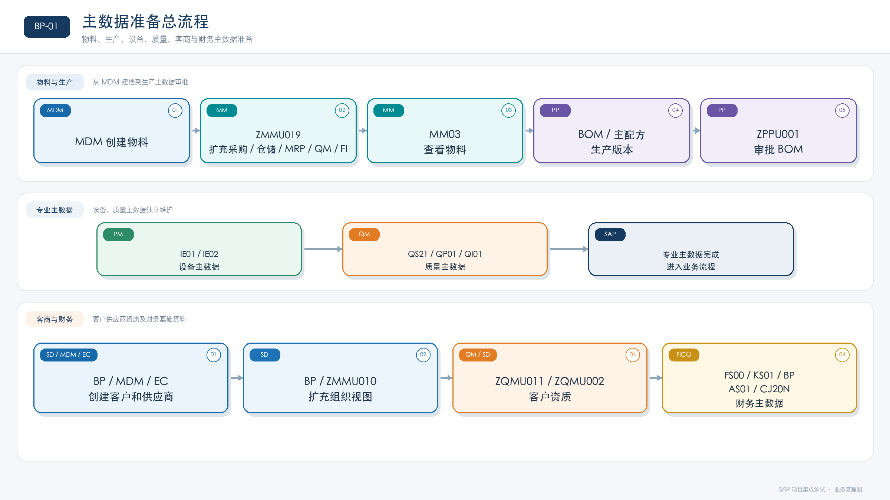

#### BP-02 采购到付款（P2P）流程

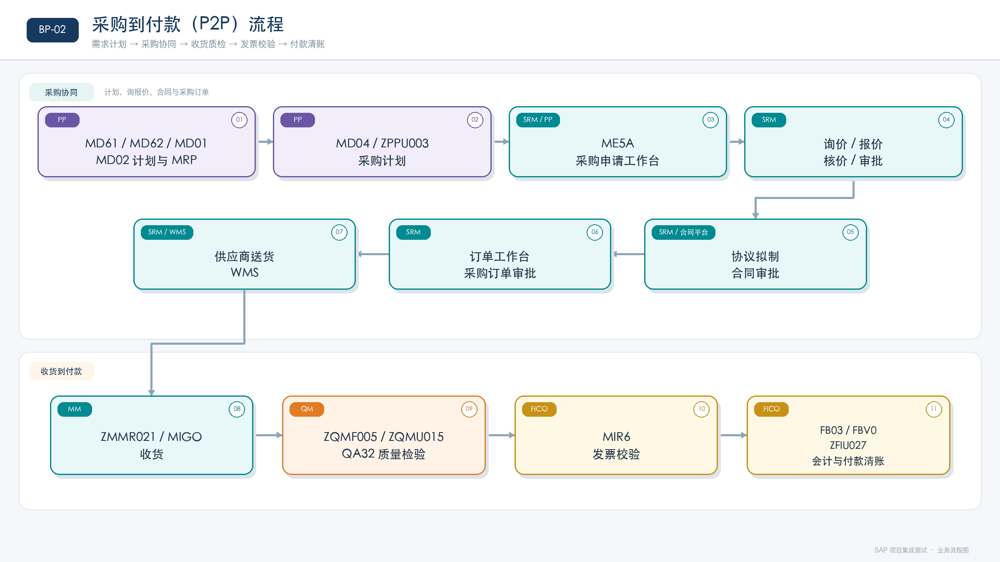

#### BP-03 生产执行与质量管理流程

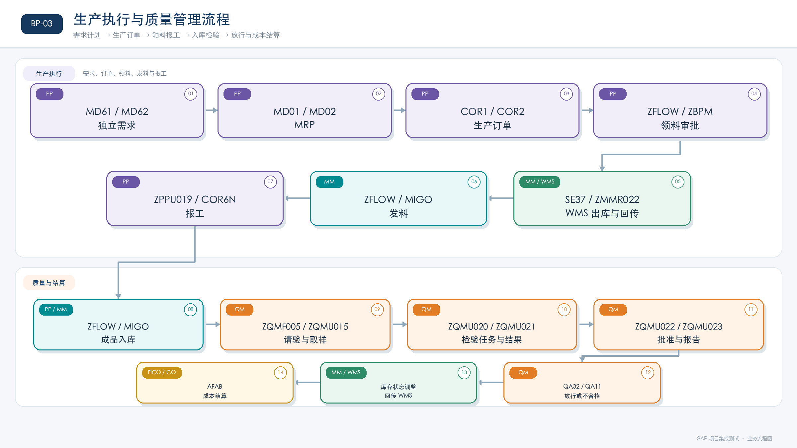

#### BP-04 销售到收款（O2C）流程

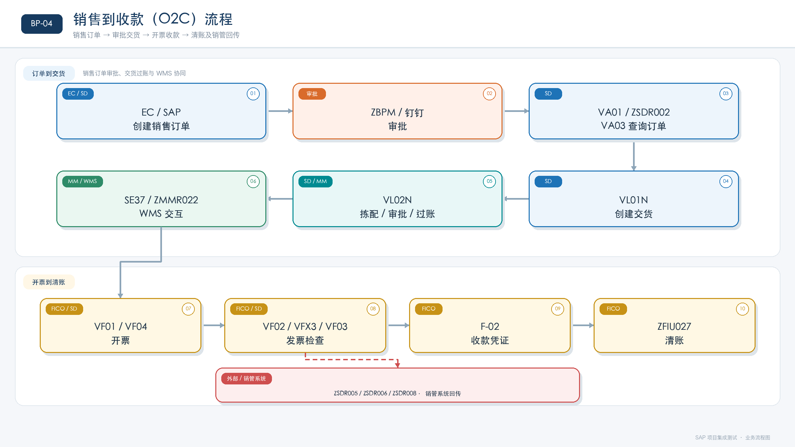

#### BP-05 财务月结流程

#### BP-06 设备全生命周期流程

#### BP-07 外部系统集成流程

#### BP-08 财务日常作业流程

#### BP-09 标准成本估算流程

#### BP-10 财务成本结转流程

### 8.2 图片索引

| 图片编号 | 流程图 | 用途 |
|---|---|---|
| BP-00 | [业务域总览流程](../../../assets/BP-00-业务域总览流程.png) | 第 3 节业务域总览 |
| BP-00A | [推荐的端到端测试顺序](../../../assets/BP-00A-推荐的端到端测试顺序.png) | 第 3.1 节测试顺序 |
| BP-01A | [主数据准备详细流程](../../../assets/BP-01A-主数据准备详细流程.png) | 第 4.1 节，与 Mermaid 详细节点对应 |
| BP-02A | [采购到付款详细流程](../../../assets/BP-02A-采购到付款详细流程.png) | 第 4.2 节，与 Mermaid 详细节点对应 |
| BP-03B | [生产执行与质量管理详细流程](../../../assets/BP-03B-生产执行与质量管理详细流程.png) | 第 4.3 节，与 Mermaid 详细节点对应 |
| BP-03A | [质量检验取样放行库存状态流程](../../../assets/BP-03A-质量检验取样放行库存状态流程.png) | 第 4.4 节，与 Mermaid 详细节点对应 |
| BP-04B | [销售到收款详细流程](../../../assets/BP-04B-销售到收款详细流程.png) | 第 4.5 节，与 Mermaid 详细节点对应 |
| BP-04A | [采购与销售退货流程](../../../assets/BP-04A-采购与销售退货流程.png) | 第 4.6 节，与 Mermaid 详细节点对应 |
| BP-05 | [财务月结流程](../../../assets/BP-05-财务月结流程.png) | 第 4.9 节 |
| BP-06 | [设备全生命周期流程](../../../assets/BP-06-设备全生命周期流程.png) | 第 4.11 节 |
| BP-07 | [外部系统集成流程](../../../assets/BP-07-外部系统集成流程.png) | 第 4.12 节 |
| BP-08 | [财务日常作业流程](../../../assets/BP-08-财务日常作业流程.png) | 第 4.7 节 |
| BP-09 | [标准成本估算流程](../../../assets/BP-09-标准成本估算流程.png) | 第 4.8 节 |
| BP-10 | [财务成本结转流程](../../../assets/BP-10-财务成本结转流程.png) | 第 4.10 节 |

---

**文档生成完成。**
